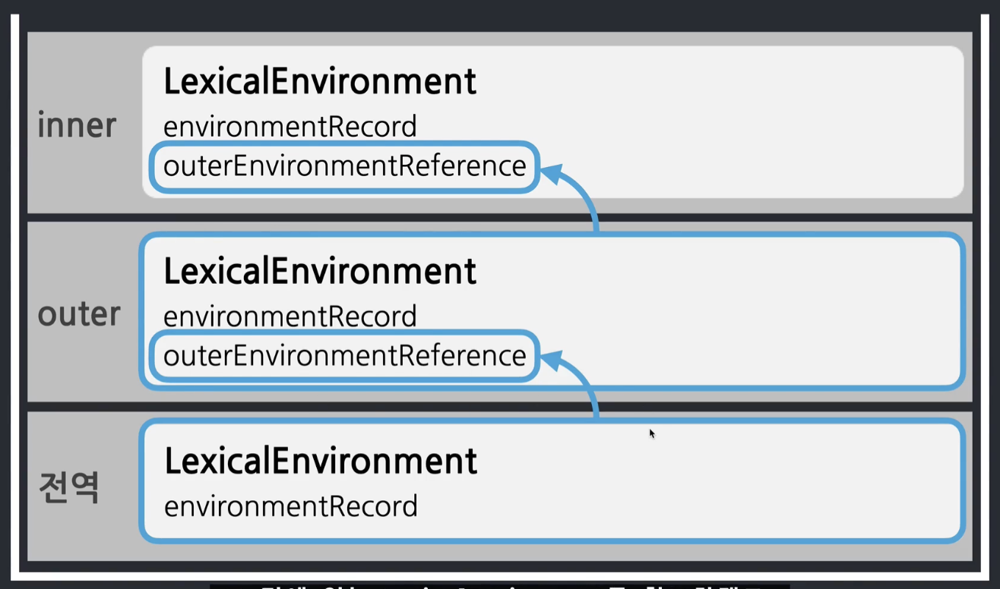
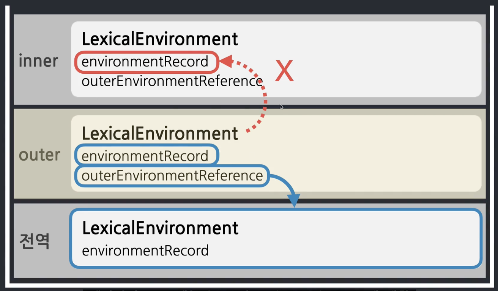
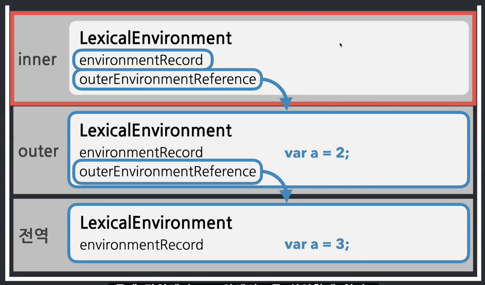

# 실행컨텍스트 (Execution Context)

- 실행컨텍스트의 의미
  - '동일한 조건, 환경을 지니는 코드뭉치를 실행할 때 필요한 조건/환경정보' 라고 볼 수 있는데 여기서 말하는 '동일한 조건, 환경을 지니는 코드뭉치'는 `전역공간`, `함수`, `eval`, `module` 4가지로 볼 수 있다.
    - 전역공간 == 전역컨텍스트. 자바스크립트에서 코드가 실행되는 순간에 바로 전역 컨텍스트가 생성되고 전체 코드가 끝날 때 전역컨텍스트는 종료된다.
    - module 어딘가에서 import 되는 순간에 컨텍스트가 생성되고 모듈 코드가 전부 끝났을 때 컨텍스트가 종료된다.
    - 따라서, 자바스크립트의 독립된 코드 뭉치라는 것은 **함수**라고 볼 수 있다.
  - **함수를 실행할 때 필요한 조건, 환경정보를 담은 객체**

## call stack


- 코드 실행에 관여하는 스택
- 현재 어떤 함수가 동작 중인지, 다음에 어떤 함수가 호출될 예정인지 등을 제어하는 자료구조

## 실행컨텍스트의 내부


- 실행 컨텍스트에는 `VariableEnvironment`, `LexicalEnvironment`, `ThisBinding` 3가지의 환경 정보들이 담긴다.
  <br>
  <br>
  <br>
  <br>

| -                                                                              | `VariableEnvironment` |      `LexicalEnvironment`      |
| :----------------------------------------------------------------------------- | :-------------------: | :----------------------------: |
| 현재 환경과 관련된 식별자 정보들이 담기는가?                                   |           O           |               O                |
| 용도                                                                           | 식별자의 정보를 수집  | 각 식별자에 담긴 데이터를 추적 |
| 컨텍스트 내부의 코드를 실행하는 동안 변수의 값에 변화를 실시간으로 반영하는가? |           X           |               O                |

<br>
<br>

### Lexical Environment

- 실행 컨텍스트를 구성하는 환경 정보들을 모아 사전처럼 구성한 객체
- Lexical Environment의 구성 요소들로 `environmentRecord`와 `outerEnvironmentReference`가 있다.
  - environmentRecord
    - 현재 문맥의 식별자 정보가 수집된다. 실행 컨텍스트가 최초 실행될 때 제일 먼저 하는 일.
    - 현재 컨텍스트의 식별자 정보를 수집해서 environmentRecord에 담는 과정을 `호이스팅` 이라고 한다.
  - outerEnvironmentReference
    - 외부 환경을 참조하는 정보

#### environmentRecord

> **호이스팅(Hoisting)**
>
> > 호이스팅은 실제하는 현상이 아니고, 'environmentRecord'의 정보 수집 과정을 더 이해하기 쉽게 만든 허구의 개념이다.<br><br>**호이스팅은 실행 컨택스트의 맨 위로 식별자 정보를 끌어올리는 것을 말한다.**
> >
> > > ```js
> > > console.log(a());
> > > console.log(b());
> > > console.log(c());
> > >
> > > function a() {
> > >   return "a";
> > > }
> > > var b = function bb() {
> > >   return "bb";
> > > };
> > > var c = function () {
> > >   return "c";
> > > };
> > > ```
> > >
> > > 라는 코드가 있다고 했을 때, 식별자인 `function a`, `var b`, `var c`를 위로 끌어올리는 것이다._이때, 함수 선언문은 함수 전체를 위로 끌어올리게 된다._
> > >
> > > ```js
> > > function a() {
> > >   return "a";
> > > }
> > > var b;
> > > var c;
> > >
> > > console.log(a());
> > > console.log(b());
> > > console.log(c());
> > >
> > > b = function bb() {
> > >   return "bb";
> > > };
> > > c = function () {
> > >   return "c";
> > > };
> > > ```
> > >
> > > 따라서, 실행 컨텍스트는 처음 생성되는 순간 `environmentRecord`에 현재 컨텍스트에서 선언되어 있는 식별자 정보를 순서대로 수집하는 것으로 호이스팅과 똑같은 일이 일어나는 것이다.
> > >
> > > ```js
> > > environmentRecord{
> > >     function a() {...},
> > >     b: undifined,
> > >     c: undifined
> > > }
> > > ```

#### outerEnvironmentReference

- 외부 환경에 대한 참조 => 외부의 'Lexical Environment'에 대한 참조
- 현재 문맥과 관련이 있는 외부에 있는 컨텍스트의 식별자 정보를 참조함



- 'inner 실행 컨텍스트'의 `outerEnvironmentReference`는 'outer 실행 컨텍스트'의 `LexicalEnvironment`를 참조하고 'outer 실행 컨텍스트'의 `outerEnvironmentReference`는 '전역 실행 컨텍스트'의 `LexicalEnvironment`를 참조한다.
- 'outerEnvironmentReference' 레퍼런스가 관여하는 것이 `스코프 체인`이다.

> **스코프 체인(Scope chain)**
>
> > '스코프'는 변수의 유효 범위를 말한다. 실행 컨택스트가 수집해놓은 정보만 접근을 할 수 있고 변수는 실행 컨택스트 내부에서만 존재하는 것이다.
> >
> > > 
> > >
> > > 'inner 컨텍스트'에서 선언한 변수는 `environmentRecord`에 의해서 접근할 수 있고 `outerEnvironmentRecord`를 이용해 'outer 컨텍스트'의 `LexicalEnvironment`에 접근할 수 있다.'outer 컨텍스트'에서 '전역 컨텍스트'에 접근하는 방법 또한 같다. <br> 하지만 'outer'의 `LexicalEnvironment`는 'inner'에 대한 정보를 수집해 놓은 것이 없기 때문에 'inner'의 `LexicalEnvironment`에 접근할 수 없다.
> > >
> > > 외부로는 나갈 수 있는데 자기 자신보다 더 안쪽으로 들어갈 수 없는 것이 변수의 유효범위이며 **스코프**이다.
> >
> > 그래서, **스코프 체인이란?**
> >
> > > 
> > > 가장 가까운 자기 자신부터 점점 멀리있는 스코프로 찾아 나가는 것을 말한다.
> > > 'inner'에서 어떤 변수를 찾으라고 명렁을 했을 때, 먼저 'inner의 environmentRecord'에서 해당 변수를 찾고 없으면 'outer'로, 또 없으면 '전역'으로 찾아나가는 것을 말한다.
> > >
> > > 만약 'inner'에서 값이 찾아졌다면, 그 밖에 있는 'outer', '전역'으로는 갈 수 없다. 이렇게 가장 먼저 찾아진 것만 접근할 수 있는 개념을 `shadowing`이라고 한다.

---

### 예제 1

```js
var a = 1;
function outer() {
  /* 1 */ console.log(a);

  function inner() {
    /* 2 */ console.log(a);
    var a = 3;
  }

  inner();

  /* 3 */ console.log(a);
}

outer();
/* 4 */ console.log(a);
```

### 예제 1. 강의 보기 전 나의 풀이

1. 메모리에 `var a`를 담은 공간 생성
2. 메모리에 `1`이라는 값을 담고 var에 대입
3. 메모리에 함수 `outer` 생성
4. 함수 `outer` 실행
5. **1번 콘솔 실행. 출력값은 1**
6. 메모리에 함수 `inner` 생성
7. 함수 `inner` 실행
8. **2번 콘솔 실행. 출력값은 1**
9. `var a`의 값 `3`으로 변경
10. **3번 콘솔 실행. 출력값은 3**
11. **4번 콘솔 실행. 출력값은 3**

### 예제 1. 강의 풀이

0. Global Execution Context 활성화
   > **전역 컨텍스트**<br>
   >
   > 1. 변수 a 선언
   > 2. 함수 outer 선언
   > 3. 변수 a에 1 할당
   > 4. outer 함수 호출 > Outer Execution Context 활성화
   >    > **Outer 컨텍스트** <br>
   >    >
   >    > 5. 함수 inner 선언
   >    > 6. outer context에서 a 탐색 (없음) > global context에서 a 탐색 > 1 출력
   >    > 7. inner 함수 호출 > Inner Execution Context 활성화
   >    >
   >    > > **Inner 컨텍스트** <br>
   >    > >
   >    > > 8. 변수 a 선언
   >    > > 9. inner context에서 a 탐색 > undifined 출력
   >    > > 10. 변수 a에 3 할당
   >    > >
   >    > 11. inner context 종료
   >    > 12. outer context에서 a 탐색 (없음) > global context에서 a 탐색 > 1 출력
   >    13. outer context 종료
   >    14. global context에서 a 탐색 > 1 출력
<br>

.15. global context 종료
