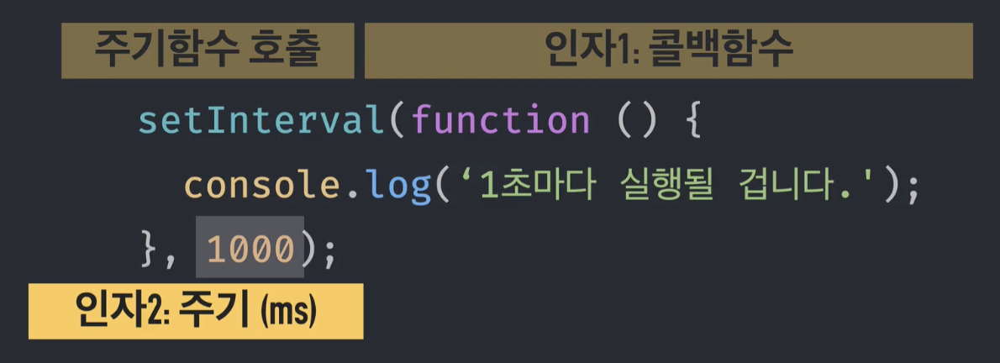
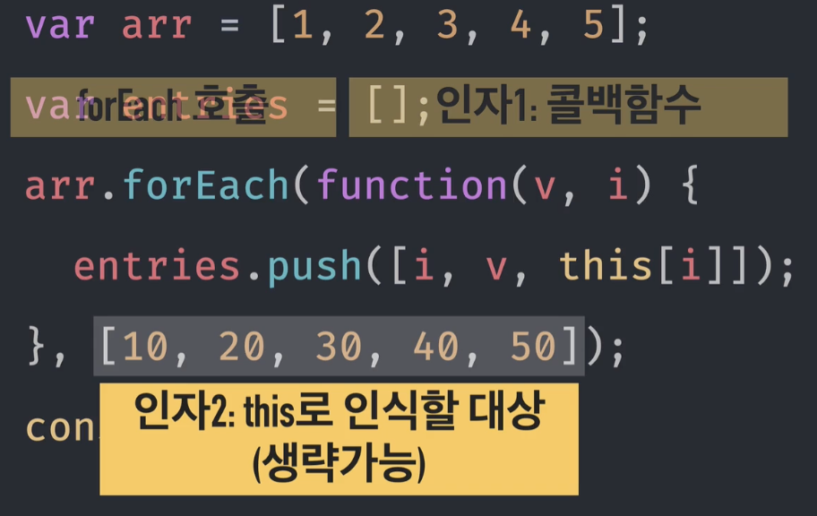
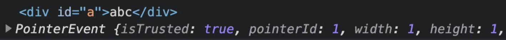
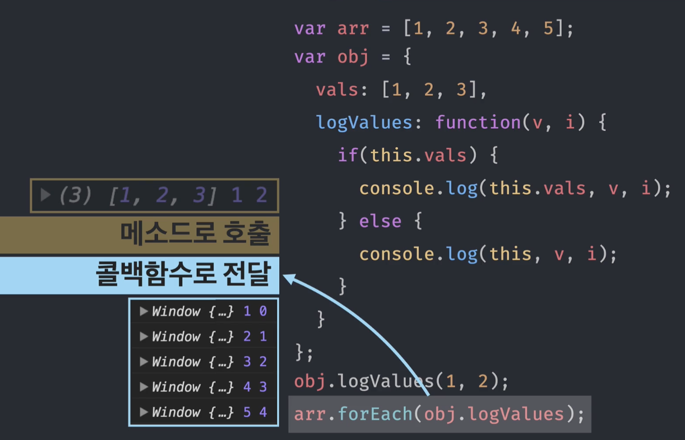

# callback Function

- 회신되는 함수
- 콜백함수를 다른 함수나 메서드에 인자로 넘김으로써, 그 콜백 함수의 실행 시점이나 방법, 매개변수 등을 그 함수나 메서드가 결정하도록 하는 것을 의미한다.
- 비동기 처리, 이벤트 퍼리 등의 상황에서 사용된다.

# 제어권 위임

- 콜백 함수의 실행시점, 매개변수, this의 제어권을 위임하게 된다.

## 실행시점

### 예시 1.


`setInterval`은 일정한 주기로 한 번씩 인자로 받은 함수를 실행하는 주기함수이다.
`setInterval`은 첫 번째 인자로 `Callback`함수를 넘겨주고 두 번째 인자로 `ms단위의 주기`를 넘겨주게 된다.
결국 `setInterval( callback, milliseconds )`형식으로 콜백함수를 넘겨주면 개발자가 실행하라는 명령을 하는게 아니라 `setInterval`이 **알아서 함수를 실행**해주게 된다.

## 매개변수

### 예시 1.

```js
var arr = [1, 2, 3, 4, 5];
var entries = [];
arr.forEach(
  function (v, i) {
    entries.push([i, v, this[i]]);
  },
  [10, 20, 30, 40, 50]
);
console.log(entries);

// 결과값: [[0, 1, 10], [1, 2, 20], [2, 3, 30], [3, 4, 40], [4, 5, 50]]
```



구문 - `arr.forEach(callback[, thisArg])`<br/>
`forEach`메서드는 배열의 요소를 순회하면서 반복하여 콜백함수를 호출한다. 첫 번째 인자로 `Callback`함수를 받고, 두 번째 인자로(option) `thisArg`를 받는다.
해당 함수에서 콜백으로 넘겨준 함수의 인자 `(v, i)`는 `forEach`메서드에 의해 결정된다.

## this

### 예시 1.

```js
document.body.innerHTML = `<div id='a'>abc</div>`;
function cdFunc(x) {
  console.log(this, x);
}

const obj = { a: 1 };

document.getElementById("a").addEventListener("click", cdFunc);
```

해당 코드는 id 값이 'a'인 엘리먼트를 클릭했을 때, cdFunc이 호출되도록 하는 `addEventListener` 코드이다.
<br/>a를 클릭하면,

값이 나오게 되는데, `addEventListener`가 콜백 함수를 받을 때 this는 이벤트 타켓으로 하고 이벤트 객체를 넘겨주도록 정했기 때문이다.

만약, this를 `obj`로 변경하고 싶다면 `document.getElementById("a").addEventListener("click", cdFunc.bind(obj));`로 bind를 걸어주는 방법이 있을 것이다.

# 콜백 함수의 특징

- 다른 함수(A)의 인자로 콜백함수(B)를 전달하면, A가 B의 **제어권**을 갖게 된다.

- _특별한 요청(bind)이 없는 한_ A에 **미리 정해놓은 방식**에 따라 B를 호출한다.
- 미리 정해놓은 방식이란 어떤 **시점**에 콜백을 호출할지, **인자**에는 어떤 값들을 지정할지, **this**에 무엇을 바인딩할지 등이다.

# ❗️콜백은 '함수'다❗️

### 예시 1.


`obj.logValues(1,2)`로 호출하면, `logValues(1, 2)`는 **메소드**로서 호출한 것이기 때문에 this.vals는 `[1, 2, 3]`이 되고, v는 1, i는 2가 될 것이다.<br/>
`arr.forEach(obj.logValues)`로 넘겨주게 되면 `logValues` 앞에 `.`은 있지만, 함수를 실행하는 것은 `forEach`이기 때문에 forEach에서 어떤 식으로 호출할지에 따라서 this가 달라지는 것이다.<br>
만약 this를 obj로 지정하고 싶다면 아래의 두 가지 방법을 사용하면 된다.

```js
arr.forEach(obj.logValues.bind(obj));
arr.forEach(obj.logValues, obj); //두 번째 인자로 thisArg를 넘길 수 있다.
```
