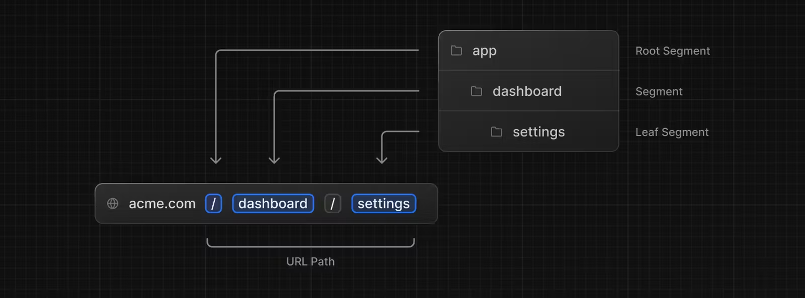

# Routing

- Next.js에서는 경로를 지정하는 방식을 '파일 시스템'기반으로 하고, `app`이라는 디렉토리 아래에 정의된다.
  - 이런 방식을 **App Router**라고 한다.

## 폴더 이름을 따르는 URL Path

- `app`이라는 디렉토리 안에 어떤 폴더를 정의하고 그 안에 규칙에 맞는 파일을 정의하면 url path와 일치하는 형태로 사용할 수 있다는 것을 의미한다.
- Next.js에서 경로의 이름이 되는 폴더를 `세그먼트(Segment)`라고 부른다.
- `app`은 가장 기초가 되는 세그먼트로 `루트 세그먼트(root segment)`라고 부른다.
  - 라우트를 표현하는 폴더의 경우 해당 폴더를 `라우트 세그먼트(Route Segment)`라고 부른다.
  - ex) 루트 라우트 세그먼트 이름이 `app`이면 App Router, `page`면 Pages Router가 되는 것이다.

### 예시 1.



Next.js의 파일 시스템 기반의 라우팅은 위의 그림과 같은 형태로 이루어진다. `app` 폴더에 `dashboard`폴더 안에 `settings`라는 폴더를 만들면 **URL path**가 폴더 이름과 동일한 순서를 따라 만들게 된다.
<br>
<br>
<br>

## 상황에 따라 짓는 파일 이름

- 세그먼트에는 파일 이름이 필요하다.
- Next.js에는 상황에 맞는 UI를 정의할 때 쓰는 파일명이 미리 정해져 있다.

| 파일명         | 설명                                                      |
| :------------- | :-------------------------------------------------------- |
| `layout`       | 세그먼트의 메인 컨텐츠와 하위 세그먼트의 공통 레이아웃 UI |
| `page`         | 세그먼트의 메인 컨텐츠 UI                                 |
| `loading`      | 세그먼트의 메인 컨텐츠와 하위 세그먼트의 로딩 UI          |
| `not-found`    | 세그먼트의 메인 컨텐츠와 하위 세그먼트의 Not Found UI     |
| `error`        | 세그먼트의 메인 컨텐츠와 하위 세그먼트의 에러 UI          |
| `global-error` | 전역 에러 UI                                              |
| `route`        | 서버 API 엔드포인트                                       |
| `template`     | 특별하게 재사용될 수 있는 레이아웃 UI                     |
| `default`      | 패러럴 라우트의 폴백 UI                                   |

<br>

### 예시 1.


- 위의 이미지와 같이 파일 이름을 약속된 대로 지정해서 세그먼트 안에 정의하면 Next.js가 알아서 React 컴포넌트를 배치해 준다.
- 위에서 언급한 파일명 이외에 아무 이름이나 넣어도 라우트에 영향을 주지 않는다.
  - 위에 언급한 특정 파일명을 사용해서 특정 기능을 자동으로 수행할 수 있는 컴포넌트를 정의한다.
    - ex) loading 파일명은 페이지나 세그먼트가 로딩 중 일 때 보여줄 UI를 정의
  - 이런 특정 파일명을 제외한 나머지 파일명은 특정 기능 없이 **URL 경로 매핑**에만 영향을 미친다.
    - ex) `pages/posts/first-post.js` 파일은 /posts/first-post URL로 접근할 수 있는 페이지를 생성하지만 next.js의 기능이나 동작 방식에 특별한 규칙을 추가하지 않는다.

<br>
<br>
<br>
<br>
<br>

## 동적으로 변할 수 있는 URL Path

만약 블로그를 만든다는 가정하에 게시글마다 URL을 하나하나 지정해 주기 어려운 경우가 발생하게 된다. 게시글마다 ID나 이름을 갖게 되는데 이를 위해서는 URL path가 동적으로 바뀌어야 할 것이다.

이런 경우를 위해 Next.js에서는 `Dynamic Routes`라는 기능을 제공한다.

> **Dynamic Routes**<br>
> 페이지 경로의 일부분이 동적으로 변할 수 있게 해주는 기능이다.<br>
> 다이나믹 라우트를 생성하기 위해서 파일명 or 디렉토리명을 대괄호([])로 감싸주면 이 대괄호 안에 있는 값이 동적으로 변하는 부분이 된다.
>
> > 예를 들어, <br>
> > pages/posts/[id].js라는 파일을 만들 경우, id는 동적인 값으로 처리된다.

### 예시 1.

`app/blog/[id]/page.tsx` 이런 디렉토리 구조가 있다고 가정할 때, 여기서 `[id]`가 동적 세그먼트가 될 것이다.

```ts
export default function Page({ params }: { params: { id: string } }) {
  return <div>My Post: {params.id}</div>;
}
```

위의 코드처럼 page.tsx에서 이 아이디 값을 `params.id`로 받아와 동적인 값을 받아오게 되고, 이 `id` 값을 이용해서 데이터에 있는 내용으로 UI를 그릴 수 있게된다. <br>
따라서, 결과적으로 `http://ex.com/blog/[id]`라는 URL을 표현할 수 있게 돠는 것이다.
