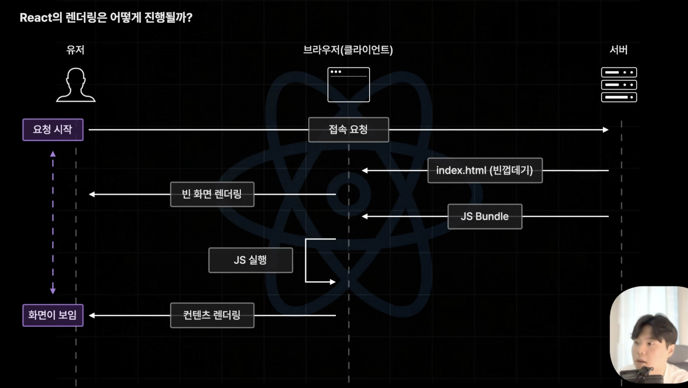
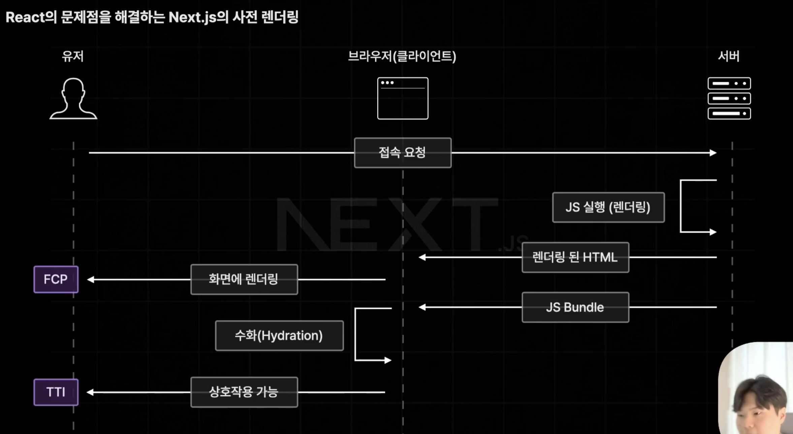
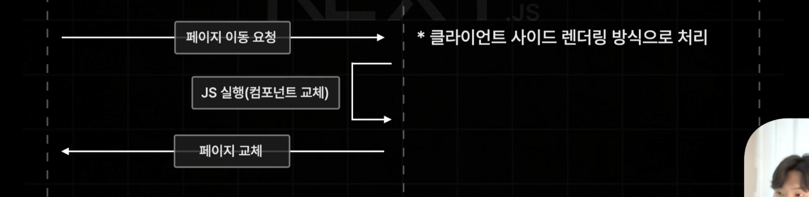

# 1. 사전 렌더링(Pre Rendering)이란?

- 브라우저의 요청에 사전에 렌더링이 완료된 HTML을 응답하는 렌더링 방식
- Client Side Rendering의 단점을 효율적으로 해결하는 기술

# 2. React의 Client Side Rendering

- 기존 React에서 사용하는 렌더링 방식
- 페이지 이동이 빠르고 쾌적하다는 장점이 있다.
  - 초기 JS번들을 가져오고 나서 페이지 이동 시 서버에 전달할 필요 없이 이미 브라우저 내에 저장된 JS번들로 실행하면 되기 때문이다.
- 초기 접속 속도가 느리다는 단점이 있다.
  - 초기 접속 요청을 하면 index.html을 받아와 빈 껍데기를 렌더링하고 서버에서 JS번들을 받아와 실행시켜 컨텐츠를 렌더링 하기까지 과정이 많기 때문이다.
  - 따라서 FCP 늦어진다는 치명적인 단점을 가지게 되는 것이다.

> FCP (First Contentful Paint)  
> "요청 시작" 시점으로부터 컨텐츠가 화면에 처음 나타나는데 걸리는 시간을 말한다.   요청시작 <---> 컨텐츠 렌더링  
>
> 웹 페이지의 성능을 대표할 정도로 굉장히 중요한 지표이다.
>
> > 3sec 이상일 경우 : 이탈률 32% 증가  
> > 5sec 이상일 경우 : 이탈률 90% 증가  
> > 6sec 이상일 경우 : 이탈률 106% 증가  
> > 10sec 이상일 경우 : 이탈률 123% 증가  

# 3. Next의 Pre Rendering

- CSR보다 FCP가 단축되는 장점이 있다.
- 단, FCP까지만 과정이 완료된 경우에는 렌더링된 화면에 JS코드가 아직 없기 때문에 상호작용은 불가한 HTML이 렌더링된 페이지만 뜨게 된다.
- Hydration : 서버에서 받아온 JS번들을 브라우저에서 실행시키고 HTML과 연결되어 상호작용이 가능한 페이지가 되는 과정을 말한다.

> TTI (Time To Interactive)  
> 페이지가 상호작용까지 가능해진 시점을 말한다.  
> 만약 'TTI 과정이 3초 걸렸다' 한다면 페이지 요청부터 TTI 과정까지의 시간을 말한다. 

- 페이지 이동 방식은 CSR 방식으로 처리된다.

<b> 👩‍🏫 따라서 초기 접속 요청 과정에서 JS코드를 HTML로 미리 렌더링하는 `사전 렌더링`방식으로 기존 React의 단점인 느린 FCP를 개선하였고 그 이후에 발생하는 페이지 이동은 CSR 방식을 그대로 사용하여 React App의 장점을 그대로 받아와 빠른 페이지 이동이 가능하게 했다.