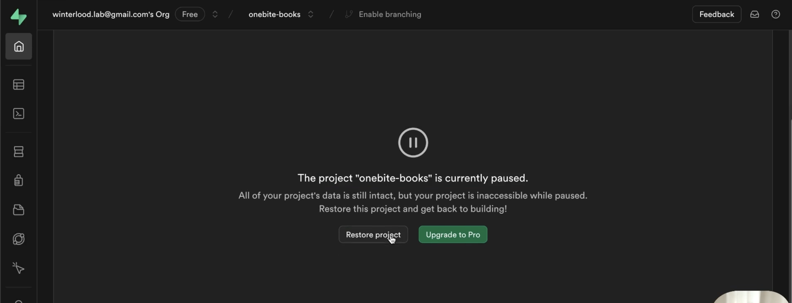

# 1. 백엔드 코드 다운로드

https://github.com/winterlood/onebite-books-server
<br> 깃허브의 코드를 다운로드하여 저장

# 2. SupaBase 회원가입 및 데이터베이스 생성

1. 회원가입을 한다.
2. 'new project'를 클릭하여 새로운 DB를 생성한다.
3. 생성 시, PW는 꼭 저장해두어야 한다.

# 3. VSC 백엔드 코드와 DB 연결

1. 생성된 DB 페이지의 카테고리에서 'Project Settings'를 클릭한다.
2. 세부 카테고리에 'Database'를 클릭
3. 'Connection string'의 mode를 `Secssion`으로 변경 후 스트링 값을 복사한다.
4. VSC에서 '.env' 파일을 생성한다.
5. '.evn'파일에 `DATABASE_URL`변수를 선언하고 문자열을 만들어 복사한 connection string 값을 넣는다.

```js
DATABASE_URL = "DB의 connection string 값";
```

6. Connection string 값에 있는 '[YOUR-PASSWORD]' 자리에 DB를 생성할 때 설정한 PW 값을 넣는다.

```js
DATABASE_URL = "...fq:[YOUR-PASSWORD]@a..."; // X
DATABASE_URL = "...fq:1234@a..."; // O
```

❗️ '.env' 파일은 패스워드 등의 개인정보가 들어있기 때문에 github나 블로그 등의 온라인 공간에 올리면 안된다.

# 4. 의존성 설치 및 설정

1. 터미널을 열어 'npm install'을 입력하여 모든 패키지를 다운로드 받는다.

```Bash
npm install
npm i
```

2. Supabase DB 초기화. 코드로 입력한 테이블이 생성된다.

```Bash
npx prisma db push
```

- Supabase 페이지의 왼쪽 카테고리 'Table Editer'를 클릭하면 테이블이 생성된 것을 확인할 수 있다.

3. 초기 데이터를 자동으로 삽입. (강의자가 만들어놓은 코드에 의해)

```bash
npm run seed
```

# 5. 백엔드 서버 빌드 및 실행

1. 백엔드 코드 빌드

```bash
npm run build
```

2. 빌드된 파일 실행

```bash
npm run start
```

# 6. 실행 확인

1. 브라우저에 'localhost:12345'를 입력.

2. 'localhost:12345/api'를 입력하면 백엔드 api문서를 확인할 수 있다.

3. 백엔드 데이터를 직접 확인하는 방법

```bash
npx prisma studio
```

# 👩‍🏫 SupaBase DB 중단 시 복구 방법

- SupaBase는 1주일 이상 DB에 api 요청을 보내지 않으면 중지 상태로 변하고 어떤 api 요청에도 정상적으로 작동하지 않게된다.

- 복구 방법
  - 프로젝트 페이지로 접속하면 해당 화면이 뜨게 되는데 `Restore project` 버튼을 클릭하면 된다. (약 10분 ~ 2시간 소요)
    
  - 복구가 완료되도 api가 정상적으로 동작하기까지 약 20분 ~ 1시간 정도 소요될 수 있다.
