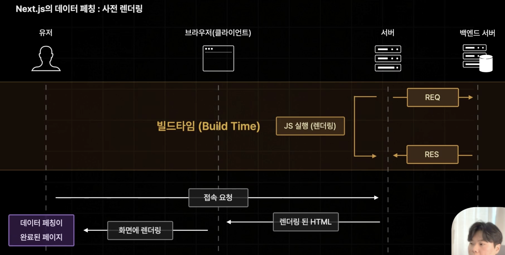

# Next의 데이터 패칭

## React App의 데이터 페칭

- 컴포넌트 마운트 이후에 발생한다.
- 데이터 요청 시점이 느려지게 되는 단점이 발생한다.

## Next App의 데이터 페칭

- 사전 렌더링 중 발생함 (당연히 컴포넌트 마운트 이후에도 발생 가능)
- 데이터 요청 시점이 매우 빨라지는 장점이 있다.

# Next.js의 다양한 사전 렌더링

## 서버사이드 렌더링 (SSR)

- 가장 기본적인 사전 렌더링 방식
- 요청이 들어올 때 마다 사전 렌더링을 진행 함

## 정적 사이트 생성 (SSG)

- 빌드 타임에 미리 페이지를 사전 렌더링 해 둠

## 증분 정적 재생성 (ISR)

- 추후에 다룰 사전 렌더링 방식
