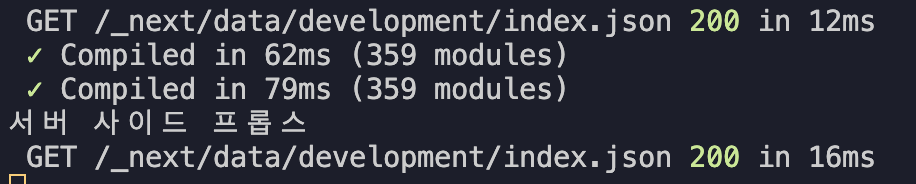
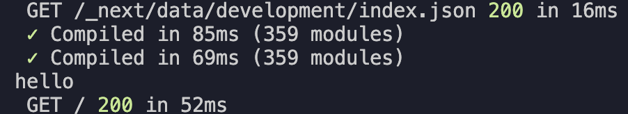

# 서버 사이드 렌더링 방식으로 동작하는 `getServerSideProps` 함수

- `getServerSideProps`라는 이름의 함수는 약속된 이름의 함수이다.
- 해당 함수를 `export`로 내보내주게 되면 자동으로 서버 사이드 렌더링 방식으로 사전 렌더링이 이루어지게 된다.

```ts
export const getServerSideProps = () => {};
```

- 동작 순서 (index.tsx에 적용한 경우)

  1. '~/' 인덱스 페이지 경로로 요청이 들어오게 되면
  2. `getServerSideProps` 함수가 동작해 백엔드 서버나 서드파티로부터 데이터를 불러온다.
  3. 해당 페이지 컴포넌트가 실행된다.

- `getServerSideProps` 함수의 리턴값은 반드시 `props{}`라는 객체 프로퍼티를 포함하는 단 하나의 객체여야 한다.
  - props라는 프로퍼티의 값을 페이지 컴포넌트에 전달해줄 수 있다.(프레임워크의 일종의 문법)
  - 렌더링과정에서 페이지 컴포넌트보다 먼저 실행되어 페이지 컴포넌트에서 필요한 데이터를 백엔드 서버 등에서 구해서 페이지 컴포넌트에 props로 넘겨주는 역할을 하는 함수이다.

```ts
export const getServerSideProps = () => {
  const data = "hello";
  return { props: { data } };
};

export default function Home({ data }: any) {
  console.log(data);
  return ( ... );
}
```


- `getServerSideProps` 함수는 사전 렌더링을 하는 과정에서 딱 한 번만 실행이 되는 함수이다.
  - 때문에 `getServerSideProps` 함수내에서 콘솔을 찍어도 브라우저에서 확인할 수 없다.
  - 대신 서버에서 로그로 나와 터미널에서 확인할 수 있다.
  ```ts
  export const getServerSideProps = () => {
  console.log("서버 사이드 프롭스");
    ...
  };
  ```
  
  - 만약, `getServerSideProps` 함수 내에서 `window.location` 같은 메소드를 사용하게 되면 오류가 발생한다.
    - window는 브라우저를 의미하기 때문에 서버 환경에서만 실행하는 `getServerSideProps` 함수에서는 undefined가 뜨게 되고 메소드를 찾을 수 없기 때문이다.

# 페이지 컴포넌트는 2번 실행된다.

- 페이지 컴포넌트는 서버에서 한번, 브라우저에서 한번 실행된다.

  - 첫 번째로 브라우저로부터 접속요청을 받으면 사전 렌더링을 위해 먼저 서버 측에서 실행된다.
  - 두 번째로 브라우저에서 자바스크립트 번들 형태로 전달되어 브라우저에서 실행될 때, 하이드레이션 과정이 진행될 때 실행된다.
  - 예를 들어, console.log()를 실행하게 되면 메시지는 서버에서 한번, 브라우저에서 한번 실행된다.
    ```ts
      export const getServerSideProps = () => {
        const data = "hello";
        return { props: { data } };
      };
      export default function Home({ data }: any) {
        console.log(data);
        return (...);
      }
    ```
    - 서버
      
    - 브라우저
      

- 페이지 컴포넌트에서 어떤 조건도 없이 window를 호출하면 에러가 발생한다.

  - 브라우저에서 실행하기 전에 서버에서 실행을 하는데 서버에는 window가 없으니 에러가 출력되는 것이다.

- 여러가지 해결방법이 있는데 가장 쉬운 방법은 `useEffect`를 사용하는 것이다.
  - `useEffect`는 컴포넌트 마운트 이후에 실행되기 때문에 서버에서 실행되지 않기 때문이다.
  ```ts
    export default function Home({ data }: any) {
    useEffect(()=>{
        console.log(window);
    },[])
    return (...);
  ```

# `getServerSideProps`에서 받는 props의 타입 설정하기
- `getServerSideProps`함수에서 설정한 props를 페이지 컴포넌트에서 받아올 때 타입을 설정해야 한다.
- Next.js에서 기본적으로 아주 다양한 내장 타입들이 제공된다.
- `InferGetServerSidePropsType`: `getServerSideProps`함수의 반환값 타입을 자동으로 추론해주는 기능을 수행하는 타입이다.
    - `{data}: InferGetServerSidePropsType<typeof getServerSideProps>`: 자동으로 `getServerSideProps` 함수의 반환값 타입인 `props`의 타입을 추론하여 매개변수인 `{data}` 타입을 정의한다.