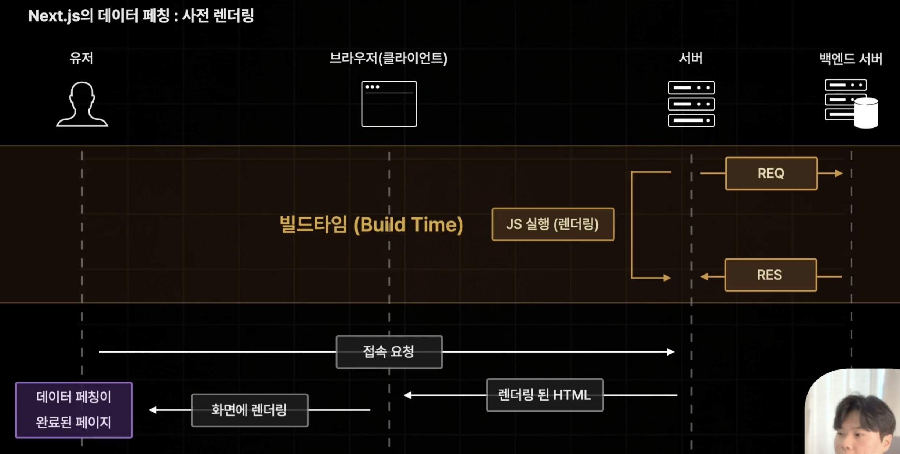

# 1. SSG(정적 사이트 생성) 소개

- SSR의 단점을 해결하는 사전 렌더링 방식
  - SSR은 사이트에 접속 요청을 할 때마다 서버에서 데이터를 받아오게 되는데 서버에서 받아올 데이터의 양이 많으면 사용자는 데이터를 불러올때까지 긴 시간을 기다려야하는 단점이 존재!
- 빌드 타임에 페이지를 미리 사전렌더링을 해두는 방식

## SSG 정적 사이트 생성

1. 개발자가 Next.js App을 `npm run build` 명령어로 빌드하게 되면 빌드 타임에 미리 사전 렌더링을 진행해 페이지를 미리 딱 한 번만 생성해 둔다.
2. 브라우저가 접속 요청을 보내게 되면 Next.js 서버는 빌드타임에 사전 렌더링 되었던 페이지를 매우 빠른 속도로 응답하게 된다.
3. 사용자들은 매우 빠른 시간안에 완성된 화면을 확인할 수 있게된다.

## SSG의 장점

- 빌드 타임에 일어나는 사전 렌더링 과정에서도 서버에게 데이터를 불러와야 하는 과정이 추가로 필요하고 이 과정이 매우 오래 걸리게 된다고 하더라도 사용자가 접속 요청을 하기 전인 빌드타임에 일어나는 일이기 때문에 사용자의 경험엔 아무런 영향을 미치지 않는다.

## SSG의 단점

- SSG는 빌드 타임 이후엔 페이지를 새롭게 사전 렌더링 하지 않기 때문에 우리가 언제 접속 요청을 보내게 되더라고 매번 똑같은 페이지만 응답한다. 따라서, 최신 데이터 반영은 어렵다.
- 때문에 정적 페이지에 적합한 방식이다.