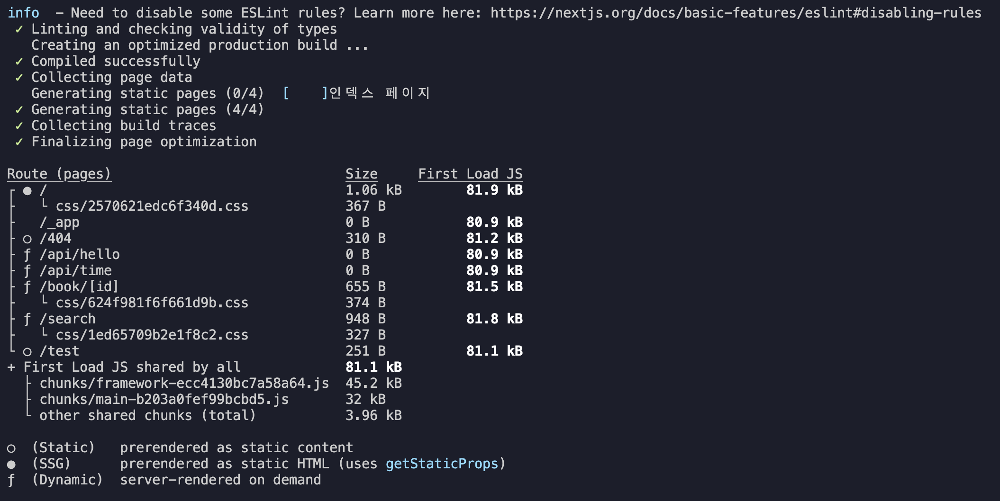
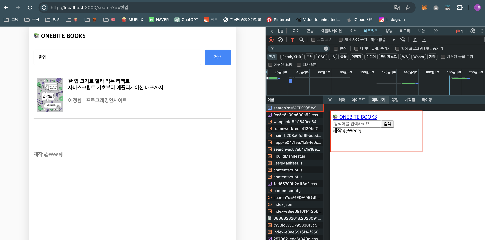

# 2. SSG 정적 경로에 적용하기

## 1. `getStaticProps` 함수 설정하기

- `getStaticProps` 함수를 사용하면 해당 페이지는 SSG 방식으로 동작하게 된다.
- `getServerSideProps` 함수와 동일하게 데이터를 불러와 props로 페이지 컴포넌트에 전달할 수 있다.

```ts
export const getStaticProps = async () => {
  const [allBooks, recoBooks] = await Promise.all([
    fetchBooks(),
    fetchRendomBooks(),
  ]);
  return {
    props: { allBooks, recoBooks },
  };
};
```

## 2. 페이지 컴포넌트에 적용하기

- SSR과 마찬가지로 props를 받아 사용하면 된다.
- props 타입을 정의할 때, `InferGetStaticPropsType<typeof getStaticProps>`로 적용한다.
  - `InferGetStaticPropsType`: `getStaticProps` 함수의 반환값 타입을 자동으로 추론해서 props의 타입으로 설정해주는 역할을 한다.
  - props 객체 반환은 반드시 해주어야 한다.

## 3. 빌드해서 SSG 적용이 잘 되고 있는지 확인하기

    * 'npm run dev'로 실행을 하게 되면 개발자들이 코드를 수정했을 때 수정 결과를 바로바로 확인할 수 있도록 요청 받을 때마다 계속 새롭게 페이지를 사전 렌더링하기 때문에 'npm run start'로 확인해야 한다.

### build 결과 확인



- ○ (Static): 디폴트 사전 렌더링 방식. `getStaticProps` 함수를 설정하지 않은 정적 페이지.
  - ex. '/test', '/404' 페이지
- ● (SSG): HTML로 사전 렌더링된 페이지. `getStaticProps` 함수를 사용해서 데이터를 불러오는 Static 페이지라는 것.
  - ex. '/' 페이지
- ƒ (Dynamic): 브라우저로부터 요청을 받을 때마다 다이나믹하게 페이지가 사전 렌더링 되는 페이지. SSR 방식으로 작동하도록 설정한 페이지.
  - ex. '/book/[id]', 'search/q=?[q]' 페이지
  - API Routes도 Next.js가 기본적으로 SSR로 작동하도록 설정해두었다.
    - ex. '/api/hello', '/api/time'

### npm run start로 동작 확인

- npm run start로 동작하게 되면 사이트를 아무리 새로고침 하더라도 서버 측 로그(VSC 터미널에서 확인가능)엔 추가 메세지가 뜨지 않는걸 확인할 수 있다.

## 👩‍🏫 동적사이트에 SSG를 적용하는 방법. (페이지 컴포넌트에서 동적으로 서버와 연동)

1.  `getStaticProps`는 빌드 타임에 실행되기 때문에 `GetStaticPropsContext`으로 사용자가 직접 입력하는 검색어 등의 정보인 쿼리스트링은 읽어올 수가 없다.

    - 때문에 정적 페이지로 사용하고 싶다면 리액트처럼 페이지 컴포넌트에서 데이터 페칭을 진행해야 한다.

    ```ts
    export const getStaticProps = async (context: GetStaticPropsContext) => {
      // context.query는 실행될 수 없다.
      const q = context.query.q;
      const books = await fetchBooks(q as string);
      return { props: { books } };
    };
    ```

2.  `useRouter`훅을 사용해서 쿼리스트링 값을 저장하고 `useEffect`훅을 사용해 검색어인 쿼리스트링이 변경되었을 때 api 함수인 `fetchBooks`를 실행한다.

    - `books`의 값은 도서 데이터를 배열로 여러개 저장하기 때문에 타입을 `<BookData[]>`으로 설정한다.

    ```ts
    export default function Page() {
      const [books, setBooks] = useState<BookData[]>([]);

      const router = useRouter();
      const q = router.query.q;

      const fetchSearchResult = async () => {
        const data = await fetchBooks(q as string);
        setBooks(data);
      };

      useEffect(() => {
        if (q) {
          fetchSearchResult();
        }
      }, [q]);

      return (
        <div>
          {books.map((book) => (
            <BookItem key={book.id} {...book} />
          ))}
        </div>
      );
    }
    ```

3.  npm run build -> npm run start

    - 빌드 결과에서 정적페이지(○)로 설정된 것을 확인할 수 있다.

4.  브라우저 개발자 모드 > 네트워크에서 가장 위에 있는 가장 처음으로 보내주는 사전 렌더링 결과인 HTML 파일을 클릭해 미리보기로 확인하면 검색 결과 데이터를 제외한 나머지 부분만 렌더링해서 보내준 것을 확인할 수 있다.

    
