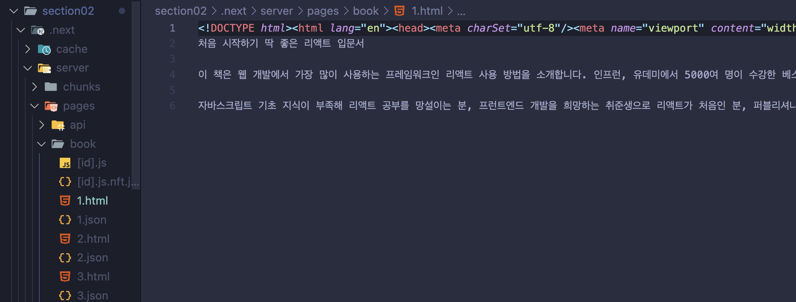

# 3. SSG 동적 경로에 적용하기

## 1. SSR 방식으로 동작하도록 `getStaticProps`함수를 설정한다.

- 매개변수의 context 타입을 `GetStaticPropsContext`로 설정한다.

```ts
export const getStaticProps = async (context: GetStaticPropsContext) => {
  const id = context.params!.id;
  const book = await fetchOneBook(Number(id));
  return { props: { book } };
};
```

## 2. 페이지 컴포넌트의 매개변수 타입을 `InferGetStaticPropsType`로 변경한다.

- `typeof` 뒤에도 아까 변경한 `getStaticProps`로 설정한다.

```ts
export default function Page({
  book,
}: InferGetStaticPropsType<typeof getStaticProps>) {
 ...
}
```

## 3. `getStaticPaths` 함수를 통해 해당 페이지에 존재할 수 있는 모든 경로에 대한 페이지를 사전에 렌더링한다.


- 이 페이지에 어떤 URL 파라미터들이 존재할 수 있는지, 어떤 경로들이 존재할 수 있는지 설정하는 과정이 반드시 필요하다.

  - 이 과정을 거치지 않으면 어떤 경로들이 있을지 모르기 때문에 아예 사전 렌더링을 진행할 수 없게된다.

- 예를 들어, `getStaticPaths` 함수로 URL 파라미터로써 id 값이 1, 2, 3이 있다고 가정하여 설정을 해주게 되면,

  ```ts
    export const getStaticPaths = () => {
        return {
          paths: [
            { params: { id: "1" } },
            { params: { id: "2" } },
            { params: { id: "3" } },
          ],
          fallback: false,
    };
  `};
  ```

  - `paths`: 어떤 경로들이 존재할 수 있는지 `배열`로 반환하도록 설정해야 한다.

    - `params`: URL 파라미터를 의미한다. 파라미터의 값은 반드시 `문자열`로만 명시해야 한다.(프레임워크 문법)

  - `fallback`: 에외 상황에 대비하는 대비책.
    - 예를 들어, 브라우저에서 Next 서버에게 'book/4'같이 `paths` 값으로 설정하지 않은 URL 접속 요청을 보내게되면 어떻게 처리할지 대비책을 설정하는 역할을 하는 옵션이다.
    - 3가지 옵션이 존재한다.
      - `false`: 가장 쉬운 방식으로, 존재하지 않는 경로의 요청은 'Not Forund' 페이지를 반환한다.

- 사전 렌더링 과정에서 이런 경로들에 해당하는 모든 페이지들(book/1, book/2, book/3)을 각각 생성하게 된다.
   
    - npm run build 후, '.next > server > pages > books'경로에서 `paths`로 설정한 경로에 해당하는 페이지를 정적으로 생성해둔 것을 확인할 수 있다.
