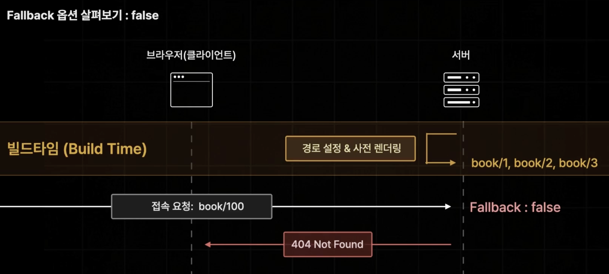
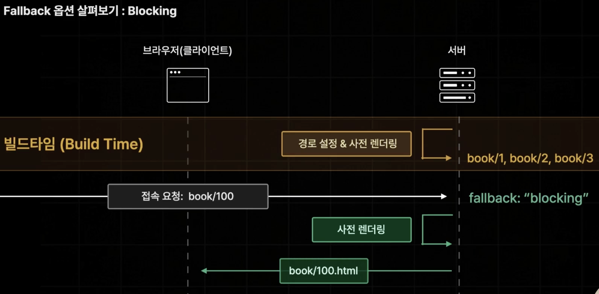
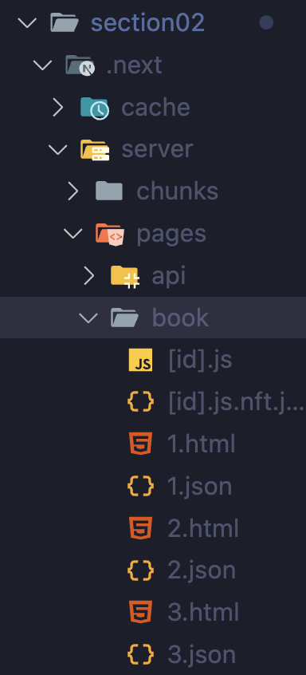
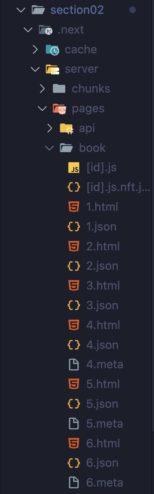
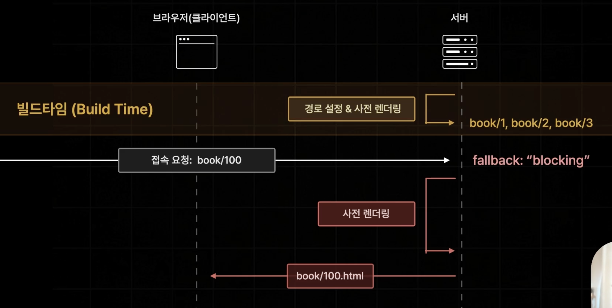
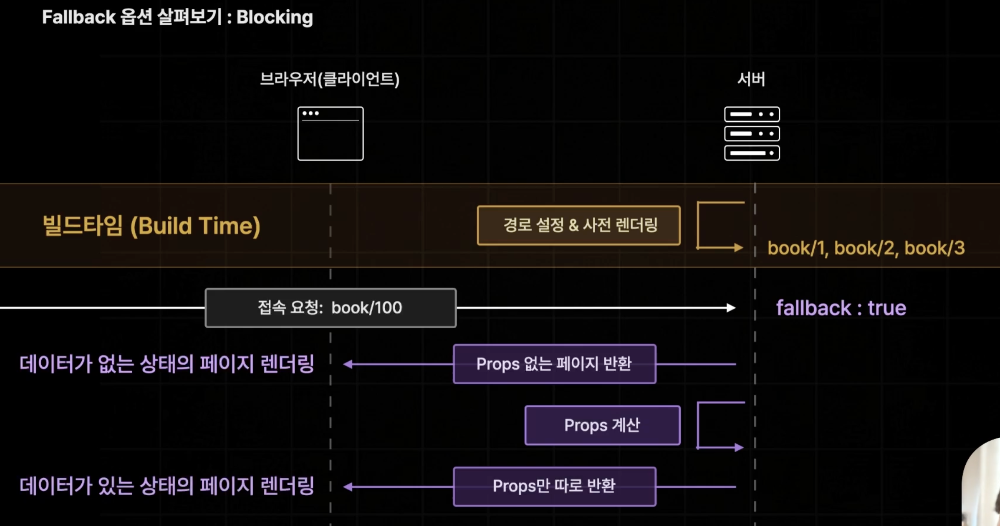

# 4. SSG 폴백옵션 설정하기

## Fallback 옵션 설정 (없는 경로로 요청시)

### false: 404 Not Found 반환



- `fallback: false`로 설정하게 되면 설정하지 않은 경로로 요청시 Not Found 페이지가 노출되게 된다.

### blocking: 즉시 생성 (Link SSR)



- `fallback: "blocking"`으로 설정하게 되면 SSR 방식처럼 실시간으로 요청받은 페이지를 사전 렌더링으로 브라우저에게 반환한다.

- 빌드 타임에 사전에 생성해두지 않았던 페이지까지 사용자에게 제공해줄 수 있다는 장점이 있다.

---

1. `getStaticPaths` 함수에서 `fallback: "blocking"`으로 설정한다.

   ```ts
   export const getStaticPaths = () => {
     return {
       paths: [
         { params: { id: "1" } },
         { params: { id: "2" } },
         { params: { id: "3" } },
       ],
       fallback: "blocking",
     };
   };
   ```

2. npm run build -> npm run start

   - npm run build 시, paths에서 선언한 페이지 3개만 생성된 것을 확인할 수 있다.
     

3. 브라우저 내에서 1, 2, 3이 아닌 다른 경로로 접속하면 서버에서 데이터를 받아 페이지가 정상적으로 뜨는 것을 확인할 수 있으며, 해당 경로가 넥스트 서버에 저장되는 것을 확인할 수 있다.
   

   - 4, 5, 6번 페이지처럼 빌드 타임 이후에 생성된 페이지들은 처음 요청할 때는 즉각적으로 생성되어야 하기 때문에 SSR 방식으로 동작해서 비교적 느리게 렌더링 될 수 있지만, 한 번만 만들어두면 자동으로 넥스트 서버에 저장되기 때문에 그 이후의 요청에는 SSG 페이지처럼 빠른 속도로 렌더링된다.

❗️ 주의사항 ❗️
 - 존재하지 않았던 페이지를 SSR 방식으로 새롭게 생성할 때 페이지의 사전 렌더링 시간이 길어지게 될 경우, 이 시간동안 브라우저에게 넥스트 서버가 아무것도 응답하지 않기 때문에 로딩이 발생하게 한다.

### true: 즉시 생성 + 페이지만 미리 반환



- 브라우저로부터 존재하지 않는 페이지를 요청 받았을 때 props가 없는 버전의 페이지를 빠르게 생성해서 브라우저에게 반환한 뒤 props만 따로 계산해서 계산이 완료되면 props만 따로 브라우저에 보내주는 방식이다.
  - 이때, props는 `getStaticProps` 함수가 반환해 페이지 컴포넌트에 전달해주는 페이지에 필요한 데이터를 의미한다. props가 없는 페이지라는 것은 데이터가 없는 페이지라고 생각하면 된다.

1. `getStaticPaths` 함수에서 `fallback: true`으로 설정한다.

   ```ts
   export const getStaticPaths = () => {
     return {
       paths: [
         { params: { id: "1" } },
         { params: { id: "2" } },
         { params: { id: "3" } },
       ],
       fallback: true,
     };
   };
   ```

   - 이렇게 설정하게 되면 `props`를 계산하는 `getStaticPaths` 함수의 호출을 생략하고 바로 페이지 컴포넌트만 사전 렌더링 해서 빠르게 브라우저에게 보내주는 것이다.

2. 페이지 컴포넌트에서 로딩페이지를 설정한다.

```ts
export default function Page({
  book,
}: InferGetStaticPropsType<typeof getStaticProps>) {
  const router = useRouter();
  if (router.isFallback) return "로딩 중입니다.";
}
```

- props가 없이 html만 로딩되고 props 데이터를 받기 전까지의 상태를 fallback 상태라고 한다. 이때 로딩페이지를 설정할 수 있다.
  - fallback 상태: 페이지 컴포넌트가 아직 서버로부터 데이터를 전달받지 못한 상태
  - `useRouter()`훅을 이용해 router 변수를 만들고 `router.isFallback`이 `true`라면 fallback 상태이므로 로딩중 화면을 렌더링 한다.

3. `getStaticProps` 함수에서 정말 존재하지 않는 도서 페이지에 접속했을 때 not Found 페이지 노출하가.

```ts
export const getStaticProps = async (context: GetStaticPropsContext) => {
  const id = context.params!.id;
  const book = await fetchOneBook(Number(id));
  if (!book) {
    return {
      notFound: true,
    };
  }
  return { props: { book } };
};
```

- `book` 데이터를 불러왔는데 데이터가 존재하지 않으면 오류가 있는 것이므로 `notFound`라는 프로퍼티의 값을 `true`로 설정하면 된다.
