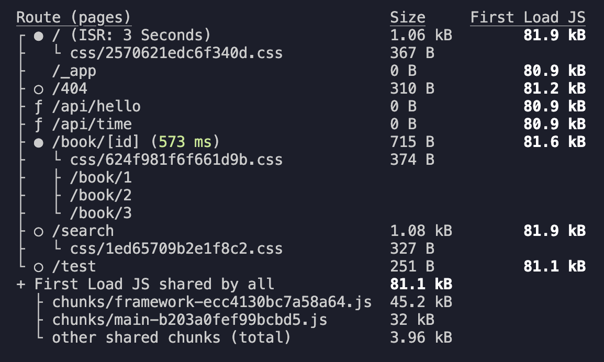

# ISR (Incremental Static Regeneration)

- 증분 정적 재생성
- SSG 방식으로 생성된 정적 페이지를 일정 시간을 주기로 다시 생성하는 기술


- SSG 방식은 빌드 타임에 미리 정적으로 사전 렌더링을 하고 나면 이 이후에 다시는 생성하지 않기 때문에 이 페이지를 언제 요청 하더라도 매번 만들어두었던 같은 페이지를 반환한다. 따라서, <b>속도는 빠르지만 최신데이터를 반영하기 어렵다는 단점이 있었다.</b>
- ISR 방식은 빌드 타임에 생성된 정적인 페이지에 유통기한을 설정할 수 있다.
- 유통기한이 지나기 전까지는 계속 똑같은 페이지를 응답 > 유통기한이 지나면 넥스트 서버에서 다시 새롭게 해당 페이지를 정적으로 생성 > 그 이후에 발생하는 접속 요청부터는 새로운 페이지를 반환.
- 일정시간을 주기로 페이지를 다시 생성하도록 설정할 수 있다.


- 예를 들어, ISR을 60초 주기로 다시 생성하도록 설정한다고 하고 시간의 흐름이 왼쪽에서 오른쪽으로 흐른다고 가정한다.
- 60초가 지나기 전까지의 요청에는 그대로 V1 버전의 페이지를 그대로 반환한다.
- 60초 이후에 접속요청이 발생하면 이땐 원래 가지고 있던 V1 버전의 페이지를 반환하고 그 다음에 서버에서 최신 데이터를 반영한 V2 페이지를 생성한다.
- 이 이후 발생하는 요청에는 V2 페이지가 반환되게 된다.

# IRS의 장점

- 기본적으로 이미 만들어져 있는 페이지를 반환하기 때문에 빠른 속도로 브라우저에게 응답이 가능하다. (SSG의 장점)

- 주기적으로 페이지를 업데이트 할 수있어 최신 데이터를 반영할 수 있다. (SSR의 장점)

# ISR 적용하기

1. `getStaticProps` 함수의 return문 안에 revalidate를 설정한다.
   - revalidate의 유통기한은 초 단위로 적는다.

```ts
export const getStaticProps = async () => {
  console.log("인덱스 페이지");

  const [allBooks, recoBooks] = await Promise.all([
    fetchBooks(),
    fetchRendomBooks(),
  ]);
  return {
    props: { allBooks, recoBooks },
    revalidate: 3,
  };
};
```

2. npm run build로 프로젝트를 빌드해서 결과를 확인해보면 '/' 경로가 ISR로 설정된 것을 확인할 수 있다.


