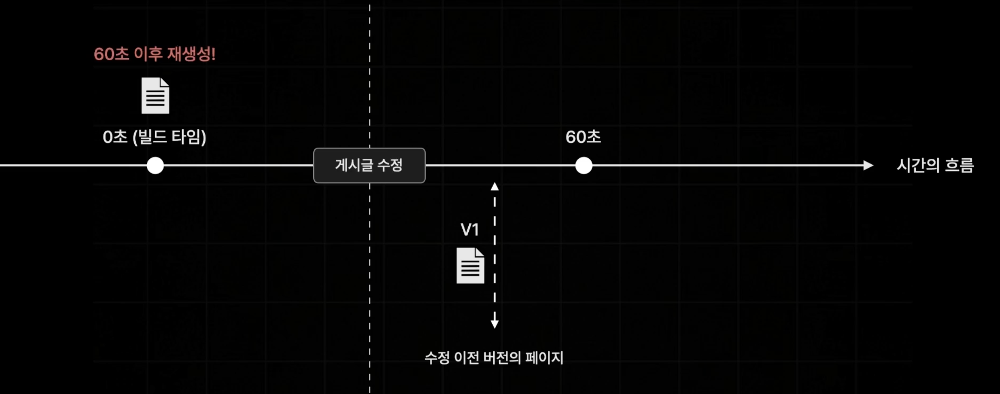
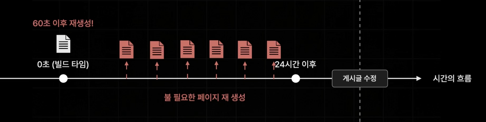
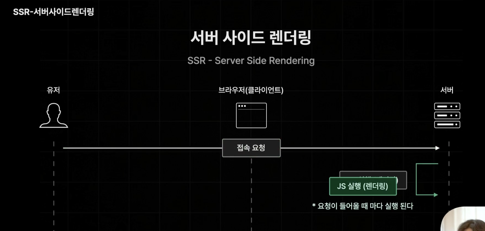

# ISR의 단점

## 1. 사용자의 행동을 기반으로 데이터가 없데이트 되는 페이지에선 ISR 적용이 어렵다.



- 예를 들어, 커뮤니티 사이트의 게시글 페이지에서 게시글의 수정과 삭제는 사용자들의 행동에 따라 즉각적으로 데이터가 업데이트 되어야 한다.
- 만약 기존의 ISR 방식대로 적용이 되었고 60초 간격으로 재 생성이 이루어진다면 실제로 60초가 되기 전에 게시글이 수정이 되고 유저가 수정이 이루어지기 전에 게시글을 보게 된다는 문제점이 존재하게 된다.

## 2. 불필요한 페이지의 재생성이 발생한다.



- 예를 들어, 60초 간격으로 재 생성이 이루어지는 커뮤니티 게시글 페이지에서 24시간 이후에 게시글 수정이 발생했다면
- 수정이 일어나기 전에는 재 생성이 발생할 필요가 없지만 수정이 일어나기 전까지 24시간 동안 60초마다 페이지가 재생성되는 문제가 발생한다.

## 🧐 그럼 SSR을 사용하면 안 돼?



- SSR은 브라우저가 요청할 때마다 새롭게 페이지를 사전 렌더링 하기 때문에 시간도 많이 느려지게 되고 동시에 접속자가 굉장히 많이 몰리게 될 때에는 서버의 부하가 커지게 된다.
- 때문에 되도록이면 정적인 페이지로 처리해주는 것이 좋다.

# On-Demand ISR

- 요청을 기반으로 페이지를 다시 생성하는 ISR 방식
- 실제로 사용자가 데이터를 수정했을 때, 업데이트가 필요해졌을 때 요청을 next 서버에 페이지 재생성 요청을 보내서 업데이트를 하는 방식이다.

## On-Demand ISR 적용하기

1. ISR 방식과 다르게 `getStaticProps` 함수에서 return문에 revalidate 항목을 넣지 않는다.

```ts
export const getStaticProps = async () => {
  console.log("인덱스 페이지");

  const [allBooks, recoBooks] = await Promise.all([
    fetchBooks(),
    fetchRendomBooks(),
  ]);
  return {
    props: { allBooks, recoBooks },
  };
};
```

2. /api/revalidate.ts 파일을 생성해 페이지 요청을 받았을 때 재생성 시켜주는 함수를 생성한다.
   - `await res.revalidate("/")`: `revalidate` 함수를 사용하여 인자로 넘겨준 페이지를 재생성 할 것인지 알려준다.
   - `return res.json({ revalidate: true })`: 페이지 재생성이 성공하면 `{ revalidate: true }`라는 객체 값을 반환한다.
   - `res.status(500).send("Revalidation Failed")`: 페이지 재생성이 실패하면 `status`를 500번으로 설정해 브라우저에 실패한 것을 알리고 "Revalidation Failed" 메세지를 전달한다.

```ts
export default async function handler(
  req: NextApiRequest,
  res: NextApiResponse
) {
  try {
    await res.revalidate("/");
    return res.json({ revalidate: true });
  } catch (err) {
    console.log(err);
    res.status(500).send("Revalidation Failed");
  }
}
```

3. npm run build -> npm run start

4. 브라우저에서 접속하여 새로고침을 계속해도 SSG 방식으로 동작하기 때문에 데이터가 변화하지 않는 것을 확인할 수 있다.

5. 브라우저에 새 탭을 열어 '~/api/revalidate'를 입력하면 api의 revalidate로 요청을 보내게 되어 새로운 페이지가 생성되게 된다. 이제 페이지를 새로고침 하면 데이터가 변경된 것을 확인할 수가 있다.
