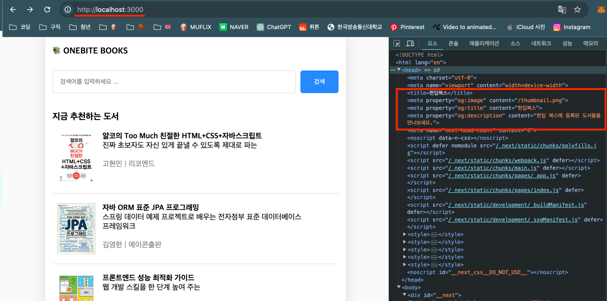
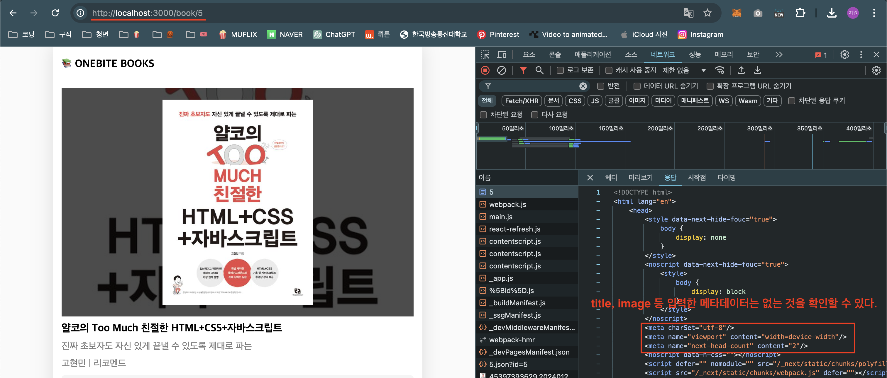
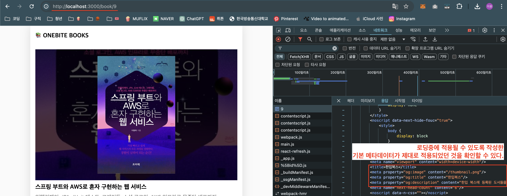

# SEO (검색 최적화 설정) 설정하기

- Next.js 에서는 리액트와 달라 각 페이지별로 메타 태그를 별도로 설정해줄 수 있다.

1. `<Head>` 태그를 사용하기 위해 "next/head"로부터 import 한다.

```ts
import Head from "next/head";
```

2. 페이지 컴포넌트의 `return`문에 `<Head>` 컴포넌트를 추가하고 이 안에 원하는 메타데이터를 작성한다.

   - `<Title>`: 페이지의 제목을 설정하는 태그
   - `<meta property="og:image" content="이미지 경로" />`: 해당 페이지가 링크로써 카카오톡 같은 SNS에 공유될 때 필요한 썸네일.
   - `<meta property="og:title" content="타이틀 이름" />`: 해당 페이지가 링크로써 카카오톡 같은 SNS에 공유될 때 필요한 타이틀.
   - `<meta property="og:description" content="설명글" />`: 해당 페이지가 링크로써 카카오톡 같은 SNS에 공유될 때 필요한 설명글.

   - '/' 경로 메타데이터
     ```ts
     return (
       <>
         <Head>
           <title>한입북스</title>
           <meta property="og:image" content="/thumbnail.png" />
           <meta property="og:title" content="한입북스" />
           <meta
             property="og:description"
             content="한입 북스에 등록된 도서들을 만나보세요."
           />
         </Head>
         ...
       </>
     );
     ```
   - '/search' 경로 메타데이터

     ```html
     <head>
       <title>한입북스 - 검색결과</title>
       <meta property="og:image" content="/thumbnail.png" />
       <meta property="og:title" content="한입북스 - 검색결과" />
       <meta
         property="og:description"
         content="한입 북스에 등록된 도서들을 만나보세요."
       />
     </head>
     ```

     - 브라우저의 개발자도구에서 확인하면 적용된 모습을 확인할 수 있다.
       

   - '/book/[id]' 경로 메타데이터

     - 백엔드 서버에서 받아온 데이터를 사용한다.

     ```html
     <head>
       <title>{title}</title>
       <meta property="og:image" content="{coverImgUrl}" />
       <meta property="og:title" content="{title}" />
       <meta property="og:description" content="{description}" />
     </head>
     ```

   - Fallback 상태에서도 meta 데이터가 입력될 수 있도록 로딩페이지에도 작성한다.

     - '/book/[id]'는 `fallback: true`인 사전 렌더링 방식을 사용하기 때문에 id값이 1, 2, 3이 아닌 경우 서버에서 생성하게 되는데 이 로딩 페이지를 하단처럼 설정했기 때문에 입력한 메타데이터가 빠져있는걸 확인할 수 있다.
     - 이렇게 되면 SEO 설정이 되어 있지 않은 문제가 발생하게 된다.

     ```ts
     if (router.isFallback) {
       return "로딩중입니다.";
     }
     ```

     

     - fallback 중에도 기본적인 메타데이터를 입력해놓는 것이 좋다.깁

     ```ts
     if (router.isFallback) {
       return (
         <>
           <Head>
             <title>한입북스</title>
             <meta property="og:image" content="/thumbnail.png" />
             <meta property="og:title" content="한입북스" />
             <meta
               property="og:description"
               content="한입 북스에 등록된 도서들을 만나보세요."
             />
           </Head>
           <div>로딩중입니다.</div>
         </>
       );
     }
     ```

     
