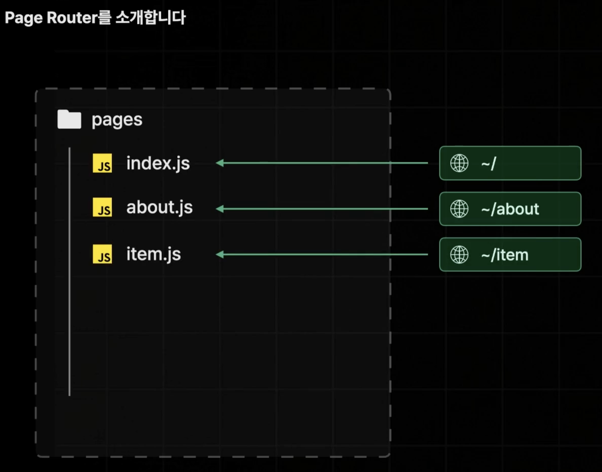
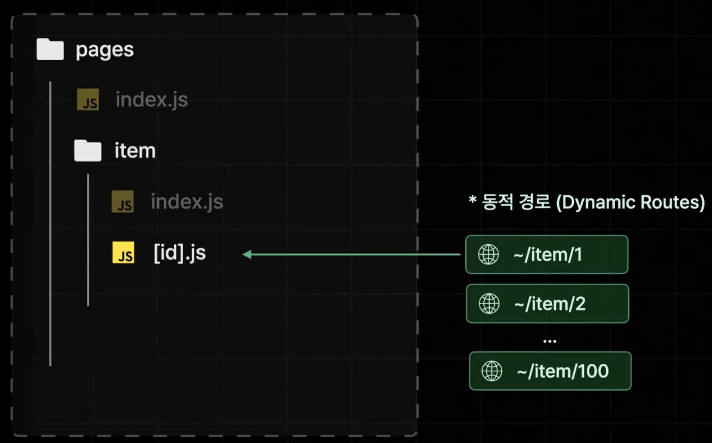

# 1. Page Router?

- 현재 많은 기업에서 사용되고 있는 안정적인 라우터
- React Router처럼 페이지 라우팅 기능을 제공함
- `Pages`라는 폴더의 구조를 기반으로 페이지를 라우팅함
  
  파일 이름을 기반으로 페이지 라우팅이 가능하고
  
  폴더 이름을 기반으로 페이지 라우팅도 가능하다.
- 동적경로(Dynamic Routes)도 간단히 설정이 가능하다.
  - 동적경로란 가변적인 값을 포함하고 있는 경로를 말한다.(ex. ~item/1, ~item/2 ... ~item/100)
  - 동적경로를 설정하는 방법은 파일명을 대괄호([])로 묶어주면 동적경로에 대응하는 페이지의 역할을 하게 된다.
    

# 2. Next.js App 생성

1. 터미널에 Next App 생성 명령어 입력

```bash
npx create-next-app@14 "패키지명"
# create-next-app 명령어를 통해서 14버전의 Next App을 설치
```

- npmjs.com에 등록된 최신 버전의 노드 패키지를 다운로드 없이 바로 실행시키는 명령어.

2. Next App 환경설정 선택
   

- Would you like to use TypeScript? => 타입스크립트 사용 여부 체크
- Would you like to use ESLint? => ESLint 사용 여부 체크
  - ESLint는 JS코드에서 에러를 사전에 찾아 표시해주는 등의 기능을 한다.
- Would you like to use Tailwind CSS? => 테일윈드 CSS 사용 여부 체크
- Would you like to use 'src/' directory? => '/src' 디렉토리 사용 여부 체크
- Would you like to use App Router? (recommended) => App Router 사용 여부 체크
- Would you like to customize the default import alias (@/\*) ? => import alias 커스터마이징 여부 체크
  - import alias란, 절대 경로로 모듈을 import 할 수 있도록 도와주는 기능이다.
  - 예를 들어, import A from "@/components/~"(@는 /src 경로를 의미한다.)

# 3. Next App 실행

- 개발 모드로 실행

```bash
npm run dev
```

# 4. pages/\_app.tsx, \_document.tsx

- pages 폴더 내에 위치해있긴 하지만 페이지의 역할을 하는 파일이 아닌 Next App의 모든 페이지에 공통적으로 적용될 로직이나 레이아웃, 데이터를 다루기 위한 파일이다.

- \_app.tsx
  - 리액트에 있는 App 컴포넌트와 동일한 하게 루트 컴포넌트의 역할을 한다.
  - 모든 페이지 컴포넌트들의 부모 컴포넌트이다.

```ts
export default function App({ Component, pageProps }: AppProps) {
  // Component: 페이지 역할을 할 컴포넌트를 매개변수로 받는다.
  // pageProps: 페이지 컴포넌트에 전달될 props를 모두 객체 매개변수로 받는다.
  return <Component {...pageProps} />;
}
```

- \_document.tsx
  - 모든 페이지에 공통적으로 적용 되어야 하는 Next.js App의 HTML 코드를 설정하는 컴포넌트이다.
  - `<Meta>`, `Font`설정 등의 설정을 할 수 있다.

# 5. next.config.mjs

- Next App의 설정을 관리하는 파일.

- reactStrictMode: true로 설정하면 리액트 앱에 존재하는 잠재적인 문제를 검사하기 위해 개발모드에서 실행할 때 컴포넌트를 두 번 실행하게 되기 때문에 편의를 위해 개발 시 false로 꺼둔다.

````ts
const nextConfig = {
  reactStrictMode: false,
};```
````
