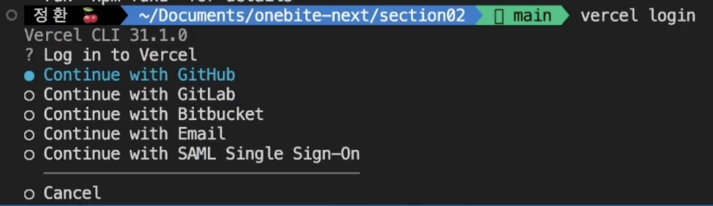
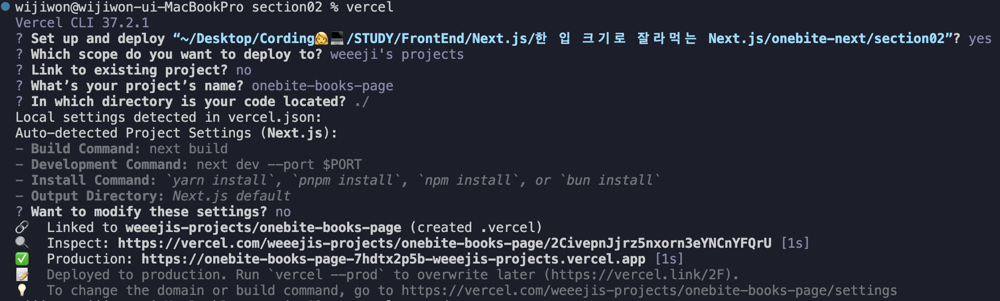
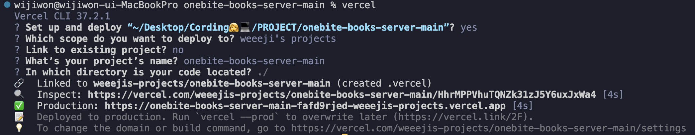
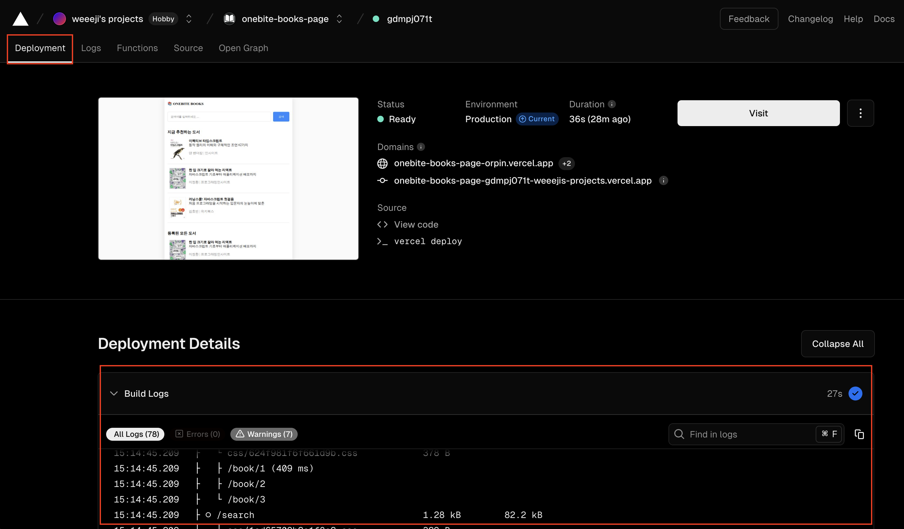

# 1. Vercel 회원가입

https://vercel.com/

# 2. VSC Vercel 설정

1. Vercel 패키지 글로벌 설치

   ```bash
   sudo npm install -g vercel
   sudo npm i -g vercel
   ```

   - 설치하면 패스워드를 물어봄

2. Vercel 로그인

   ```bash
   vercel login
   ```

   

   - vercel 회원가입한 방법으로 선택하면 된다. (나는 깃허브)

# 3. Next App 배포

1. 배포 명령어 입력

   ```bash
   vercel
   ```

2. 배포 방식 체크
   

- `Set up and deploy "..."?`: 현재 이 폴더에 들어있는 Next App을 배포하길 원해?
- `Which scope do you want to deploy to?`: 어떤 계정에 배포할거야?
- `Link to existing project?`: 기존에 존재하던 프로젝트에 연결할거야?
- `What’s your project’s name?`: 배포하려는 프로젝트 이름이 뭐야?(원하는 이름 입력)
- `In which directory is your code located?`: 어떤 디렉토리에 코드가 있어?
- `Want to modify these settings?(Next.js)`: 프로젝트가 Next.js로 되어있던데 이렇게 배포할거야 세팅 바꾸고 싶어?

---

여기까지 배포하고 배포된 사이트 주소로 들어가면 백엔드 데이터가 없는 사이트가 뜬다.

# 4. 백엔드 (nest) 배포

1. 배포 명령어 입력

   ```bash
   vercel
   ```

2. 배포 방식 체크
   

- Next.js 배포와 같은 질문이다. 코드에 맞게 선택하여 배포한다.

# 5. 배포된 백엔드 도메인 주소로 fetch 함수 URL 변경

- Vercel 대시보드 접속하여 배포한 백엔드 클릭
- 상단에있는 "Domains" 주소 복사
- 백엔드와 통신하는 fetch 함수의 Base_URL 수정

# 6. Next.js App 프로덕션 모드로 배포

```bash
vercel --prod
```

# 👩‍💻 Vercel 사이트에서 빌드 로그를 확인할 수 있다.


