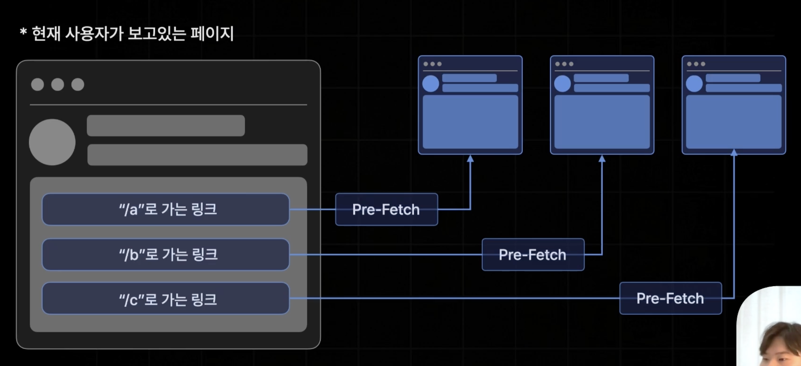
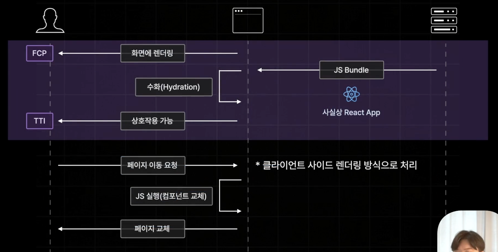
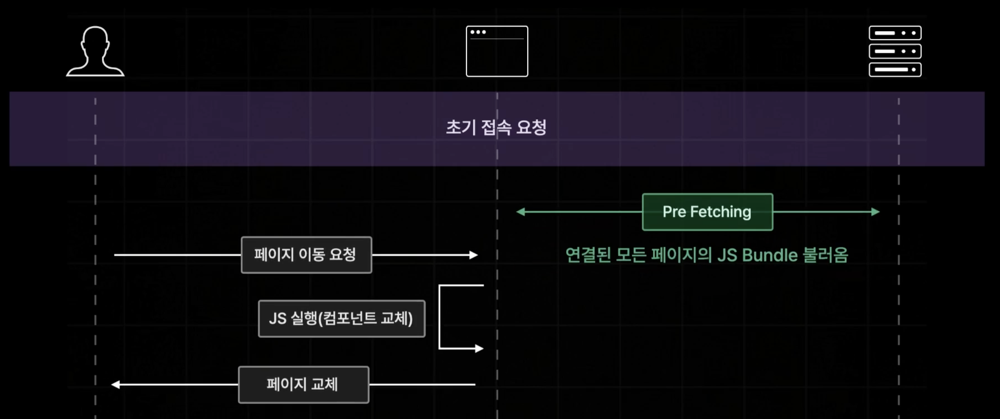
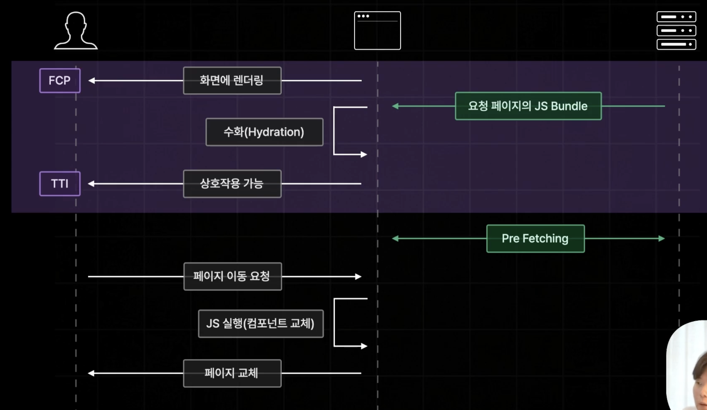
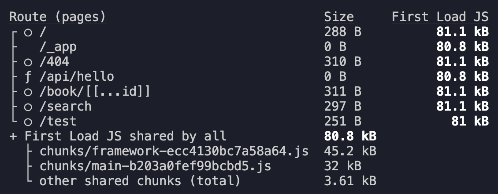
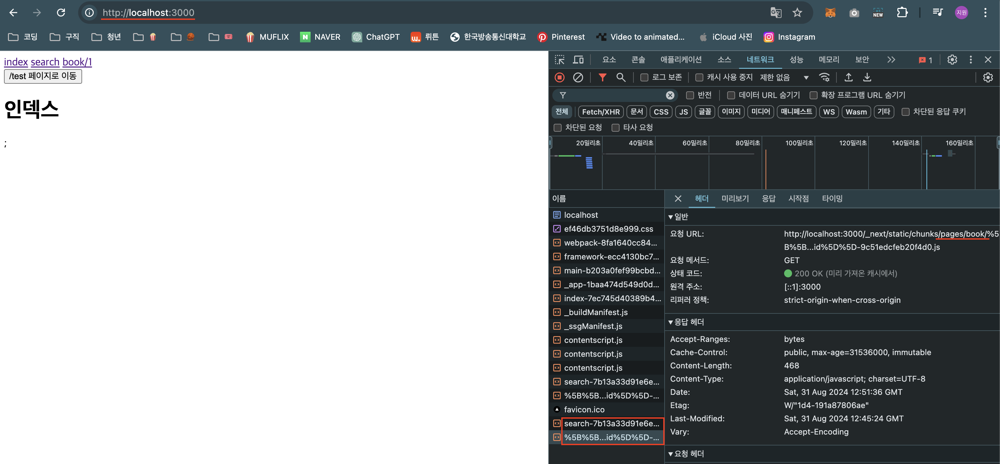
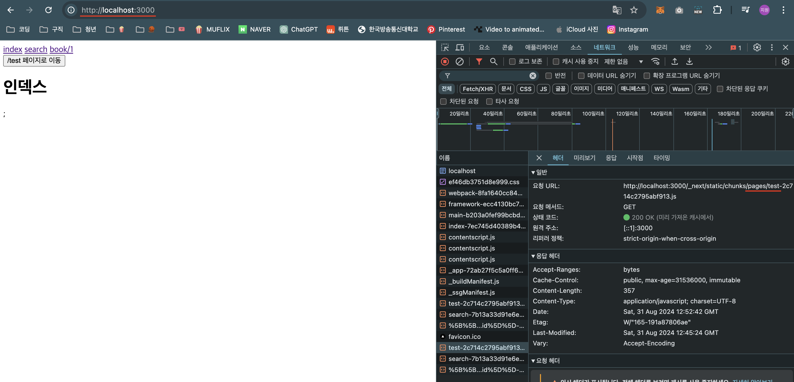
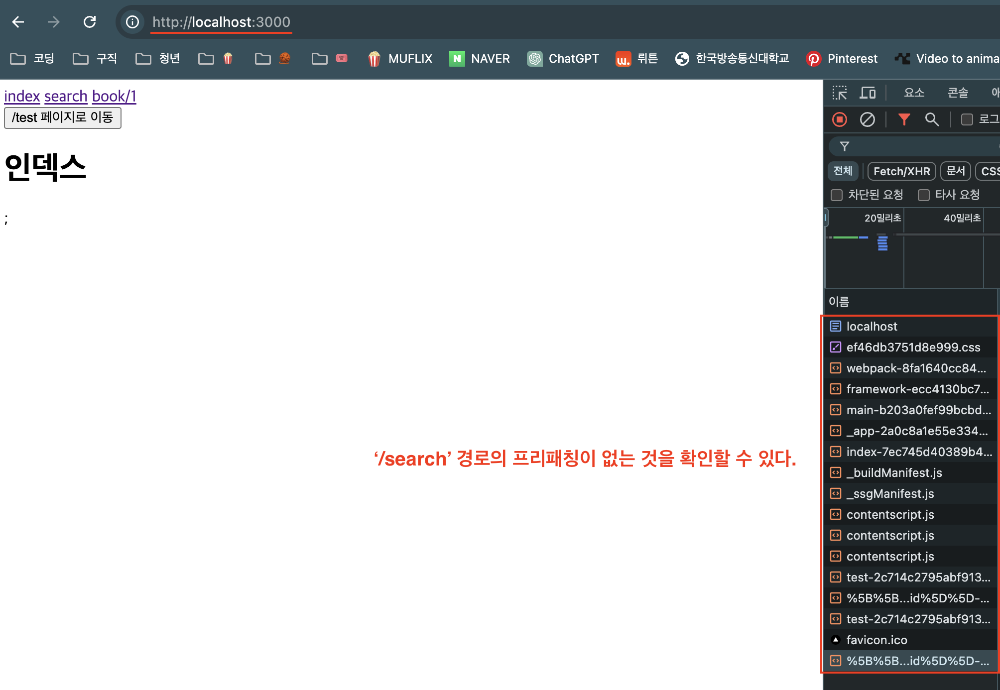

# 1. Pre-Fetching?



- 현재 사용자가 보고있는 페이지에서 링크를 통해 연결되어 있는 모든 페이지들의 JS코드를 사전에 미리 불러와 놓는 기능을 말한다.
- 패이지 이동을 매우 빠르게 지체 없이 실행하기 위해서 구현된 기능

## 🧐 Pre-Fetching 왜 필요한거지?



- Next에서는 사용자가 `초기 접속 요청`을 하면 서버가 브라우저에게 `JS Bundle` 파일을 전달해주기 때문에 페이지 이동을 요청하게 되면 브라우저에서 서버로 별도의 요청 없이 직접 `JS코드`를 실행시켜 CSR 방식으로 처리를 하게 된다.
- 이미 초기 접속 요청이 완료되어 페이지 렌더링 되었는데 왜 추가적인 데이터를 또 불러와야 하나??

<b> - Next.js는 next.js app에 작성한 모든 리액트 컴포넌트들을 자동으로 페이지별로 분리해서 저장하기 때문에 서버에서 `js 번들`을 전달할 때 모든 페이지에 필요한 JS코드가 전달되는 것이 아닌 <u>현재 페이지에 필요한 JS코드만 전달되는 것이다.</u></b>

> 예를 들어, '/search' 경로로 search 페이지로 접속요청을 보냈다면 서버에서 전달되는 JS 번들 파일에는 search 페이지에 해당하는 코드만 전달되는 것이다.

- 만약 JS번들이 모든 페이지의 번들파일을 전달하게 된다면 용량이 너무 커지게되고 Hydration도 늦어지게 되면서 유저가 경험하는 TTI의 속도가 느려지게 될 것이다.

- 때문에 이런 문제를 경제적으로 해결하기 위해 접속 요청한 페이지에 해당하는 JS 번들파일만 따로 보내주게 되면서 용량 경량화로 인해 Hydration 시간이 단축될 수 있게된다.

- 하지만 이 방식은 현재 페이지에서 다른 페이지로 이동할 때마다 JS 코드를 계속 추가로 불러와야 하고 페이지간의 이동은 느려지고 비효율적이게 될 것이다. 이런 문제를 방지하고자 Pre-Fetching 기능이 추가로 작용하는 것이다.

## 🤩 Pre-Fetching 이래서 필요하다!



- Pre-Fetching: 현재 사용자가 보고있는 웹 페이지와 연결된 모든 페이지들의 자바스크립트 코드를 미리 불러와 놓는 과정.
- 현재 페이지에서 이동할 수 있는 모든 페이지들의 자바스크립트 코드를 사전에 다 불러와 놓기 때문에 이동할 때 추가적인 데이터를 서버에 요청할 필요없이 클라이언트 사이드 렌더링 방식처럼 빠른 속도로 페이지를 이동시킬 수 있게 된다.

# 2. Next.js의 Pre-Rendering



- 초기 접속 요청 시에 모든 자바스크립트 파일이 다 전달되는 것이 아닌 접속 요청이 발생한 페이지에 해당하는 자바스크립트 번들 파일만 전달된다.

- 페이지 접속 후 프리패칭 기능을 통해 현재 페이지에서 이동할 수 있는 모든 페이지에 대한 자바스크립트 코드를 사전에 미리 불러와 놓는다.

- 최종적으로 초기 접속 요청 시에 Hydration을 더 빠르게 처리할 수 있도록 만들어 주면서 프리패칭을 통해 초기 접속 요청 이후에 페이지 이동까지 빠르게 처리하도록 동작할 수 있게되었다.

# 3. 실습으로 확인하자!

1. npm run dev로 확인하면 개발모드로 가동하고 있어 프리패칭이 동작하지 않는다.
   - 개발자 도구 > 네크워크를 켜고 페이지 이동을 시키면 이동시킬 때마다 해당 페이지에 필요한 자바스크립트 코드를 매번 서버로부터 불러오는 것을 확인할 수 있다.
2. `npm run build`로 빌드 결과가 페이지별로 빌드된 결과를 확인할 수 있다.
   
3. `npm run start`로 프로덕션 모드로 앱을 실행시켜 브라우저 개발자 모드에서 프리패칭된 결과를 확인할 수 있다.
   

- 간혹 해당 페이지에 대한 자바스크립터 코드를 다시 불러오는 로그를 확인할 숟도 있는데 캐시가 만료되어 다시 불러온 것이기 때문에 프리패칭은 그대로 동작하고 있는 것이다.

## 👩‍🏫 Link 컴포넌트가 아니면 Pre-Fetching이 이루어지지 않는다.

- `Link` 컴포넌트로 구현한 페이지 이동은 자동으로 프리패칭이 이루어 졌지만, 프로그래매틱하게 페이지를 이동하도록 설정을 한 경우에는 프리패칭이 이루어지지 않는다.

- 이런 경우에도 똑같이 프리패칭을 시켜주기 위해서 useRouter를 실행해서 반환받은 객체의 특정 메소드를 통해 직접 프로그래매틱하게 프리패칭 하도록 코드를 작성할 수 있다.

1. `useEffect`훅을 사용해 페이지가 마운트 될 때 특정 페이지를 프리패칭 할 수 있도록 router 객체의 `prefetch()`메소드를 사용해 인자로 프리패칭할 페이지의 경로를 문자열로 작성한다.

```ts
const router = useRouter();

const onClickButton = () => {
  router.push("/test");
};

useEffect(() => {
  router.prefetch("/test");
}, []);
```

2. `npm run build`로 변경된 코드를 다시 빌드시키고 `npm run start`로 코드를 실행해 브라우저의 개발자모드>네크워크에서 Link가 아닌 `useRouter`로 페이지 이동한 경로도 프리패칭이 이루어진 것을 확인할 수 있다.
   

## 👩‍🏫 Link 컴포넌트의 Pre-Fetching을 강제로 해제할 수 있다.

- 만약 Link로 페이지 이동을 설정한 경로가 잘 접속할 것 같지 않아 프리패칭을 굳이 하지 않아도 된다고 가정한다.

1. Link 컴포넌트의 `prefetch` props의 값을 `false`로 설정한다.

```ts
<>
  <header>
    <Link href={"/"}>index</Link>
    &nbsp;
    <Link href={"/search"} prefetch={false}>
      {" "}
      //프리패칭 해제 search
    </Link>
    &nbsp;
    <Link href={"/book/1"}>book/1</Link>
    <div>
      <button onClick={onClickButton}>/test 페이지로 이동</button>
    </div>
  </header>
  <Component {...pageProps} />;
</>
```

2. `npm run build`로 변경된 코드를 다시 빌드시키고 `npm run start`로 코드를 실행해 브라우저의 개발자모드>네크워크에서 `prefetch` props의 값을 false로 설정한 '/search'의 경로가 프리패칭이 이루어지지 않은 것을 확인할 수 있다.
   
