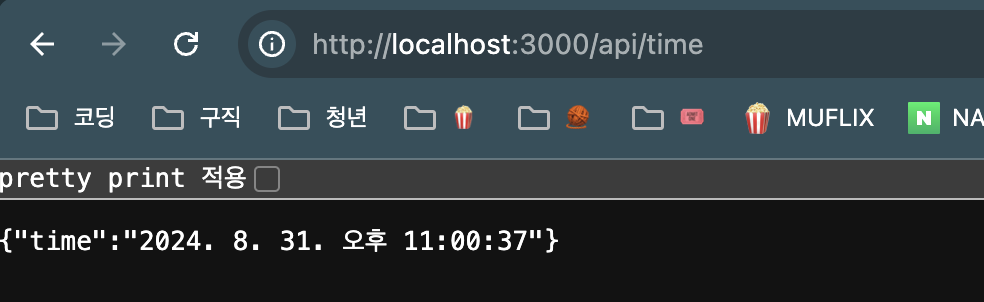

# 1. API Routes?

- Next.js에서 API를 구축할 수 있게 해주는 기능
- 브라우저로부터 요청을 받아 데이터베이스에서 데이터를 빋이오던가 다른 서드파티 데이터를 불러와서 전달을 해주는 등의 동작을 직접 만들 수 있다.

# 2. Pages/api

- Psges/api 폴더 아래 새로운 파일들을 배치시켜주면 해당 파일들은 API Routes로서 웹 페이지를 정의하는 파일이 아닌 API 응답을 정의하는 코드로서 설정된다.

# 3. 현재 시간을 출력하는 API 만들기

1. Pages/api 경로에 'time.ts'라는 파일을 만든다.

2. `export default function handler(){}`로 api를 동작해 출력할 함수를 만든다.

3. 함수의 매개변수로 `req`, `res` (매개변수 이름은 임의로 설정할 수 있음)를 받고 각 타입으로 `NextApiRequest`, `NextApiResponse` 타입으로 정의한다.

   - `NextApiRequest`, `NextApiResponse` 타입은 Next.js에서 자체적으로 기본 제공하는 타입이다.

4. 현재 시간의 값을 담은 변수 date를 선언하고 응답값(res)으로 현재 시간을 toLocaleString값으로 출력한다.

```ts
import type { NextApiRequest, NextApiResponse } from "next";

export default function handler(req: NextApiRequest, res: NextApiResponse) {
  const date = new Date();
  res.json({ time: date.toLocaleString() });
}
```

5. URL에 '~/api/time'를 입력하여 출력된 api 값을 확인할 수 있다.


