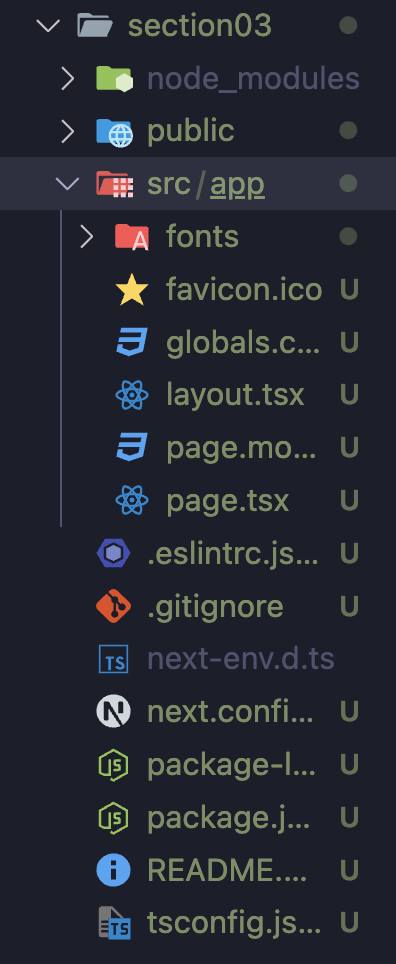

# App Router?

- Next.js v.13부터 새롭게 추가된 기존의 Page Router를 대체하는 완전히 새로운 개념의 라우터
- 변경되거나 추가되는 사항
  - 페이지 라우팅 설정 방식 변경
  - 레이아웃 설정 방식 변경
  - 데이터 페칭 방식 변경
  - React 18 신규 기능 사용가능
    - 예. React Server Component / Streaming
- 크게 변경되지 않는 사항
  - 네비게이팅 (Navigating)
  - 프리페칭 (Pre-Fetching)
  - 사전 렌더링 (Pre-Rendering)

# App Router 기반의 Next App 생성하기

1. 터미널에 Next App 패키지를 생성하는 명령어 입력

```bash
npx create-next-app@rc '폴더명'
```

- `@rc`는 정식 출시되지 않은 버전을 의미한다.(아직 정식 출시되지 않은 15버전을 사용하기 위함이다.)



- `next.config.mjs`: Next App의 옵션을 설정해주는 파일
- `globals.css`: 글로벌 css 설정 파일
- `layout.tsx`: 레이아웃 설정 파일
- `page.tsx`: 페이지 역할을 하는 파일
