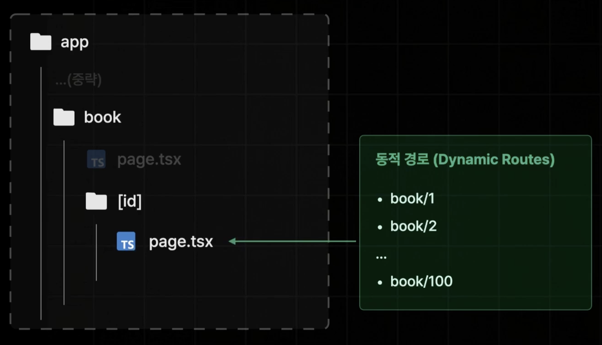

# App Router

- `App`이라는 폴더 구조를 기반으로 라우팅을 설정한다.
- `page`라는 이름을 갖는 파일만 Page 파일로 취급된다.
  
  

# 쿼리스트링, params 값 사용하는 방법

- App Router에서는 페이지 컴포넌트에 자동으로 전달되는 `props`를 통해 쿼리스트링, params 값을 사용할 수 있다.
- props를 콘솔 찍어보면 VSC 터미널에서 값을 확인할 수 있다.

  ```bash
  { params: {}, searchParams: {q: '한입' } }
  ```

  - 쿼리스트링

    ```ts
    export default function Page({
      searchParams,
    }: {
      searchParams: { q?: string };
    }) {
      return <div>search {searchParams.q}</div>;
    }
    ```

  - params
    ```ts
    export default function Page({
      params,
    }: {
      params: { id: string | string[] };
    }) {
      return <div>book/{params.id} page</div>;
    }
    ```
