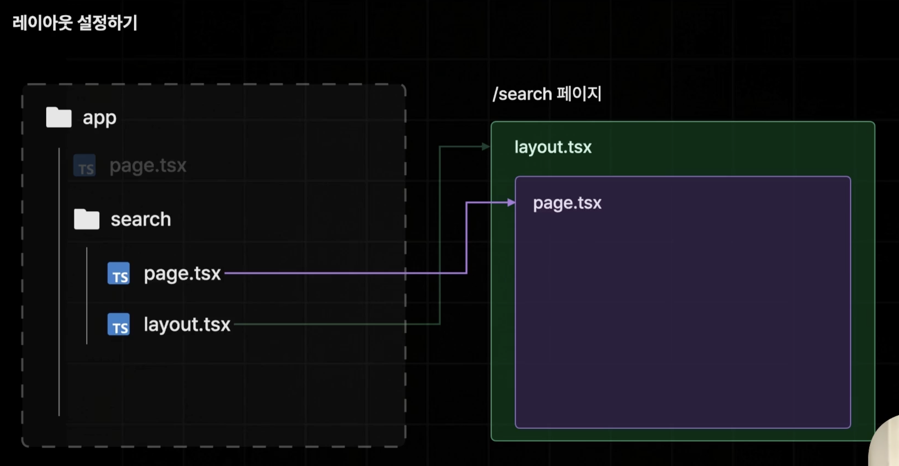
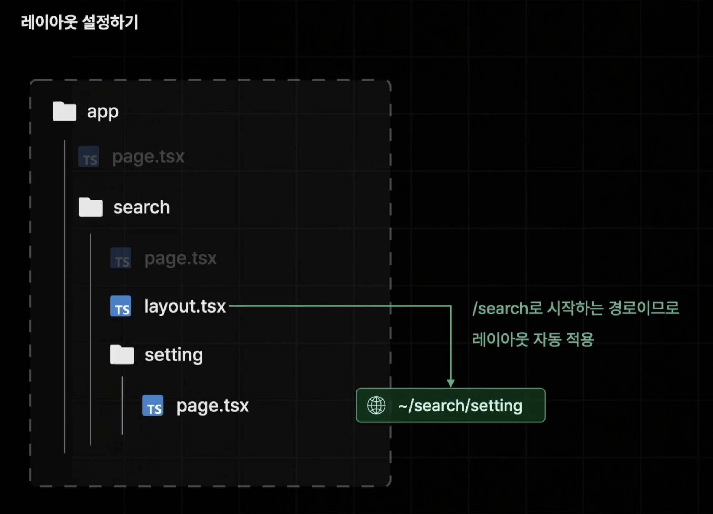
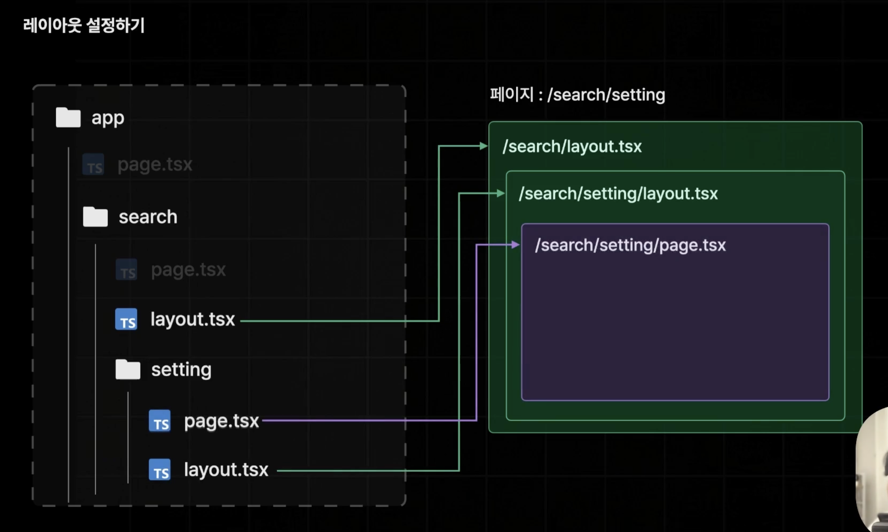
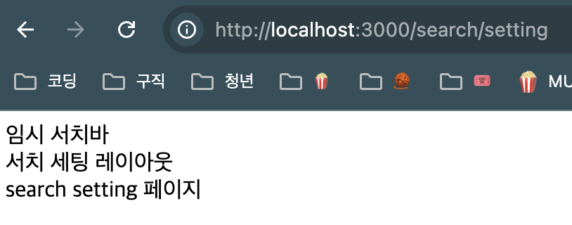
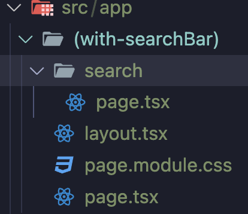

# App Router에서 Layout 적용하기

## Layout 파일은 저장된 폴더에 자동으로 설정된다.



- 위의 그림처럼 search 폴더에 layout.tsx 파일을 생성하게 되면 이 파일은 '/search' 페이지의 레이아웃으로써 자동으로 설정된다.
- 레이아웃 컴포넌트가 먼저 렌더링되고 그 다음 페이지 컴포넌트가 렌더링된다.



- 이 레이아웃은 '/search' 뿐만 아니라 '/search' 경로로 시작하는 모든 페이지의 레이아웃으로 적용된다.



- 레이아웃 세팅이 된 폴더 하위에 새로운 레이아웃 파일이 추가되면 레이아웃은 자동으로 중첩되어 적용된다.
- 상위 폴더에 있는 레이아웃이 적용되고 그 안에 하위 폴더의 레이아웃이 적용된다. 마지막으로 페이지 컴포넌트가 렌더링되며 마무리된다.

# src/app/layout.tsx

- Next.js App의 모든 페이지에 공통적으로 적용되는 글로벌 레이아웃 파일
- `RootLayout` 컴포넌트는 children을 props로 받아 현재 페이지의 역할을 할 페이지 컴포넌트를 전달받는다.
- `return`문 내부에서 `<html>`, `<body>` 안에 `{children}`을 받아 페이지 컴포넌트를 렌더링한다.
- `RootLayout` 컴포넌트는 html 페이지의 기초 틀을 잡아주는 역할을 한다.
- 절대 없어지면 안되는 파일이다.
  - 만약 개발자가 실수로 해당 파일을 삭제하거나 이름을 변경하게 되면 서비스를 가동할 수 없기 때문에 Next.js가 자동으로 `RootLayout`을 생성한다.

```ts
export default function RootLayout({
  children,
}: Readonly<{
  children: React.ReactNode;
}>) {
  return (
    <html lang="en">
      <body className={`${geistSans.variable} ${geistMono.variable}`}>
        {children}
      </body>
    </html>
  );
}
```

# Layout 컴포넌트 만들어보기 ('/search' 페이지 적용)


- '/search'페이지에서 적용할 레이아웃을 생성하고자 한다.

1. src/app/search/layout.tsx 파일 생성

2. `export default function Layout() {}` 컴포넌트 생성

3. props로 `{children}` 객체 받아와 현재 페이지 노출
   - 현재 페이지를 `{children}` 객체로 전달받지 않으면 next에서는 레이아웃만 노출되게 된다.

```ts
import { ReactNode } from "react";

export default function Layout({ children }: { children: ReactNode }) {
  return (
    <div>
      <div>임시 서치바</div>
      {children}
    </div>
  );
}
```

# Layout 컴포넌트 만들어보기 ('/search/setting' 페이지 적용)

- '/search/setting' 페이지에 레이아웃이 중첩으로 적용되는 것을 확인하고자 한다.

1. 'search/setting/layout.tsx' 생성 및 레이아웃 생성

   - search/setting/layout.tsx

     ```ts
     import { ReactNode } from "react";

     export default function Layout({ children }: { children: ReactNode }) {
       return (
         <div>
           <div>서치 세팅 레이아웃</div>
           {children}
         </div>
       );
     }
     ```

   - search/setting/page.tsx
     ```ts
     export default function Page() {
       return <div>search setting 페이지</div>;
     }
     ```



# RouteGroup을 이용하여 공통되지 않은 경로의 페이지에 동일한 레이아웃 적용하기 ('/', 'search' 페이지 적용)

- '/'루트 경로와 '/search' 페이지에 동일한 레이아웃을 적용하고자 한다. (단, 'book/~' 경로에는 적용하지 않는다.)
  ***
  ### 👩‍🏫 라우트 그룹(Route Group)?
  - 라우트 그룹은 경로상에는 아무런 영향을 미치지 않는 폴더를 의미한다.
    - ex. 'src/app/(routeGroup)/test/page.tsx'의 경로에 파일이 있다고 가정하면 해당 페이지 컴포넌트는 '~/test'에서 정상적으로 렌더링될 것이다.
  - 각기 다른 경로를 갖는 페이지 파일을 하나의 폴더 안에 묶어둘 수 있는 기능이다.
  - 이 라우트 그룹을 이용하면 다른 경로의 페이지 파일에 동일한 레이아웃을 적용할 수 있디.
  ***

1. 폴더명을 소괄호()로 감싸서 라우트 그룹을 만든다.

   - (with-searchBar)

2. (with-searchBar) 폴더에 '/app/page.tsx'파일과 '/app/search' 폴더를 이동한다.

3. (with-searchBar) 폴더에 layout.tsx 파일을 생성하여 공통적으로 적용시킬 레이아웃을 생성한다.


