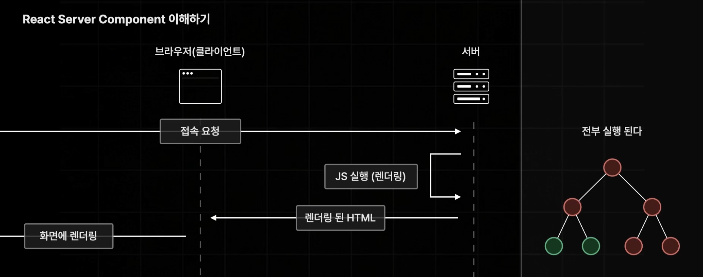
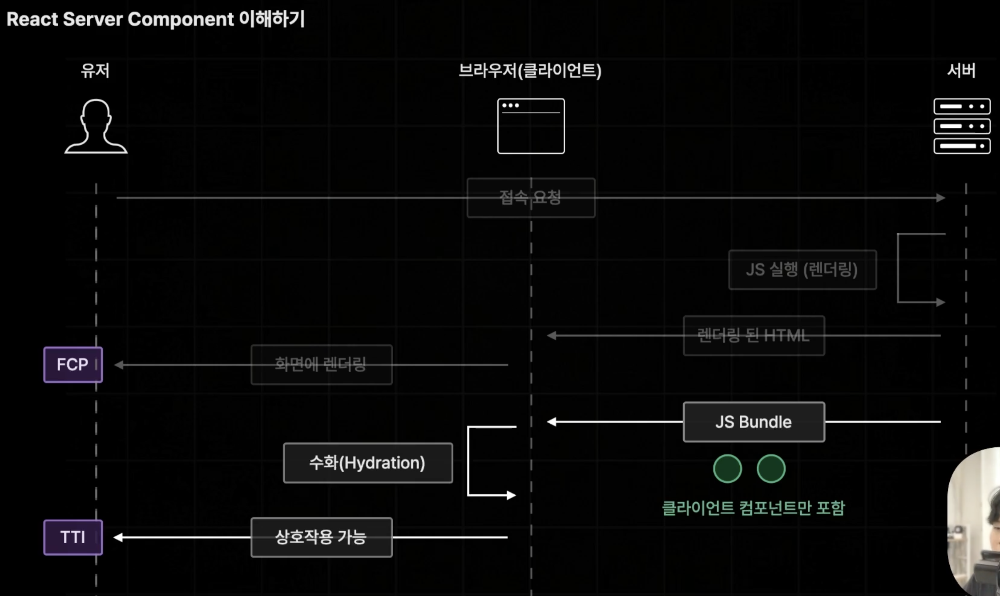
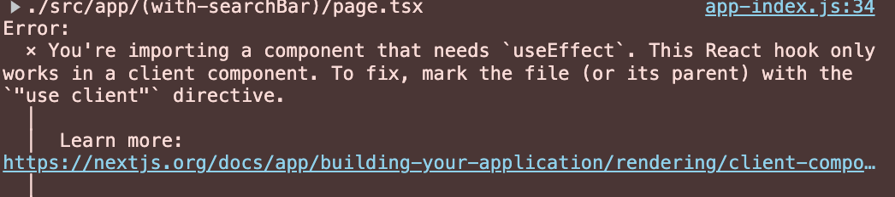
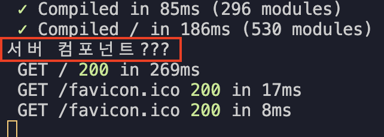

# React Server Component

- 리액트 18버전 부터 새롭게 추가된 새로운 유형의 리액트 컴포넌트
- 오직 서버 측에서만 실행이 되는 컴포넌트

# 🧐 리액트 서버 컴포넌트가 나오기 전엔 어떤 문제가 있었을까?

## 불필요한 컴포넌트들의 불필요한 하이드레이션!



- 넥스트에서는 사전 렌더링과 JS번들을 브라우저에 그려주는 렌더링 총 2번의 렌더링을 진행하게 된다.
- 이 과정에서 브라우저와 상호작용을 하지 않는 컴포넌트는 사전 렌더링 과정만 진행하면 된다.
- 기존의 next에서는 모든 컴포넌트들이 2번의 렌더링을 진행했기 때문에 JS 번들의 크기가 불필요하게 커지면서 TTI 과정이 오래 걸린다는 단점이 있었다.

## 리액트 서버 컴포넌트로 서버에서만 렌더링하자!



- 상호작용이 없는 컴포넌트들은 서버 컴포넌트로 분류하고 상호작용을 하는 컴포넌트는 기존의 클래식한 컴포넌트를 사용하여 분리해준다.
- 서버가 브라우저의 요청으로 사전 렌더링을 진행하는 과정에서는 서버 컴포넌트와 클라이언트 컴포넌트 모두 동일하게 실행되지만 이후 하이드레이션 과정에서 서버 컴포넌트는 제외되고 클라이언트 컴포넌트만 한 번더 실행된다.

# Next.js 공식문서 권장사항

- 페이지의 대부분을 서버 컴포넌트로 구성할 것을 권장한다.
- 클라이언트 컴포넌트는 꼭 필요한 경우에만 사용할 것.

# App Router에서는 기본적으로 모든 컴포넌트를 서버 컴포넌트로 설정한다.

- App Route에서 별도로 서버 컴포넌트로 작성할 필요가 없다.
- Page 컴포넌트에서 콘솔을 찍어보면 브라우저 > 개발자모드 에서는 콘솔내용을 확인할 수 없지만 VSC 터미널에서는 확인이 가능하다.
  
- page Router에서 `getServerSideProps`나 `getStaticProps` 같은 역할을 페이지 컴포넌트에서 직접 데이터를 불러올 수 있다.
- 때문에 브라우저에서 할 수 있는 일은 컴포넌트 내부에서 수행할 수 없다.

  - 예. useEffect: 브라우저에서만 동작하는 기능이기 때문에 클라이언트 컴포넌트에서만 수행가능하다.

    ```ts
    export default function Home() {
      console.log("서버 컴포넌트???");

      useEffect(() => {});

      return <div>index</div>;
    }
    ```

    

# 클라이언트 컴포넌트 설정방법

- 해당 파일의 최상단에 `"use client"`를 작성한다.
- 해당 파일안에 있는 컴포넌트들은 모두 클라이언트 컴포넌트로 설정된다.

# Co-location

- 파일의 이름이 page, layout이 아니면 일반적인 js, ts 파일로 간주하기 때문에 'src/app'폴더 안에 필요한 컴포넌트 파일을 생성하여 배치해도 된다.
