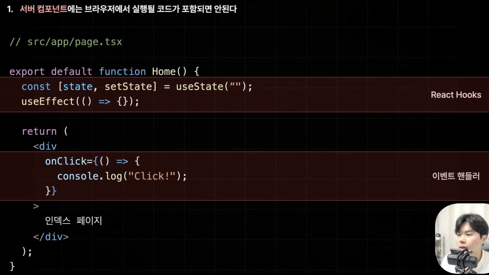
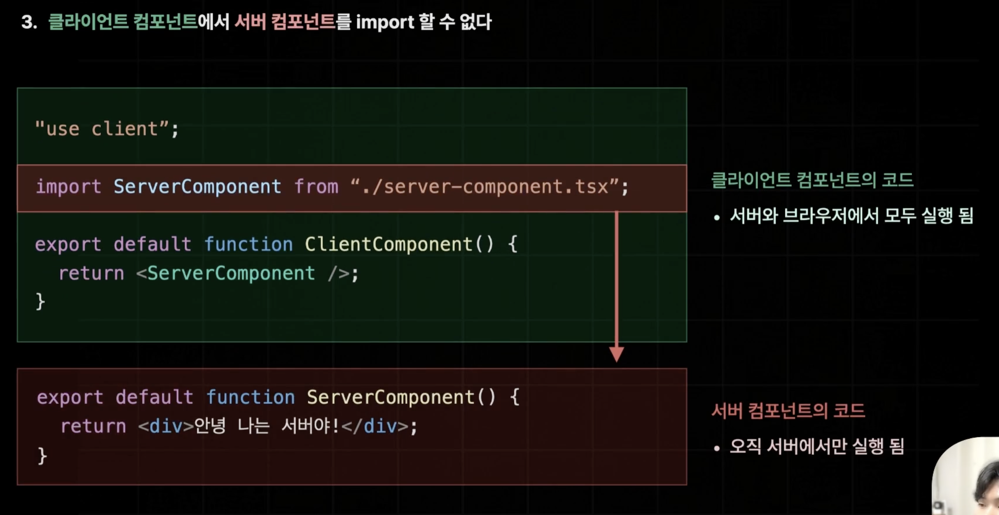
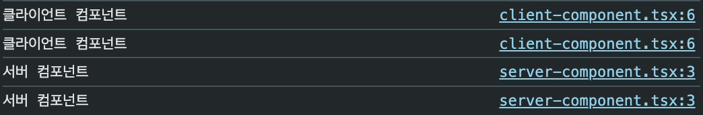
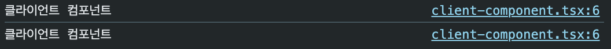
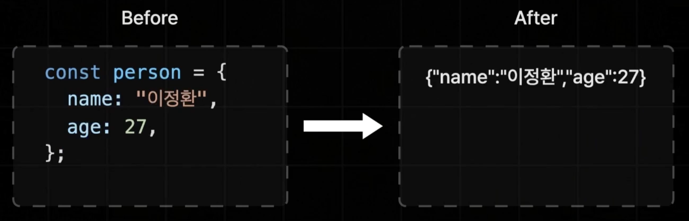
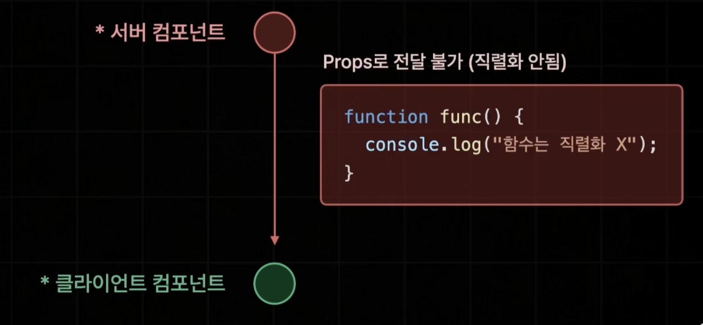
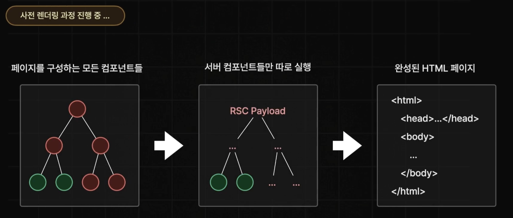
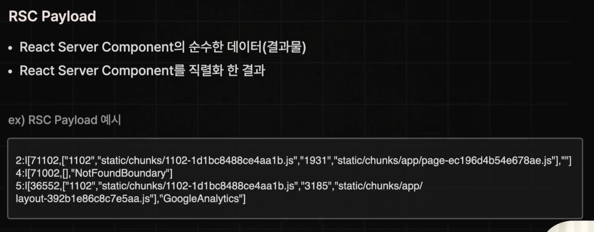

# 리액트 서버 컴포넌트 주의사항

# 1. 서버 컴포넌트에는 브라우저에서 실행될 코드가 포함되면 안된다.

- `useState()`, `useEffect()`같은 리액트 hooks나 `onClick`, `onChacge` 등의 이벤트 핸들러는 서버 컴포넌트에서 사용될 수 없다.

- 어떠한 라이브러리가 브라우저 측에서 실행되는 기능을 담고 있다면 해당 라이브러리는 서버 컴포넌트에서 실행될 수 없다.
  

# 2. 클라이언트 컴포넌트는 클라이언트에서만 실행되지 않는다.

- 서버 컴포넌트는 사전 렌더링 과정 단 한번만 실행이 되지만, 클리이언트 컴포넌트는 사전 렌더링 한 번, 하이드레이션을 위한 브라우저에서 한 번 총 2번의 실행이 이루어진다.

# 3. 클라이언트 컴포넌트에서 서버 컴포넌트를 import 할 수 없다.



- 클라이언트 컴포넌트는 2번의 실행이 이루어지지만 서버 컴포넌트는 사전 렌더링 과정에서만 실행되기 때문이다.

  - 사전 렌더링 과정에서는 서버와 클라이언트 컴포넌트 둘 다 실행되기 때문에 클라이언트 컴포넌트에서 서버 컴포넌트를 `import` 시켜도 문제없이 수행이 이루어진다.
  - 하지만 하이드레이션을 위해 브라우저에서 실행될 때는 클라이언트 컴포넌트는 실행이 되지만 서버 컴포넌트는 존재하지 않기 때문에 없는 코드를 `import`하려고 해 오류가 발생한다.

  ## Next.js는 import한 서버 컴포넌트를 자동으로 클라이언트 컴포넌트로 바꿔준다.

  - Next를 개발하다보면 컴포넌트의 개수가 많아지고 서버 컴포넌트를 `import`해오는 경우가 종종 발생할 수 있다.
  - next에서는 런타임 에러를 반환하는 대신 서버 컴포넌트를 클라이언트 컴포넌트로 바꿔서 해석해준다.

    ### 한 번 실행해보자.

    - 서버 컴포넌트
      ```ts
      export default function ServerComponent() {
        console.log("서버 컴포넌트");
        return <div></div>;
      }
      ```
    - 클라이언트 컴포넌트

      ```ts
      "use client";

      import ServerComponent from "./server-component";

      export default function ClientComponent() {
        console.log("클라이언트 컴포넌트");
        return <ServerComponent />;
      }
      ```

    - 페이지 컴포넌트

      ```ts
      import ClientComponent from "./client-component";
      import styles from "./page.module.css";

      export default function Home() {
        return (
          <div>
            index
            <ClientComponent />
          </div>
        );
      }
      ```

    

    - 서버 컴포넌트는 서버에서 단 한 번만 실행되어 브라우저 콘솔에는 보이지 않아야 하지만, 클리이언트 컴포넌트에서 `import`했기 때문에 `"use client"`라는 디렉티브 없이도 자동으로 클라이언트 컴포넌트로 변경되어 브라우저에 콘솔이 찍히는 것을 확인할 수 있다.

    ❗️하지만 JS 번들의 크기를 최소화하고 블필요한 클라이언트 컴포넌트를 줄이기 위해 서버 컴포넌트를 import하는 행위는 최대한 피해야한다.

## 👩‍🏫 클라이언트 컴포넌트가 서버 컴포넌트를 자식으로 두는 방법 => props로 children 객체를 받자!

- 클라이언트 컴포넌트

  ```ts
  "use client";

  import { ReactNode } from "react";

  export default function ClientComponent({
    children,
  }: {
    children: ReactNode;
  }) {
    console.log("클라이언트 컴포넌트");
    return <div>{children}</div>;
  }
  ```

- 페이지 컴포넌트

  ```ts
  import ClientComponent from "./client-component";
  import ServerComponent from "./server-component";

  export default function Home() {
    return (
      <div>
        index
        <ClientComponent>
          <ServerComponent />
        </ClientComponent>
      </div>
    );
  }
  ```

  

- children으로 전달된 서버 컴포넌트는 클라이언트 컴포넌트로 변경되지 않는다.
- 클라이언트 컴포넌트는 서버 컴포넌트를 직접 실행할 필요 없이 서버 컴포넌트의 결과물만 children으로 전달받아 렌더링만 하면 되기 때문이다.

# 4. 서버 컴포넌트에서 클라이언트 컴포넌트에게 직렬화 되지 않는 Props는 전달 불가하다.

## 직렬화?

- 자바스크립트의 객체나 배열, 클래스 같은 복잡한 구조를 갖는 어떠한 값을 데이터베이스에 저장하거나 네크워크 상으로 전송하기 위해서 문자열이나 바이트 등의 단순한 형태로 변환하는 과정을 말한다.
  
- 자바스크립트의 함수는 코드 블럭을 포함하는 특수한 형태를 가지고 있으며 클로저, 랙시컬 스코프 등의 다양한 환경에 의존해있는 경우가 많기 때문에 이런 모든 정보를 단순한 문자열이나 바이트의 형태로 표현할 수 없다.
  

## 서버 컴포넌트의 동작 방식

- 서버 컴포넌트는 사전 렌더링 과정에서만 실행이 된다.



- 사전 렌더링 과정에서는 서버 컴포넌트들이 먼저 실행되고 그 이후에 클라이언트 컴포넌트들이 뒤이어 실행된다.
- 서버 컴포넌트만 따로 실행하게 되면 RSC Payload라는 JSON과 비슷한 형태의 문자열이 생성된다.

  ### RSC Payload?

  

  - RSC Paylosd는 서버 컴포넌트와 관련된 모든 데이터가 들어있다.
    - 서버 컴포넌트의 렌더링 결과
    - 연결된 클라이언트 컴포넌트의 위치
    - 클라이언트 컴포넌트에게 전달하는 Props 값 등

- 따라서 사전 렌더링 과정 중에는 서버 컴포넌트들이 먼저 RSC Payload라는 형태로 먼저 직렬화되고 클라이언트 컴포넌트들이 마저 실행되어 RSC Payload 결과와 합쳐져 HTML 페이지가 생성된다.

<b>따라서, RSC Payload 형태로 직렬화하는 과정에서 직렬화할 수 없는 함수의 정보를 props로 전달한다면 런타임 에러가 발생하게 된다.</b>
