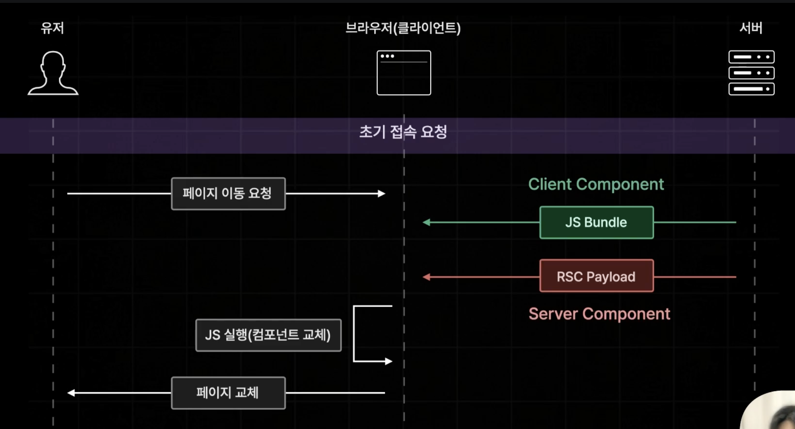
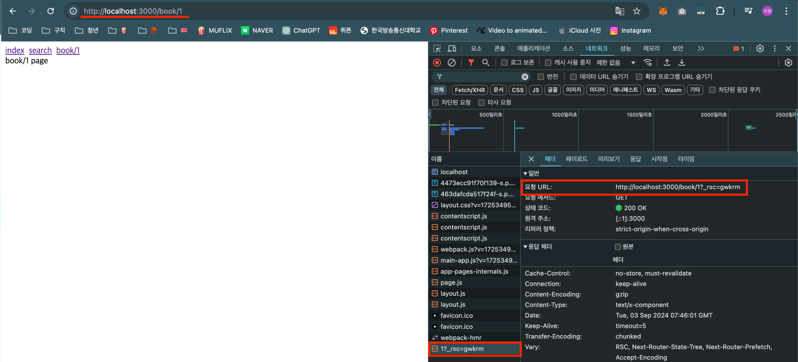
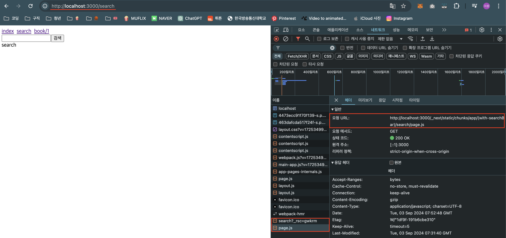
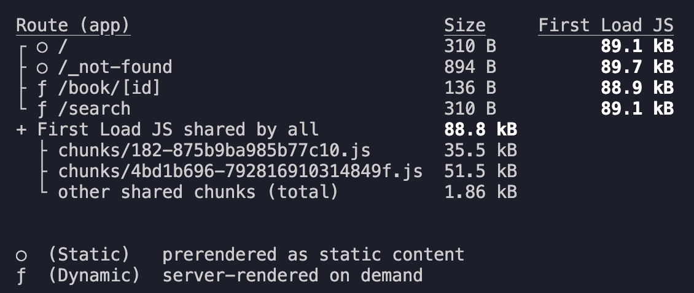

# 페이지 이동은 Client Side Rendering 방식으로 처리된다.

- Page Router와 동일한 방식인 CSR 방식으로 처리한다.
- 다만, Server Compoent가 추가되면서 방식이 조금 변경되었다.



- App Router 버전에서는 페이지 이동이나 프리패칭 시 Next.js 서버가 브라우저에게 JS번들 + RSC Payload가 전달된다.
  - JS 번들: 클라이언트 컴포넌트만 들어있다.
  - RSC Payload: 서버 컴포넌트들만 들어있디.
  - 때문에 Page Router처럼 JS 번들만 보내게되면 서버 컴포넌트들에 대한 데이터는 빠져있기 때문에 정상적으로 페이지를 이동시킬 수 없게된다.
- 페이지 이동이 발생하게 되면 브라우저에서 JS 번들을 실행해서 RSC Payload와 합쳐 페이지를 교체하게 되는 것이다.

## 확인해보자!

1.  서버 컴포넌트

    ```ts
    export default function Page({
      params,
    }: {
      params: { id: string | string[] };
    }) {
      return <div>book/{params.id} page</div>;
    }
    ```

    

    - 서버 컴포넌트에서는 '~\_rsc~'로 페이지에 대한 RSC Payload가 불러와진것을 확인할 수 있다.
    - 해당 페이지는 클라이언트 컴포넌트가 없기 때문에 JS번들 파일이 없는 것이다.

2.  클라이언트 컴포넌트

    ```ts
    import ClientComponent from "@/app/components/client-component";

    export default function Page({
      searchParams,
    }: {
      searchParams: { q?: string };
    }) {
      return (
        <div>
          search {searchParams.q}
          <ClientComponent>
            <></>
          </ClientComponent>
        </div>
      );
    }
    ```

    

    - RSC Payload와 JS번들이 불러와지고 있는 것을 확인할 수 있다.

# Pre-Fetching

## Static Page, Dynamic Page



- App Router의 모든 페이지는 Static 페이지와 Dynamic 페이지로 나뉘게 된다.
  - Static 페이지는 SSG 방식으로 빌드 타임에 미리 생성이 된 정적인 페이지.
  - Dynamic 페이지는 SSR 방식으로 브라우저가 요청을 보낼 때마다 즉각적으로 생성하게 되는 동적인 페이지.
- 기본적으로는 모든 페이지가 Static 페이지로 설정이 되는데 페이지 내부에서 쿼리스트링을 꺼내 쓴다던가 URL 파라미터를 꺼내쓰는 등의 동작을 수행할 경우에는 Dynamic 페이지로 설정된다.
- 이 페이지의 유형에 따라 프리패칭의 결과가 달라지게 된다.

## Static, Dynamic이 Pre-Fetching에 끼치는 영향

- Static 페이지의 경우 데이터의 업데이트가 추가로 필요하지 않으니 RSC Payloadㅇ와 JS번들을 한꺼번에 불러오게 된다.
- Dynamic 페이지의 경우 데이터의 업데이트가 필요할 수 있으니 RSC Payload만 프리패칭하고 JS 번들의 경우 실제 페이지 이동이 발생했을 때 불러오게 된다.
