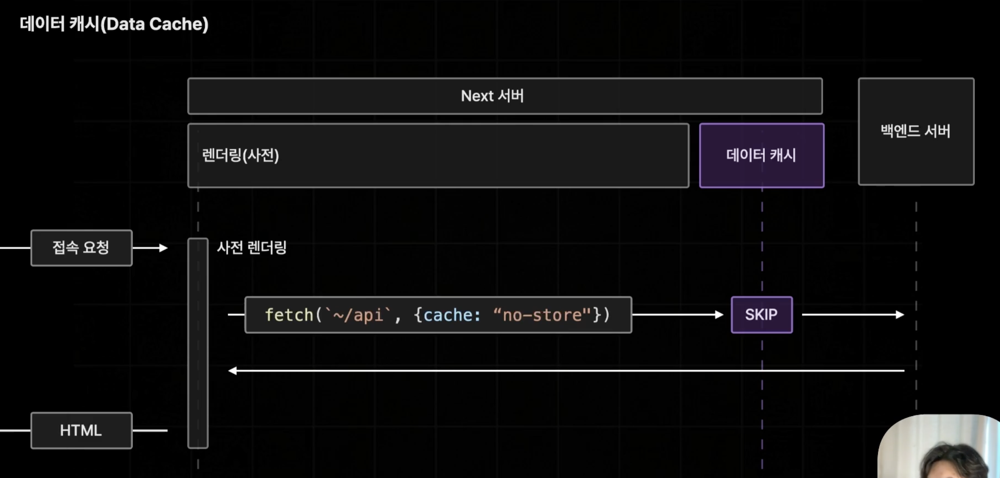
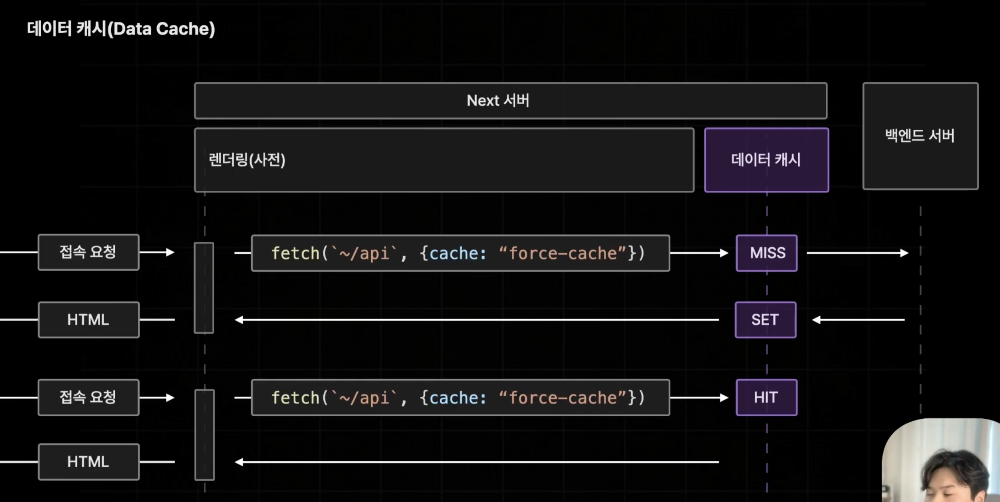
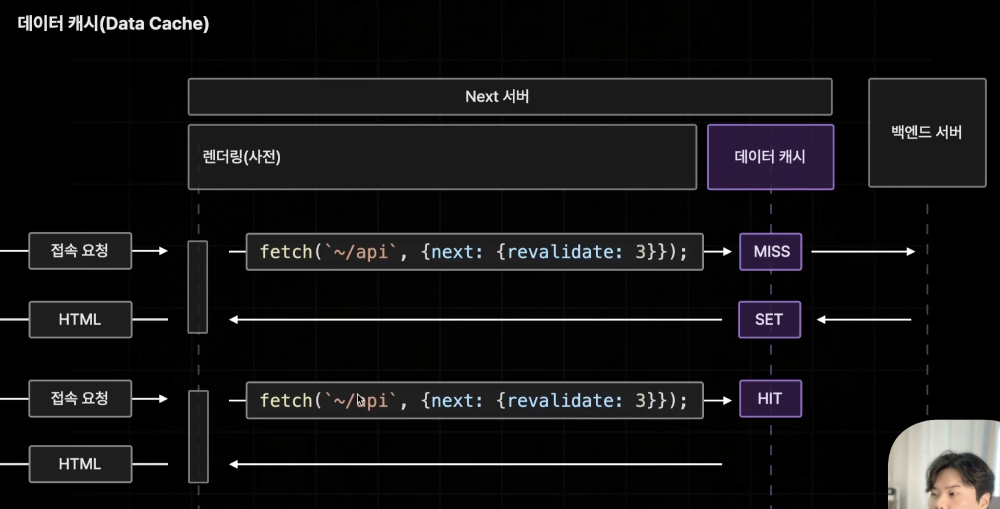
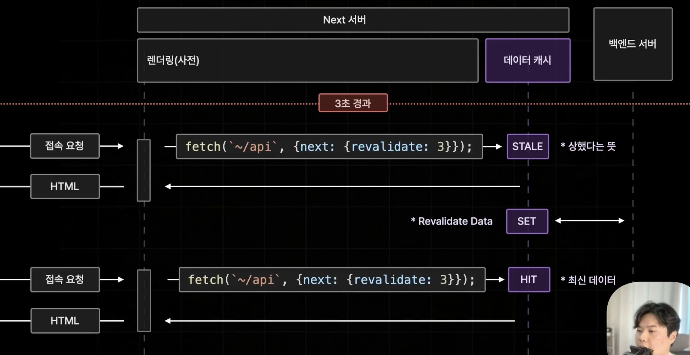
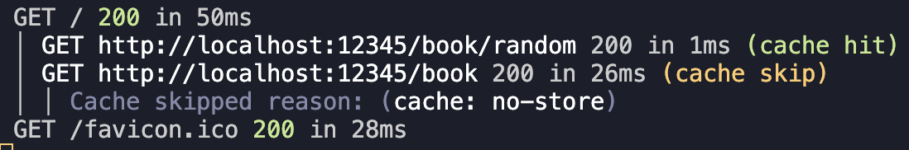

# 데이터 캐시(Data Cache)?

- `fetch` 메서드를 활용해서 API 서버로부터 불러온 데이터를 next 서버측에서 캐싱해두는 기능
- 데이터 캐시를 이용해서 한 번 불러온 데이터를 영구적으로 저장해서 불필요한 데이터 페칭을 방지하던지 특정 시간을 주기로 캐싱해둔 데이터를 새롭게 갱신하여 불필요한 요청 수를 줄여 웹 서비스의 성능을 개선할 수 있다.

- Next.js의 데이터 캐시는 `fetch` 메서드의 두 번째 인수로 객체 형태의 추가 옵션을 통해 설정할 수 있다.

# 👩‍🏫 오직 `fetch` 메서드를 통해서만 옵션을 사용할 수 있다!

- `Axios`등의 다른 HTTP 리퀘스트 라이브러리에서는 활용될 수 없다.
- Next.js에서 제공하는 `fetch` 메서드는 일반적인 fetch 메서드가 아닌 Next.js에서 자체적으로 데이터 캐시와 관련된 여러 기능을 덧붙여 놓은 일종의 확장판 개념의 메서드이기 때문이다.

# 👩‍🏫 데이터 페칭의 로그를 확인하기 위한 설정!

- 루트 경로의 next.config.mjs 파일을 아래와 같이 수정한다.
  - next.config.mjs: Next app에 옵션을 설정하는 파일
- Next app에서 발생하는 모든 데이터 패칭이 로그로써 자동으로 VSC 터미널 콘솔에 출력된다.

```js
const nextConfig = {
  logging: { fetches: { fullUrl: true } },
};
```

# 데이터 캐시 옵션들

## `no-store`

- 기본값. (옵션을 설정하지 않으면 자동으로 해당 옵션으로 설정된다.)
- 데이터 페칭의 경과를 저장하지 않는 옵션
- 캐싱을 아예 하지 않도록 설정하는 옵션

  ### `no-store`의 흐름

  

  1. 브라우저로부터 접속요청이 들어오게되면 Next 서버는 사전 렌더링을 진행한다.
  2. 사전 렌더링 진행과정에서 fetch 옵션이 `"no-store"`이면 캐싱된 데이터를 사용하지 않기 때문에 데이터 캐시를 무시하여 `SKIP`하게 된다.
  3. 백엔드 서버에게 데이터를 요청고 응답받은 데이터로 페이지를 생성해서 브라우저에 반환한다.

```ts
const allRes = await fetch(`${process.env.NEXT_PUBLIC_API_SERVER_URL}/book`, {
  cache: "no-store",
});
```


- '~/book/random': (cache skip)으로 데이터 캐싱이 동작하지 않음을 알려주고 자동으로 캐싱되지 않았다고 적혀있다.(기본값이기 때문)
- '~/book': (cache skip)으로 데이터 캐싱이 동작하지 않음을 알려주고 'no-store'로 설정되었기 때문이라고 이유가 적혀있다.

> 👩‍🏫 <b>Next ver.14은 무조건 캐싱하는 것이 기본값.<br></b>
> 15버전과는 달리 기본값이 요청의 결과를 무조건 캐싱하는 것이었다. <br>
> 그런데 많은 사람들이 불편함을 토로하여 15버전부터 바뀌게 되었다.

## `force-cache`

- 요청의 결과를 무조건 캐싱함
- 한 번 호출된 이후에는 다시는 호출되지 않음

  ### `force-cache`의 흐름

  

  1. 브라우저로부터 접속요청이 들어오게되면 Next 서버는 사전 렌더링을 진행한다.
  2. 사전 렌더링 진행과정에서 fetch 옵션이 `"force-cache"`이면 데이터 캐시에서 먼저 저장된 데이터를 찾아본다.
  3. fetch 요청이 청므으로 발생한 상황이라면 저장된 데이터가 없기 때문에 `MISS` 판정이 난다.
  4. 백엔드 서버에 데이터를 요청하고 불러온 데이터를 다음 요청시부터 새롭게 불러오지 않기 위해 데이터 캐시 안에 저장(`SET`)하게 된다.
  5. 이렇게 불러온 데이터로 페이지를 생성해서 브라우저에 반환한다.
  6. 이후에 접속 요청이 추가로 들어오게 되면 똑같이 사전 렌더링 과정을 진행하면서 데이터 페칭을 실행해 데이터 캐시에서 저장된 데이터를 찾는다.
  7. 저장된 데이터가 있으면 찾아내어(`HIT`) 백엔드 서버에 요청을 보낼 필요 없이 그대로 데이터 캐시 안에 저장되어있던 데이터를 활용하여 페이지를 생성해 브라우저에 반환하게 된다.

```ts
const recoRes = await fetch(
  `${process.env.NEXT_PUBLIC_API_SERVER_URL}/book/random`,
  { cache: "force-cache" }
);
```


- '~/book/random': (cache hit)으로 데이터 캐싱에 추가적인 동작이 발생하지 않았다는 것을 알 수 있다.


- '.next/cache/fetch-cache/~': 해당 폴더 안에 JSON 형태로 캐시된 데이터가 보관된 것을 확인할 수 있다.

## `next: {revalidate: 3}`

- 특정 시간을 주기로 캐시를 업데이트 함
- 마치 Page Router의 ISR 방식과 유사함
- `next: {revalidate: 3}`: 페치 요청으로부터 불러온 데이터를 캐싱하고 캐싱한 데이터를 3초 주기로 자동으로 Next 서버가 업데이트 한다.

  ### `force-cache`의 흐름

  
  

  1. force-cache와 동일하게 첫 번째 접속 요청이 들어오면 캐싱된 데이터가 없으니 `MISS`가 발생하고 최초로 백엔드 서버에서 데이터를 불러와 데이터 캐시에 `SET`하고 나서발생하는 요청들에는 저장해두었던 캐시된 데이터를 데이터 캐시로부터 찾아서 가져다 이용하는 방식으로 작동된다.
  2. 설정해둔 시간이 지나고 브라우저에서 접속 요청이 들어오게되면 일단 데이터 캐시의 데이터를 확인하는데 유효시간이 지난 데이터는 상한(`STALE`) 상태로 설정해두고 상한 데이터라도 빠르게 캐시된 데이터로 응답을 해서 페이지를 생성한다.
  3. 그 후 서버 측에서 데이터를 다시 백엔드 서버로부터 불러와 최신 데이터로 최신화(Revalidate / `SET`) 시키고 업데이트된 최신의 캐시로 빠르게 페이지를 생성해 반환한다.

```ts
const recoRes = await fetch(
  `${process.env.NEXT_PUBLIC_API_SERVER_URL}/book/random`,
  { next: { revalidate: 3 } }
);
```



## `next: {tags: 3}`

- On-Demand Revalidate
- 요청이 들어왔을 때 데이터를 최산화 함
- 해당 옵션은 서버 액션, 라우트 핸들러 등의 추가적인 개념을 배우고나서 실습을 하기로 한다.

```ts
const recoRes = await fetch(
  `${process.env.NEXT_PUBLIC_API_SERVER_URL}/book/random`,
  { next: { tags: ["a"] } }
);
```
