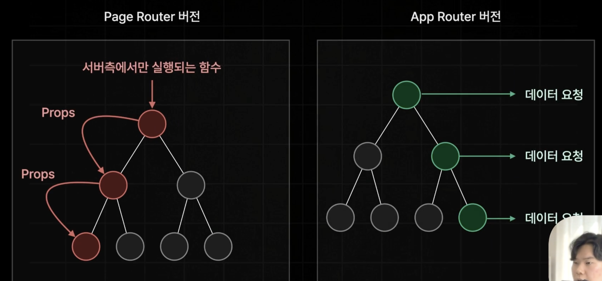

# Request Memoization

- 하나의 페이지를 서버 측에서 렌더링하는 과정에서 페이지를 구성하는 여러개의 컴포넌트에서 발생하는 API 요청들 중 중복적으로 발생하는 요청들을 캐싱해서 단 한 번만 요청할 수 있도록 자동으로 데이터 페칭을 최적화해주는 기능


- 만약 위의 그림과 같이 하나의 페이지를 구성하는 컴포넌트들 중에서 같은 API 요청이 3번 발생한다고 가정한다. (no-stare)

1. 첫 번째 요청이 발생했을 때 리퀘스트 메모이제이션에 캐싱된 데이터가 없기 때문에 `MISS` 되고 백엔드 서버에 데이터가 요청된다. 백엔드 서버에서 불러온 데이터를 `SET`한다.
2. 동일한 API에 요청이 발생하게 되면 데이터 캐시를 찾아보거나 백엔드 서버에 데이터를 요청하는 것이 아닌 리퀘스트 메모이제이션 안에 캐시된 데이터가 있는지 확인한다.
3. 리퀘스트 메모이제이션 안에 캐시된 데이터가 있어 `HIT`되면 해당 데이터를 그대로 사용해서 페이지를 렌더링한다.

# Request Memoization과 DataCache의 차이점

## Request Memoization

- 하나의 페이지를 렌더링 하는 동안에 중복된 API 요청을 캐싱하기 위해 존재한다.
- 때문에 렌더링이 종료되면 모든 캐시가 소멸된다.

## Data Cache

- 백엔드 서버로부터 불러온 데이터를 거의 영구적으로 보관하기 위해 사용된다.
- 서버 가동중에는 영구적으로 보관된다.

# 왜 Next.js에서는 Request Memoization 기능을 제공해주는 걸까?



- React Server Component의 도입으로 인해 데이터를 패칭하는 패턴이 변화했기 때문이다.
- 기존 page router에선 `getServerSideProps`같은 서버측에서만 실행되는 함수를 통해서 데이터를 불러와 필요한 컴포넌트까지 `props`로 전달해서 내려줘야 했던 반면, app router에서는 데이터가 필요한 컴포넌트에서 직접 데이터를 페칭할 수 있게되었다.
- app router에서는 이런 패턴을 사용하다보니 같은 페이지를 구성하는 서로 다른 컴포넌트에서 같은 데이터를 페칭해오는 경우가 종종 발생하곤 한다.

  ## 예시. '/'페이지에서 같은 '~/book'경로로 데이터를 페칭해오는 경우

  - '/layout.tsx'

    ```ts
    async function Footer() {
      const res = await fetch(`${process.env.NEXT_PUBLIC_API_SERVER_URL}/book`);
      const books: BookData[] = await res.json();
      const bookCount = books.length;
      return ( ... );
    }

    export default function RootLayout({
      children,
    }: Readonly<{
      children: React.ReactNode;
    }>) {
      return (
        <html lang="en">
          <body>...<Footer />...</body>
        </html>
      );
    }
    ```

    - '/page.tsx'

    ```ts
    async function AllBooks() {
      const allRes = await fetch(
        `${process.env.NEXT_PUBLIC_API_SERVER_URL}/book`,
        { cache: "no-store", });
      const allBooks: BookData[] = await allRes.json();
      return ( ... );
    }
    ```

    

    - 같은 페이지의 2개의 컴포넌트에서 동일한 '/book' 데이터 페칭을 실행한다.
    - 원래라면 2번의 데이터 페칭이 발생해야 하지만 자동으로 리퀘스트 메모이제이션이 실행되어 한 번의 데이터 페칭만 일어난 것을 터미널에서 확인할 수 있다.
