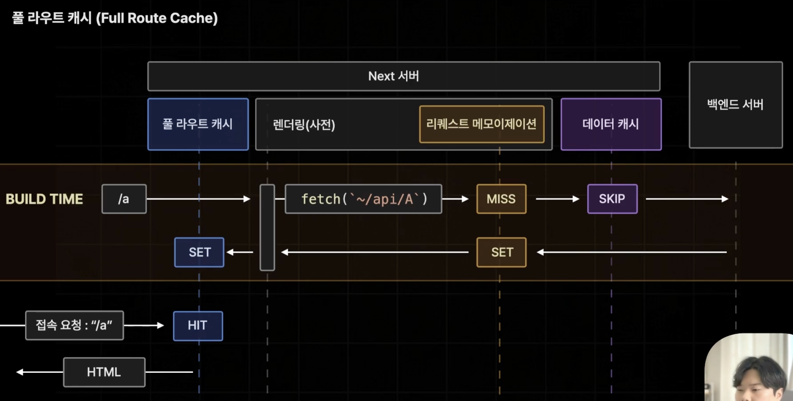
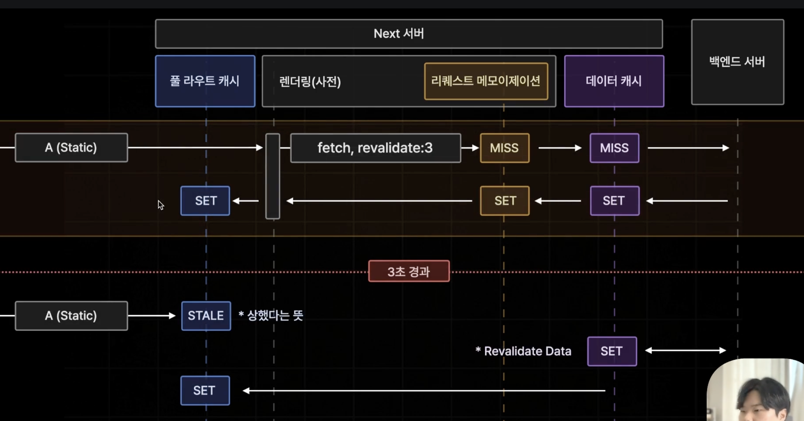

# Full Route Cache

- Next.js 서버 측에서 빌드 타임에 특정 페이지의 렌더링 결과를 미리 저장해 놓는 기능



- 만약 '/a'라는 주소를 갖는 페이지가 풀라이트 캐시에 저장되는 페이지로 설정이 되어있었다면

1. '/a'페이지는 빌드 타임에 사전 렌더링을 진행하게 된다. 리퀘스트 메모이제이션, 데이터 캐시를 거쳐 벡엔드에서 데이터를 받아오고 렌더링이 완료된 결과 반환한다.
2. Next.js 서버에 풀라우트 캐시라는 이름으로 렌더링된 결과를 미리 저장하게 된다.
3. 빌드 타임이 끝나고 Next 서버가 실제로 가동되어 '/a'페이지의 접속 요청이 들어오게 되면 빌드 타임에 미리 렌더링해서 풀라우트 캐시에 저장한 데이터를 가져와 브라우저에 전송된다.

```
풀 라우트 캐시는 정적(Static)페이지에서만 적용된다.
```

# Static Page / Dynamic Page

### Dynamic Page

- 특정 페이지가 접속 요청을 받을 때 마다 매번 변화가 생기거나 데이터가 달라질 경우
  - ex. 데이터 페칭 시 cache 옵션이 존재하지 않거나 no-store로 설정된 경우
- 동적 함수(쿠키, 헤더, 쿼리스트링)을 사용하는 컴포넌트가 있을 때
  - 동적인 값을 꺼내오는 동적함수라는 건 접속 요청에 따라서 언제든지 시간에 따라 자유롭게 변화할 수 있는 값이기 때문에 정적으로 페이지가 생성되면 안된다.

### Static Page

- Dynamic page가 아니면 모두 정적 페이지이다.(디폴트)

---

| 동적함수 | 데이터 캐시 |     페이지 분류     |
| :------: | :---------: | :-----------------: |
|   YES    |     NO      | <b>Dynamic Page</b> |
|   YES    |     YES     | <b>Dynamic Page</b> |
|    NO    |     NO      | <b>Dynamic Page</b> |
|    NO    |     YES     | <b>Static Page</b>  |

# 풀라우트 캐시도 Revalidate가 가능하다.



- 데이터 페치시 설정한 revalidate 시간이 경과해 데이터가 상했다면, 풀라우트 캐시의 페이지도 상하게 된다.
- 데이터가 상하면 우선 풀라우트 캐시에서는 `STALE`로 표시하고 상한 페이지라도 빠르게 렌더링 해준다음 백엔드 서버에서 다시 보내준 데이터를 받아와 저장하게 된다.
