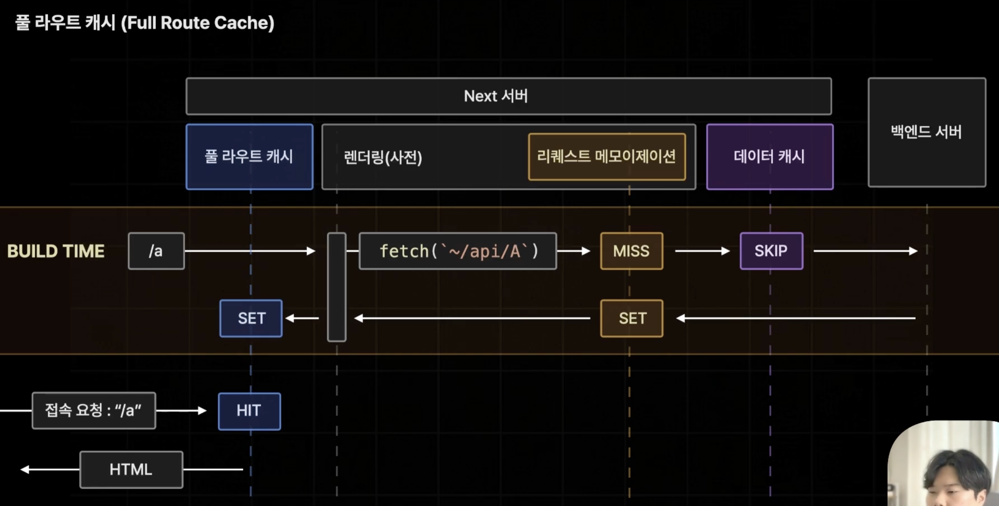

# Full Route Cache

- Next.js 서버 측에서 빌드 타임에 특정 페이지의 렌더링 결과를 미리 저장해 놓는 기능

- 만약 '/a'라는 주소를 갖는 페이지가 풀라이트 캐시에 저장되는 페이지로 설정이 되어있었다면

1. '/a'페이지는 빌드 타임에 사전 렌더링을 진행하게 된다. 리퀘스트 메모이제이션, 데이터 캐시를 거쳐 벡엔드에서 데이터를 받아오고 렌더링이 완료된 결과 반환한다.
2. Next.js 서버에 풀라우트 캐시라는 이름으로 렌더링된 결과를 미리 저장하게 된다.
3. 빌드 타임이 끝나고 Next 서버가 실제로 가동되어 '/a'페이지의 접속 요청이 들어오게 되면 빌드 타임에 미리 렌더링해서 풀라우트 캐시에 저장한 데이터를 가져와 브라우저에 전송된다.

# 정리 마저 해야함