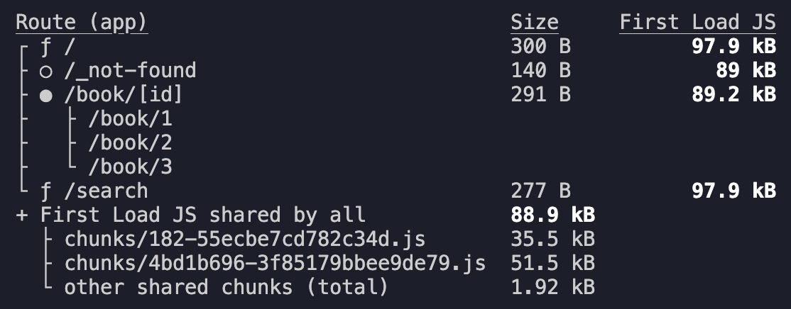
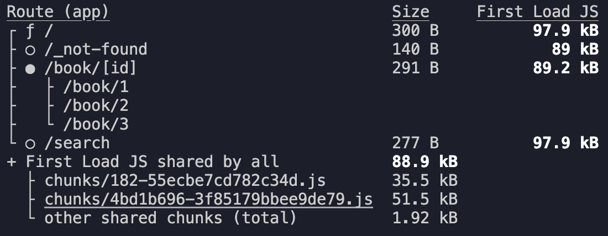

# 라우트 세그먼트 옵션

- 특정 페이지의 Page, Layout, Route Handler를 강제로 설정하는 기능
  - 특정 페이지를 강제로 Static 또는 Dynamic 페이지로 설정
  - 페이지의 Revalidate time을 강제로 설정
  - 페이지의 동작을 강제로 설정 등
- 여러 옵션 값이 있지만, 그 중 가장 많이 사용되는 `dynamic`옵션을 살펴보고자 한다.

# `export const dynamic`

- 특정 페이지의 유형을 강제로 static 또는 dynamic 페이지로 설정해주는 옵션
- 페이지 내부의 동적 함수나 데이터 캐시의 유무를 떠나 강제로 페이지를 static 또는 dynamic으로 설정한다.

## auto

- 기본값, 아무것도 강제하지 않음
- 동적함수나 데이터 캐시의 원칙에 따라 페이지의 유형을 자동으로 설정한다.
- 생략해도 된다.

```ts
export const dynamic = "auto";
```

## force-dynamic

- 페이지를 강제로 Dynamic 페이지로 설정
- 예. '/'경로의 page.tsx

  ```ts
  export const dynamic = "force-dynamic";
  ```

  

  - '/' 경로의 페이지가 Dynamic(ƒ) 페이지로 설정된 것을 확인할 수 있다.

## force-static

- 페이지를 강제로 Static 페이지로 설정
- 예. '/search' 경로의 page.tsx

  ```ts
  export const dynamic = "force-static";
  ```

  

  - '/search' 경로의 페이지가 Static(○) 페이지로 설정된 것을 확인할 수 있다.
  - 해당 페이지에 쿼리스트링 같은 동적함수가 있으면 undefined 값을 반환한다.
  - 해당 페이지에 데이터 캐싱이 없도록(no-store) 설정되어 있다면 강제로 캐싱되도록 변경된다.

  ### 예시. 쿼리스트링의 값을 검색 결과로 받는 '/search'

  - 강제로 Static 페이지로 설정하게 된다면 검색기능이 제대로 동작하지 않을 것이다.
  - force-static으로 설정하게 되면 동적함수인 쿼리스트링의 값은 nudefined. 즉 빈값으로 설정이 되어 검색어를 받아올 수 없게되는 것이다.

## error

- 페이지를 강제로 Static 페이지로 설정 (설정하면 안되는 이유가 있다면 -> 빌드시 오류 반환)
- 예. '/search' 경로의 page.tsx
  ```ts
  export const dynamic = "error";
  ```
  
