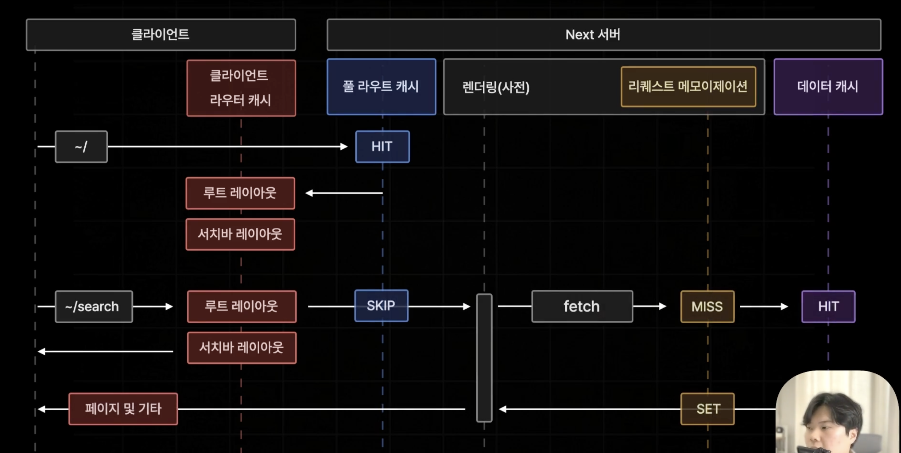

# 클라이언트 라우터 캐시

- 브라우저에 저장되는 캐시
- 페이지 이동을 효율적으로 진행하기 위해 페이지의 일부 데이터를 보관해두는 기능



- '/'는 static 페이지 / '/search'는 dynamic 페이지이다.

1. '/'페이지는 static 페이지로 풀라우트 캐시에 해당 페이지가 저장되어 있는지 확인하고 존재한다면 캐싱된 데이터를 반환해줄것이다.
2. '/search'페이지는 dynamic 페이지로 풀라우트 캐시를 스킵하고 실시간으로 페이지를 생성하기 위해 리퀘스트 메모이제이션과 데이터 캐스를 거쳐 페이지를 생성해서 브라우저에 반환한다.
3. 이 과정에서 Next 서버는 브라우저에게 HTML, JS번들, RSC Payload를 보내주게 된다. '/'와 '/search' 모두 RSC Payload에는 루트 레이아웃, 서치바 레이아웃, 페이지 컴포넌트가 들어있을 것이다.
4. '/'와 '/search'를 요청했을 때 루트 레이아웃, 서치바 레이아웃이 중복으로 전달받게 되는 비효율이 발생하게 된다.
5. 이런 비효율을 줄이기 위해 브라우저에 `클라이언트 라우터 캐시`라는 새로운 캐시 공간을 추가해서 접속 요청시 Next 서버로부터 받게 되는 RSC Payload 값 중에 레이아웃에 해당하는 부분의 데이터만 따로 추출해서 보관하도록 자동으로 설정한다.

```
따라서, 브라우저에서 Next 서버에게 접속 요청을 보냈을 때 해당 페이지의 레이아웃을 담당하는 RSC Payload의 데이터만 클라이언트 라우터 캐시라는 공간에 캐싱하게 된다.
```

- 한 번 접속한 페이지의 레이아웃만 따로 보관해둠으로써 나중에 페이지 이동이 추가로 발생하게 되었을 때 헤당 페이지의 공통된 레이아웃을 서버로부터 중복되게 부르지 않을 수 있도록 페이지의 이동을 최적화 해주는 기술이다.

- 클라이언트 라우터 캐시는 기본적으로 `새로고침`이 되면 모두 사라지게 된다.
