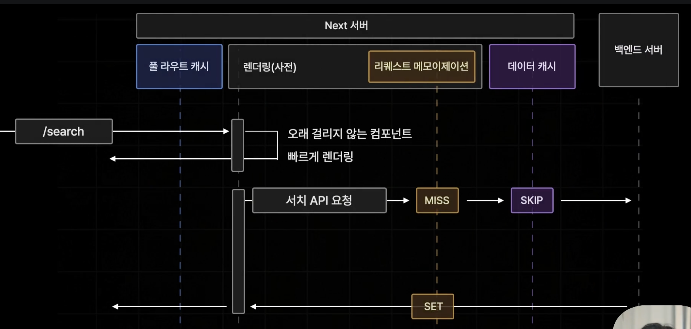

# Streming?

- 서버에서 클라이언트로 데이터를 보낼 때 이 데이터의 크기가 크거나 시간이 오래걸리게 되는 등의 데이터를 빠르게 전송하기 어려울 것 같을 때 데이터의 크기를 여러 조각으로 쪼개에 순차적으로 클라이언트에 보내는 기술

# Next.js의 Streaming

- 자체적으로 HTML 페이지를 스트리밍하는 기능을 제공함
- 특정 페이지를 렌더링할 때 비동기 작업이 존재하지 않아 빠르게 렌더링 될 수 있는 컴포넌트부터 즉시 렌더링해서 브라우저에게 보내주고 비동기 작업을 포함해 비교적 렌더링 작업이 오래 걸리는 컴포넌트의 렌더링 결과를 뒤늦게 페이지에 보내주게 되는 동작을 말한다.
- Dynamic 페이지에 자주 사용된다.
  - 다이나믹 페이지는 next 서버에서 빌드 타임에 생성되지 않기 때문에 요청이 들어왔을 때마다 실행된다.

1. 브라우저로 접속 요청이 들어왔을 때 오래 걸리지 않는 컴포넌트만 빠르게 렌더링해서 브라우저에게 응답한다.
2. 오래 걸리는 부분은 로딩바 같은 대체 UI를 보여준다.
3. next 서버에서 데이터 페칭이 완료되어 렌더링이 끝나면 후속으로 렌더링된 데이터를 보내 실제 데이터로 채워넣는다.
