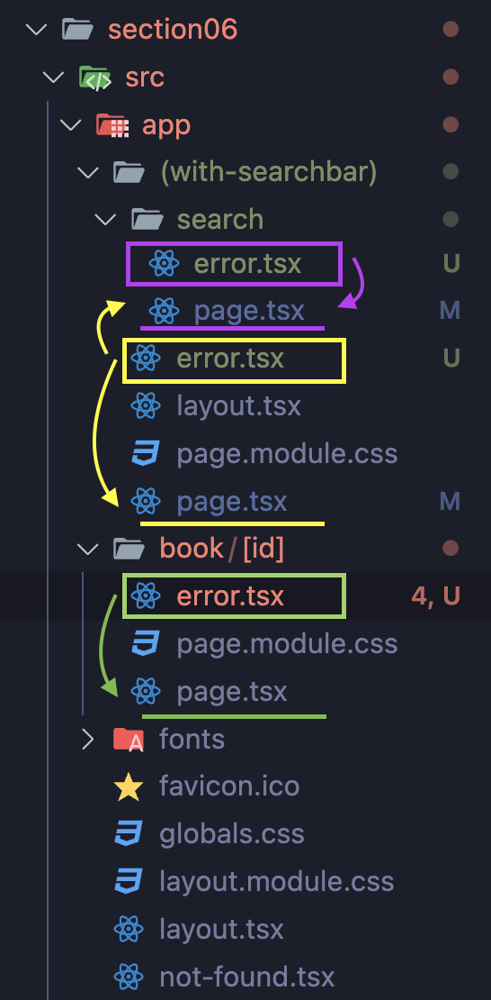

# 특정 경로에서 발생하는 오류를 일괄처리하는 Error.tsx

- 해당 파일과 같은 경로에 있거나 하위 경로에 있는 페이지 컴포넌트에서 오류가 발생하게 되면 대신 렌더링된다.
- `Error` 컴포넌트를 생성해 return으로 에러가 발생했을 때 렌더링할 UI를 작성한다.
- `"use client"` 를 작성하여 클라이언트 컴포넌트로 설정한다.
  - 에러는 서버나 클라이언트 둘 다 발생할 수 있는 것이라 서버와 클라이언트 모두 대응할 수 있도록 설정을 해주는 것이다. (서버 컴포넌트는 서버 측에서만 실행되고 클라이언트 측에서는 실행되지
    않기 때문)

```ts
"use client";

export default function Error() {
  return (
    <div>
      <h3>오류가 발생했습니다.</h3>
    </div>
  );
}
```

# 에러의 원인을 확인하기 위해서 error Props로 확인하자

- 현재 발생한 에러의 원인 또는 메세지를 확인하기 위해서는 Error 컴포넌트에서 props로 전달되는 error 깂을 확인한다.
- Next에서는 error라는 이름의 props로 현재 발생한 오류의 정보를 Error 컴포넌트에 자동으로 보내준다.
- props로 전달된 {error}는 객체로 전달되고 타입은 자바스크립트의 Error로 정의한다.
- useEffect로 error 값이 변경될 때마다 콘솔로 값을 확인해줄 수 있다.

```ts
export default function Error({ error }: { error: Error }) {
  useEffect(() => {
    console.log(error.message);
  }, [error]);

  return (
    <div>
      <h3>오류가 발생했습니다.</h3>
    </div>
  );
}
```

# 에러를 복구하기 위해 다시 한번 컴포넌트를 렌더링 시키는 reset Props

- 에러가 발생한 페이지를 복구하기 위해 다시 한번 컴포넌트들을 렌더링 시켜보는 기능을 가진 함수
- 타입은 `() => void`로 어떤 매개변수도 받지 않고 어떤 반환 값도 리턴하지 않는 함수이다.

- reset은 클라이언트 측에서만 현재 서버로부터 전달받은 데이터를 이용해서 화면을 다시 한번 렌더링하는 메소드이다. 즉 서버 컴포넌트를 다시 실행하지 않는다.
  - 이말은 데이터 페칭 등 서버 측에서 문제가 발생한 것에 대해서는 복구를 할 수 없다는 것이다.
  - 그렇다고 방법이 없는 것은 아니다!

## 서버 컴포넌트도 다시 실행하는 방법

### 1. 브라우저 강제 새로고침 (추천 X)

- 가장 쉬운 방법이다.
- 브라우저를 강제로 새로고침하는 방법
- 페이지를 강제로 새로고침하면 이 페이지에 초기 접속하는 것과 동일하게 동작한다.
- 하지만 브라우저에 보관했던 state등의 각종 데이터가 사라질 수 있고, 에러가 발생하지 않은 레이아웃, 컴포넌트까지 전부 새로 렌더링되어야 한다는 단점이 있다.

```ts
<div>
  <h3>오류가 발생했습니다.</h3>
  <button
    onClick={() => {
      window.location.reload();
    }}
  >
    다시 시도
  </button>
</div>
```

### 2. 오류가 발생한 컴포넌트만 새로 렌더링하는 useRouter

- "next/navigation"의 refresh() 메소드를 사용하여 현재 페이지에 필요한 서버 컴포넌트들을 Next 서버에서 다시 한번 실행해줄 것을 요청하며 결과값을 브라우저에 전달하는 메소드이다.
- 하지만 설정한 Error 컴포넌트는 클라이언트 컴포넌트 이므로("use client")이 메서드로 서버 컴포넌트를 다시 불러와도 클라이언트 컴포넌트인 에러 컴포넌트는 사라지지 않는다.
- Error 컴포넌트의 props로 받은 reset 함수를 사용하면 클라이언트 렌더링을 시킬 수 있다.
  ```ts
  <div>
    <h3>오류가 발생했습니다.</h3>
    <button
      onClick={() => {
        router.refresh();
        reset();
      }}
    >
      다시 시도
    </button>
  </div>
  ```
  - 하지만 이렇게 설정하면 router.refresh()는 비동기 메소드로 이 작업이 끝나기 전에 reset()으로 먼저 클라이언트 렌더링을 진행하기 때문에 원하는 결과를 가져올 수 없다.
- StartTransition() 함수를 사용하면 콜백 함수를 인수로 전달받아 해당 콜백함수 안에 들어있는 UI를 변경하는 과정을 모두 일괄적으로 처리하게 된다.

```ts
<div>
  <h3>오류가 발생했습니다.</h3>
  <button
    onClick={() => {
      startTransition(() => {
        router.refresh();
        reset();
      });
    }}
  >
    다시 시도
  </button>
</div>
```

# Error.tsx의 위치에 따른 에러 처리 결과



1. 동일한 파일의 경로의 페이지 컴포넌트와 그 하위 경로의 컴포넌트에 적용된다. (노란색)
2. 상위에 에러 컴포넌트가 있지만 별도의 에러 컴포넌트가 필요할 경우 필요한 컴포넌트와 동일한 경로에 error.tsx 파일 생성 후 Error 컴포넌트 생성하면 해당 에러 컴포넌트가 우션적으로 적용된다.
3. Error 컴포넌트는 자신과 같은 경로에 있는 레이아웃 까지만 렌더링된다.
   - (with-searchbar)같이 서치바가 적용되는 경로('/', '/search')가 있는데 'app'경로에 Error 파일을 설정하면 에러 발생 시 '/', '/search'경로에 서치바가 나타나지 않게된다.
   - 이런 경우를 신경써서 배치해야 한다.(주황색)
