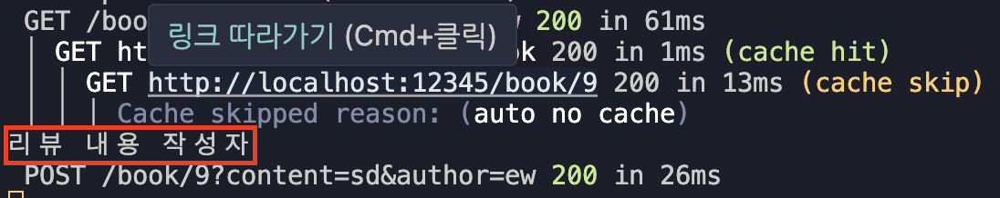

# Server Action?

- 브라우저에서 직접 호출할 수 있는 서버 측에서 실행되는 비동기 함수
- 클라이언트인 브라우저에서 특정 폼의 제출 이벤트가 발생했을 때 서버에서만 실행되는 함수를 브라우저가 직접 호출하면서 데이터까지 폼 데이터 형식으로 전달할 수 있게 해주는 기능

```ts
export default funtion Page() {
    const saveName = async (formData: FormData) => {
        "use server"

        const name = formData.get("name"
            ...
        )
    };

    return (
        <form>
            <input name="name" placeholder="이름을 알려주세요 ..."/>
            <button></button>
        </form>
    )
}
```

- `input` 태그에 값을 입력받고 `button` 태그로 제출이 되면 `form` 태그의 `action`으로 설정한 saveName 함수가 실행된다.
- saveName 함수의 `"use server"`지시자는 해당 함수가 Next 서버에서만 실행되는 서버액션 함수로 설정한다.
- input 태그에서 입력해둔 닶들이 form 데이터 형식으로 묶여서 전달된다.
- get 메서드를 활용하여 formData를 통해 전달받은 값을 꺼내와서 사용하거나 saveDB, 쿼리문 등으로 데이터베이스에 직접 데이터를 저장할 수도 있다.

## 실습해보기

```ts
function ReveiwEditor() {
  async function crearteReviewAction(formData: FormData) {
    "use server";
    const content = formData.get("content")?.toString();
    const author = formData.get("author")?.toString();

    console.log(content, author);
  }
  return (
    <section>
      <form action={crearteReviewAction}>
        <input name="content" placeholder="리뷰 내용" />
        <input name="author" placeholder="작성자" />
        <button type="submit">작성하기</button>
      </form>
    </section>
  );
}
```


