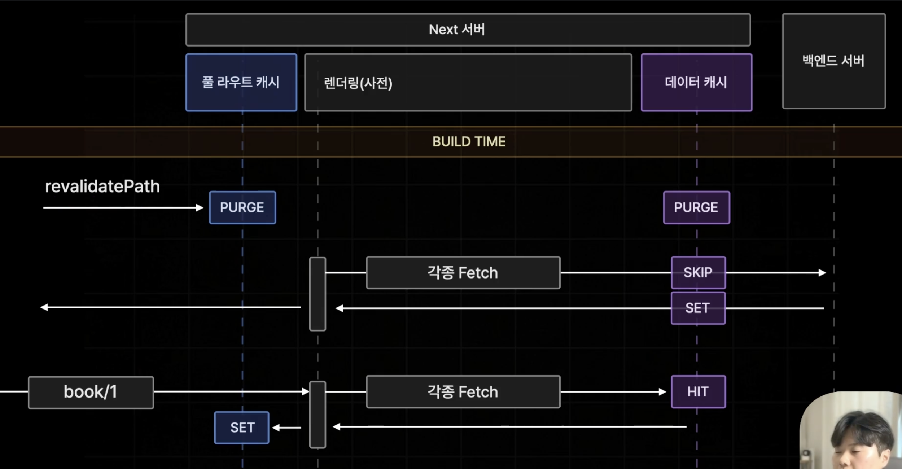

- 서버 액션이 성공적으로 종료되면 실시간으로 서버 측에서 페이지를 다시 렌더링하거나 서버 컴포넌트를 다시 렌더링해 사용자가 보고 있는 북 페이지를 재검증하도록 한다.

```ts
try {
  const res = await fetch(`${process.env.NEXT_PUBLIC_API_SERVER_URL}/review`, {
    method: "POST",
    body: JSON.stringify({ bookId, content, author }),
  });
  revalidatePath(`/book/${bookId}`);
} catch (err) {
  console.error(err);
  return;
}
```

# RevalidatePath()

- 인수로 전달한 경로에 해당하는 페이지를 재검증(다시 생성)한다.
- 페이지를 재검증하는 것이기 때문에 해당 페이지에 렌더링되는 모든 자식 컴포넌트가 다시 렌더링되고 데이터 페칭도 다시 수행된다.
- 오직 서버 측에서만 호출이 가능하다.(서버 컴포넌트, 서버액션 : O, 클라이언트 컴포넌트 : X)
- 페이지를 전부 재경증하기 때문에 페이지에 포함된 모든 캐시들을 전부 무효화 시켜버린다.
- 풀 라우트 캐시 또한 삭제된다.



1. 빌드 타임 종료되고 프로젝트가 실제로 가동되면서 `revalidatePath()`가 서버 액션으로부터 호출되면 풀 라우트 캐시와 데이터 캐시를 모두 제거(`PURGE`)한다.
2. 화면을 업데이트 하기 위해서 새롭게 사전 렌더링을 실행하여 각종 fetch를 다시 실행하여 백엔드 서버에서 데이터를 받아 데이터 캐시로 저장해 페이지를 생성한다.
   - 단, 이 때 풀 라우트 캐시는 새롭게 업데이트 되지 않는다.
3. 다음번 접속 요청이 들어오게 되면 다시 각종 fetch가 실행되고 데이터 캐시의 정보를 받아온 다음 페이지를 생성해서 이때서야 풀 라우트 캐시를 저장한다.

- 이렇게 동작하는 이유는 Revalidate 요청 이후에 브라우저에서 페이지에 접속하게 되었을 때 무조건 최신의 데이터를 보장하기 위해서이다.
