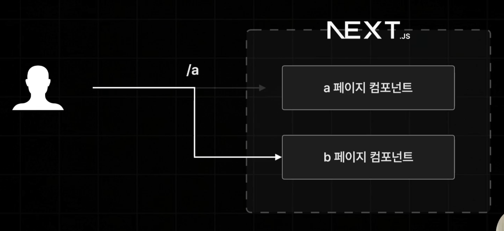
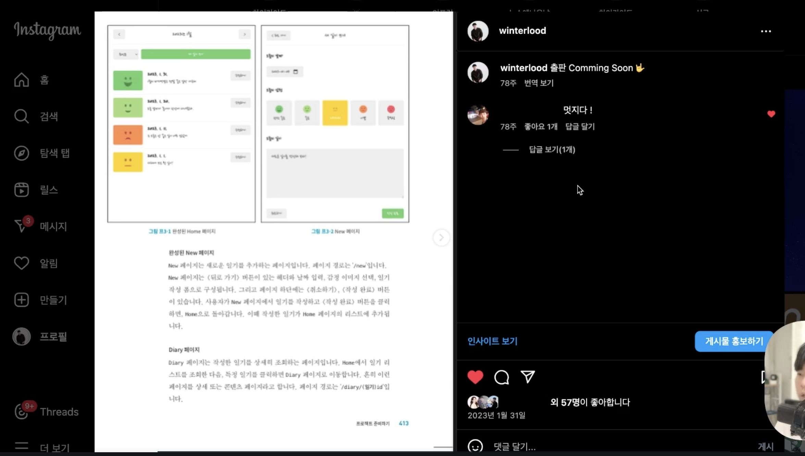
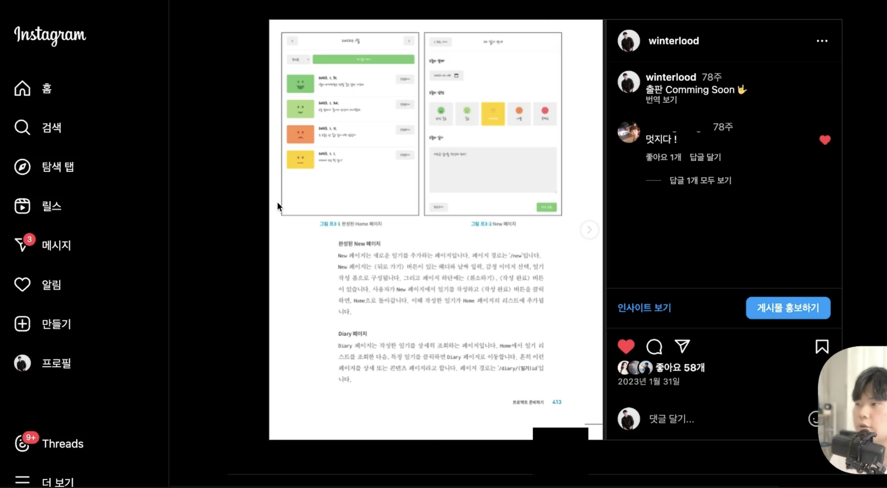

# Intercepting Route



- 사용자가 특정 경로로 접속해서 새로운 페이지를 요청할 때 이 요청을 가로채서 원래 렌더링 되어야 하는 페이지가 아닌 개발자가 원하는 어떠한 페이지를 대신 렌더링하도록 설정하는 라우팅 패턴이다.
- 사용자가 동일한 경로에 접속하더라도 특정 조건에 만족하면 그땐 원래 페이지가 아닌 다른 페이지가 렌더링되는 것이다.
- Next.js에서는 초기 접속 요청이 아닐 때, 즉 클라이언트 사이드 렌더링 방식으로 접속을 하게 되었을 때 동작하도록 고정되어 있다.
- 예시. 인스타그램 피드

  - 마이페이지에서 특정 피드를 누르면 모달로 피드가 뜬다.
    

  - 새로고침이나 해당 피드의 경로를 입력하면 피드의 페이지가 렌더링된다.
    

# 인터셉트 라우팅 실습하기(~/book)

- '/'경로에서 bookItem 컴포넌트를 클릭하면 해당 책의 상세페이지로 넘어갔지만, 클릭하면 모달에서 책의 정보를 확인할 수 있게 한다. 모달의 뒷 배경을 클릭하거나 ESC를 누르면 모달은 꺼진다.

1. 인터셉트를 해서 띄울 `Modal` 컴포넌트를 생성한다.

   - 'app/book/[id]/page.tsx'의 페이지 컴포넌트를 인터셉트할 모달 컴포넌트를 생성하기 위해 'app/(.)book/[id]/page.tsx'를 생성한다.
   - 폴더명 앞에 `(.)`의 의미는 `(.)`뒤에 나오는 경로를 인터셉트 하라는 뜻이다.
     - `(.)~`: 동일 경로 상에 있는 ~ 경로의 페이지를 인터셉트
     - `(..)~`: 상위 경로 상에 있는 ~ 경로의 페이지를 인터셉트
       - ex.`(..)(..)~`는 상위 경로에서 한 번더 상위경로를 의미
     - `(...)~`: app 폴더 바로 밑에 있는 폴더를 인터셉트

   ```ts
   export default function Page() {
     return <div>가로채기 성공</div>;
   }
   ```

2. 인터셉트 페이지에 도서의 상세 내용을 띄우기위해 `book/[id]`의 페이지 컴포넌트를 불러온다.

   - 기존 페이지 컴포넌트의 props를 똑같이 전달해야하기 때문에 `{...props}`로 props를 전달한다.

   ```ts
   export default function Page(props: any) {
     return (
       <div>
         가로채기 성공
         <BookPage {...props} />
       </div>
     );
   }
   ```

3. 인터셉트 페이지를 모달형태로 띄우기 위해 Modal 컴포넌트를 생성한다.

   - `createPortal(렌더링 할 요소, 렌더링 할 위치)`: 'createPortal(`<dialog></dialog>`, document.getElementById("modal-root") as HTMLElement)'은 즉 브라우저에 존재하는 `"modal-root"`라는 id를 갖는 DOM요소 아래에 `<dialog>`가 렌더링된다는 뜻이다.
     - `RootLayout`에 "modal-root"라는 id값을 가진 div를 생성한다.
     ```ts
     return (
     <html lang="en">
       <body>
         <div className={style.container}>
           <header>...</header>
           <main>{children}</main>
           <footer>...</footer>
         </div>
         <div id="modal-root"></div>
       </body>
     </html>
     ```
   - `useRef`로 `<dialog>`를 참조하고 `useEffet`를 사용하여 인터셉트 페이지 접속 시 바로 모달을 켜준다.
     - `<dialog>`는 모달의 역할을 하기 때문에 기본적으로 꺼져있는 상태로 렌더링된다.
     - 하지만 지금은 책을 누르면 해당 컴포넌트로 인터셉트되고 그럼 모달이 바로 켜져야 하기 때문에 강제로 모달창을 켜준다.
     - `useEffet`에 if문을 사용해서 만약 dialog가 open이 아니라면 현재 모달이 꺼져있기 때문에 `showMadal`로 모달창을 켜주고 `scrollTo({ top: 0 }`으로 스크롤이 항상 맨 위에 위치하게 한다.
     - 모달창의 배경 부분을 클릭하면 모달이 꺼지게 하기 위해서 dialog를 클릭할 때 클릭한 부분이 내용인 DIV가 아니라 배경부분인 DIALOG라면 `useRouter`로 불러온 router 객체를 이용하여 뒤로가기를 한다.
       - JS에서는 `e.target.nodeName`으로 입력해도 되지만 아직 TS에서는 dialog 태그에 클릭이벤트가 발생하였을 때 `nodeName` 속성을 지원하지 않기 때문에 타입오류를 해결하기 위해서 `(e.target as any).nodeName`이렇게 작성한다.
     - 사용자가 esc를 눌러서 돌아가기를 구현하기 위해 `onClose` 이벤트를 사용한다.
       - `onClose`는 esc를 누르면 자동으로 실행된다.

   ```ts
   "use client";

   import { ReactNode, useEffect, useRef } from "react";
   import style from "./modal.module.css";
   import { createPortal } from "react-dom";
   import { useRouter } from "next/navigation";

   export default function Modal({ children }: { children: ReactNode }) {
     const dialogRef = useRef<HTMLDialogElement>(null);
     const router = useRouter();

     useEffect(() => {
       if (!dialogRef.current?.open) {
         dialogRef.current?.showModal();
         dialogRef.current?.scrollTo({ top: 0 });
       }
     }, []);

     return createPortal(
       <dialog
         onClick={(e) => {
           // 모달의 배경이 클릭되면 뒤로가기
           if ((e.target as any).nodeName == "DIALOG") {
             router.back();
           }
         }}
         onClose={() => router.back()}
         className={style.modal}
         ref={dialogRef}
       >
         {children}
       </dialog>,
       document.getElementById("modal-root") as HTMLElement
     );
   }
   ```

4. 생성한 모달을 인터렙트 페이지에 적용한다.

```ts
<div>
  가로채기 성공
  <Modal>
    <BookPage {...props} />
  </Modal>
</div>
```
