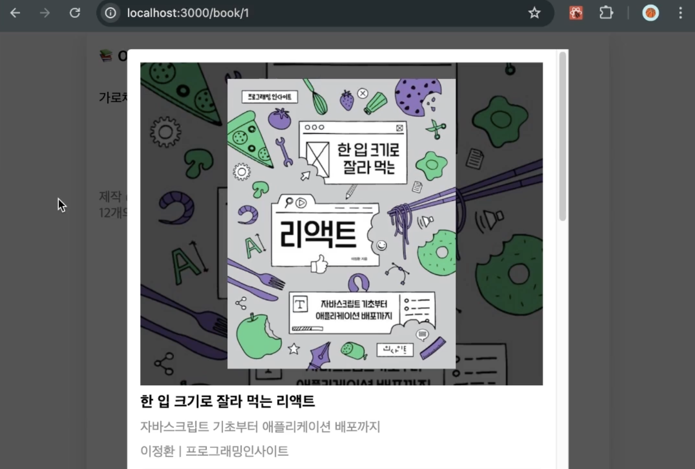

# 지난 강의에서 적용한 Intercepting Route에 Parallel Route 적용하기

- 지난 시간에 '/'경로에서 BookItem을 클릭했을 때 Intercepting Route를 적용한 페이지는 '/'경로의 페이지와 함께 병렬로 노출되고 있었게 아니라 인터셉팅 페이지로 만든 페이지 자체가 렌더링 되고 있었다.
  
- 적용을 원했던 결과는 '/' 페이지나 '/search'페이지 위에 모달이 병렬로 렌더링 되는 것이기 때문에 Parallel Route를 사용하여 적용하도록z 한다.
  

### Parallel Route 적용하기

1. app폴더에 `@modal` 폴더를 생성하여 '(.)book/~'폴더를 '@modal'폴더 안으로 이동한다.
   - 이렇게 페이지 루트 경로에 슬롯 폴더를 만들어 그 안에 인터셉트 페이지를 옮기면 모달이 출력되는 페이지 컴포넌트는 RootLayout 컴포넌트에 props로 전달된다.

```ts
export default function RootLayout({
  children,
  modal,
}: Readonly<{
  children: React.ReactNode;
  modal: ReactNode;
}>) {
  return (
    <html lang="en">
      <body>
        <div className={style.container}>
          <header>
            <Link href={"/"}>📚 ONEBITE BOOKS</Link>
          </header>
          <main>{children}</main>
          <footer>
            <Footer />
          </footer>
        </div>
        {modal}
        <div id="modal-root"></div>
      </body>
    </html>
  );
}
```

### '/' 경로에서 Modal 컴포넌트가 없을 경우를 대비할 default 컴포넌트 설정

- 사용자가 '/'의 경로를 초기 접속하게 되면 '@modal'의 슬롯에서 기본 page를 찾게 되는데 설정해둔 페이지 컴포넌트가 없으므로 페이지를 렌더링할 수 없어 에러가 날 것이다.
- 에러방지를 위해 defaul.tsx로 기본적으로 띄워줄 창을 작성한다.

1. @modal 슬롯레 default.tsx를 생성하여 Default 컴포넌트를 생성한다.
   - BookItem을 클릭했을 때 params 값을 받아 모달을 띄우기 위한 슬롯으로 값을 받기 전에 '/'페이지에는 아무것도 띄울 필요가 없으므로 null을 리턴한다.

```ts
export default function Default() {
  return null;
}
```
