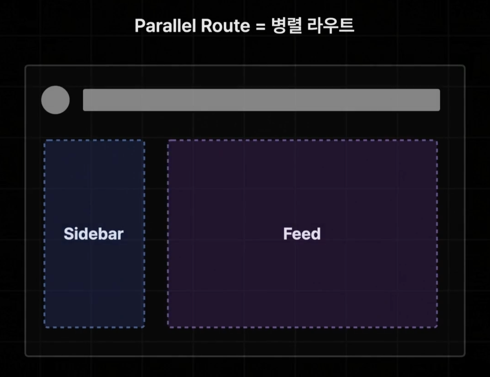
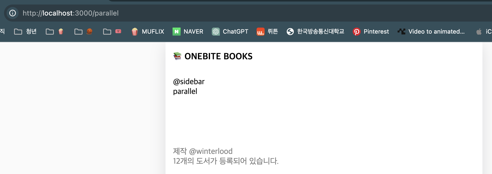
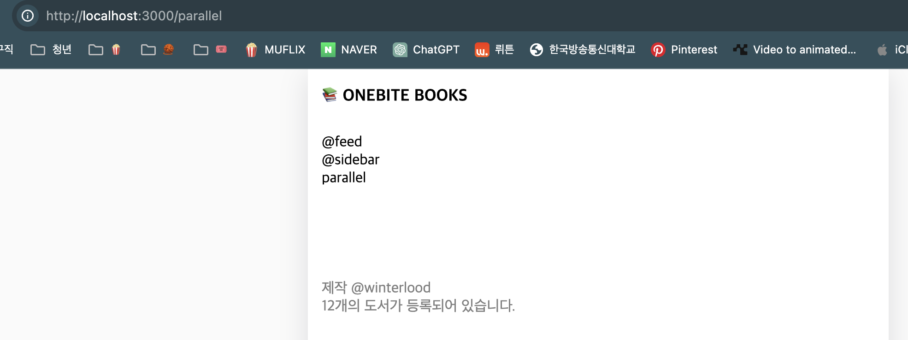
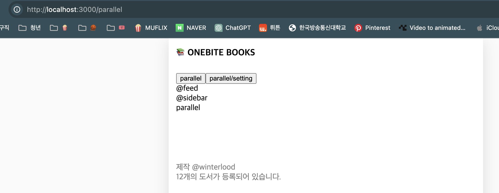
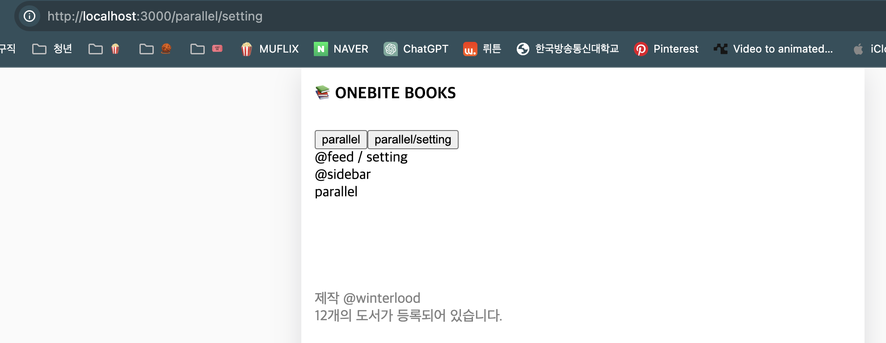
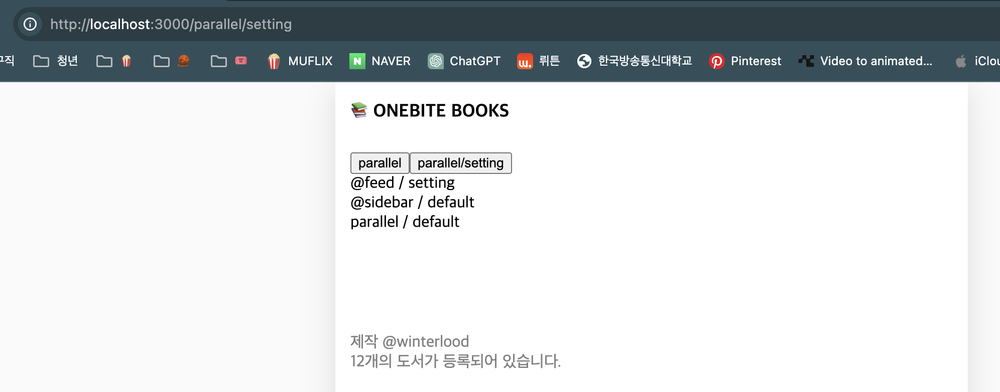

# Parallel Route(페럴랠 라우트)?



- 병렬 라우트
- Next에서 제공하는 고급 라우팅 패턴
- 하나의 화면에 여러 개의 페이지를 병렬로 렌더링 시켜주는 패턴이다.
  - 여기서 페이지란, page.tsx를 의미한다.
- 소셜 미디어 서비스나 관리자의 대시보드 같이 복잡한 구조로 이루어져 있는 서비스들을 구축하는데 상당히 유용하게 사용될 수 있다.

# Parallel Route 사용홰보기

### Parallel route로 병렬 화면 렌더링하기

1. 'app/parallel' 경로에 page.tsx와 layout.tsx를 생성한다.

   - 'parallel/page.tsx'
     ```ts
     export default function Page() {
       return <div>parallel</div>;
     }
     ```
   - 'parallel/layout.tsx'

     ```ts
     import Link from "next/link";
     import { ReactNode } from "react";

     export default function Layout({ children }: { children: ReactNode }) {
       return <div>{children}</div>;
     }
     ```

2. '@sidebar/page.tsx'를 생성하고 Layout 컴포넌트에 적용하여 페럴렐 라우트를 적용한다.

   - '@'로 시작하는 폴더를 슬롯이라 하며 병렬로 렌더링이 될 하나의 페이지 컴포넌트를 보관하는 역할을 한다.
     - 슬롯은 라우트 그룹처럼 URL의 경로에 아무런 영향을 미치지 않는다. 부모 레이아웃 컴포넌트에 추가적으로 제공되는 페이지 컴포넌트를 보관하기 위한 폴더이다.
   - '@~/page.tsx`의 페이지 컴포넌트는 자신의 부모 Layout 컴포넌트에게 자동으로 props로 전달된다.

   - 'parallel/@sidebar/page.tsx'

     ```ts
     export default function Page() {
       return <div>@sidebar</div>;
     }
     ```

   - 'parallel/layout.tsx'

     ```ts
     import Link from "next/link";
     import { ReactNode } from "react";

     export default function Layout({
       children,
       sidebar,
     }: {
       children: ReactNode;
       sidebar: ReactNode;
     }) {
       return (
         <div>
           {sidebar}
           {children}
         </div>
       );
     }
     ```

     

```
❗️ 만약! 페럴렐 라우트 적용이 안된다거나 404 페이지가 뜬다면?
next의 버그로 이럴 가능성이 있다. npm run dev를 종료하고 '.next' 폴더를 삭제하고 다시 num run dev로 프로젝트를 가동하면 잘 적용될 것이다.
```

### Parallel Route의 슬롯의 갯수는 제한이 없다.

- '~/parallel' 경로에 page.tsx, @sidebar애 이어 @feed를 추가한다. 방식은 이전과 동일하다.

  - 'parallel/@feed/page.tsx'

  ```ts
  export default function Page() {
    return <div>@feed</div>;
  }
  ```

  - 'parallel/layout.tsx'

  ```ts
  import Link from "next/link";
  import { ReactNode } from "react";

  export default function Layout({
    children,
    sidebar,
    feed,
  }: {
    children: ReactNode;
    sidebar: ReactNode;
    feed: ReactNode;
  }) {
    return (
      <div>
        {feed}
        {sidebar}
        {children}
      </div>
    );
  }
  ```

  

### Parallel Route 슬롯 안에 새로운 페이지를 추가할 수 있다.

- 'parallel/@feed/setting/page.tsx'가 존재한다고 했을때, 슬롯은 URL 경로에 영향을 미치지 않으므로, 해당 페이지 컴포넌트는 '~parallel/setting' 경로에서 렌더링 될 것이다.
- 'parallel/@feed/setting/page.tsx'는 '~/parallel/setting' 경로에 대한 페이지가 아니라, ~/parallel의 @feed 슬롯 내부에서 렌더링되는 컴포넌트이다.
- 즉, 이 컴포넌트는 URL 경로와는 관계없이 부모 컴포넌트(parallel/layout.tsx)의 구조 내에서만 존재하는 컴포넌트이다. 따라서, '~/parallel/setting' 경로로 직접 접근하면 해당 슬롯을 찾을 수 없어 404가 발생하게 된다.

  - parallel/@feed/setting/page.tsx'

  ```ts
  export default function Page() {
    return <div>@feed / setting</div>;
  }
  ```

  - 'parallel/layout.tsx'

  ```ts
  import Link from "next/link";
  import { ReactNode } from "react";

  export default function Layout({
    children,
    sidebar,
    feed,
  }: {
    children: ReactNode;
    sidebar: ReactNode;
    feed: ReactNode;
  }) {
    return (
      <div>
        <button>
          <Link href={"parallel"}>parallel</Link>
        </button>
        <button>
          <Link href={"parallel/setting"}>parallel/setting</Link>
        </button>
        <br />
        {feed}
        {sidebar}
        {children}
      </div>
    );
  }
  ```

  
  

  - '~/parallel/setting'의 경로에서 '@sidebar', 'parallel'은 변하지 않고 그대로 렌더링 되지만 '~/parallel'의 경로에서 '@feed'였던 feed 페이지의 내용이 '~/parallel/setting'의 경로에서 '@feed / setting'으로 변한 것을 확인할 수 있다.

  - '~/parallel/setting'의 경로에서는 사실 children, sidebar 객체는 setting의 경로가 존재하지 않으므로 사실상 없는 페이지이기 때문에 404가 뜨는거 아닌가? 싶지만 next는 이전 페이지를 유지하도록 처리한다.
    - 단 이런식으로 유지가 되는것은 클라이언트 사이드 렌더링 방식으로 페이지를 이동할 때에만 한정된다. URL 입력창에 직접 '~/parallel/setting'으로 검색하거나 새로고침을 하게 되면 404 페이지가 뜨게된다.
      - 사용자가 ~/parallel 경로에서 '~/parallel/setting'으로 이동할 때, Next.js는 클라이언트 사이드에서 페이지를 변경한다. 이때, 기존에 로드된 컴포넌트가 메모리에 남아 있기 때문에 @feed의 내용이 @feed / setting으로 바뀌는 것이다.
      - 사용자가 주소창에 직접 '~/parallel/setting'을 입력하거나 페이지를 새로 고침하면, 브라우저는 해당 URL에 대한 요청을 서버에 보낸다. 서버는 해당 경로에 대한 페이지가 존재하지 않는다는 것을 알게 되고, 따라서 404 페이지를 반환한다.

### 슬롯 별로 현재 렌더링할 페이지가 없을 때 404를 방지하는 default 페이지

- 각 슬롯 별로 default.tsx 파일을 생성하여 404 페이지 대신 렌더링할 페이지를 생성한다.
  - '~/parallel/default.tsx'
    ```ts
    export default function Default() {
      return <div>parallel / default</div>;
    }
    ```
  - '~/parallel/@sidebar/default.tsx'
    ```ts
    export default function Default() {
      return <div>@sidebar / default</div>;
    }
    ```
    
