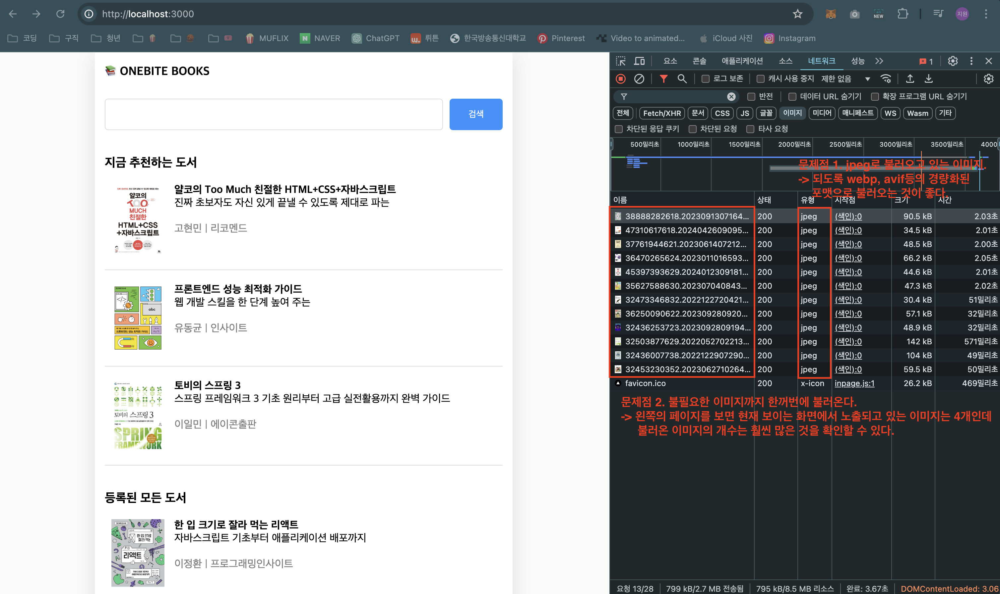
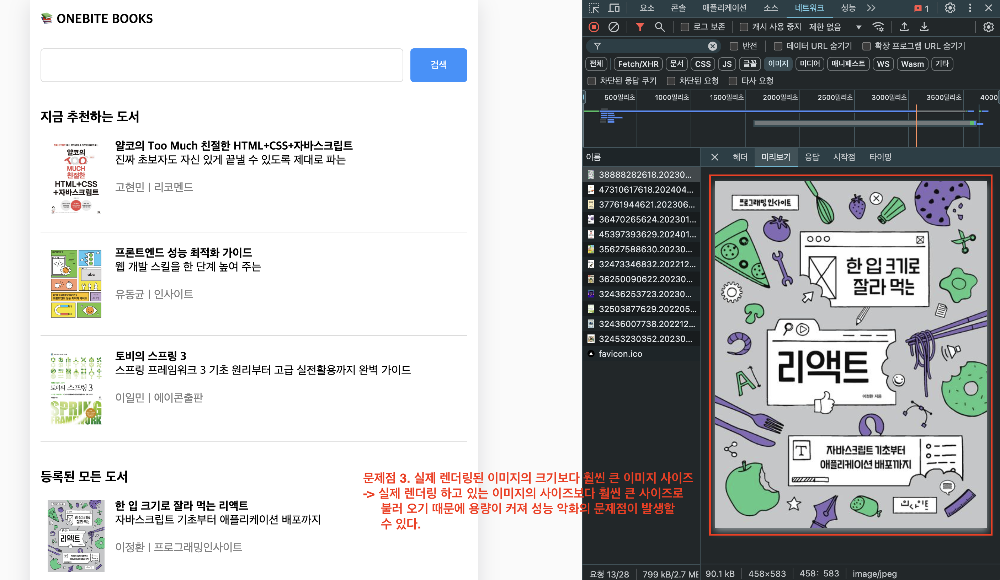
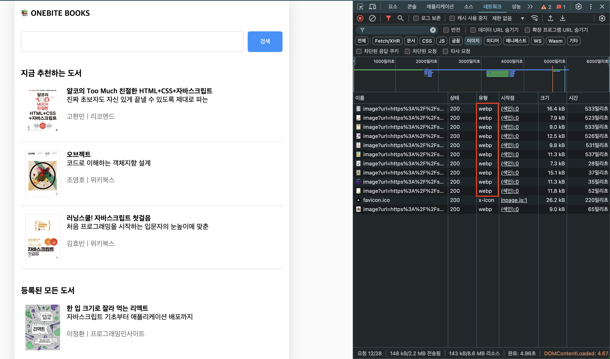

# 이미지 최적화

- 웹 페이지에서 평균적으로 가장 많은 용량을 차지하는 요소는 `이미지`로 http archive라는 연구기관에 따르면 이미지는 평균적으로 웹페이지 용량의 58%를 차지한다고 한다.
- 그 결과 많은 이미지 최적화 기법들이 생겨나게 되었다.
  - wepb, AVIF 등 차세대 형식으로 변환하기
  - 디바이스 사이즈에 맞는 이미지 불러오기
  - 레이지 로딩 적용하기
  - 블러 이미지 활용하기 등
- Next.js에서는 `Image` 컴포넌트를 통해 이런 대부분의 최적화 기법을 자체적으로 제공해준다.

# 기존 프로젝트에서의 ``사용 시 이미지 성능 확인




# Image 컴포넌트로 적용시키기

- 속성값
  - src: 이미지 경로
  - width, height: 이미지 사이즈 직접 명시.
    - 사이즈를 고정적으로 명시하는 이유는 필요 이상으로 큰 이미지를 불러오지 않도록 설정하기 위해서이다.
  - alt: 사용자의 디바이스가 이미지를 렌더링하지 못할 때 대신 표시되는 텍스트

```ts
<Image
  src={coverImgUrl}
  width={240}
  height={300}
  alt={`${title}의 표지 이미지`}
/>
```

# next.config.mjs 수정

- `Image` 컴포넌트를 이용해서 특정 이미지를 최적화 할 때에는 이미지가 현재 next 프로젝트에 저장된 이미지가 아니라 외부 서버에 보관된 이미지를 사용하는 경우 Next.js의 보안 때문에 자동으로 차단되어 오류가 발생한다.
- 때문에 `images`의 `domains`을 추가하여 해당 도메인으로부터 불러오는 이미지는 안전하다는 것을 설정해주면 된다.

```js
/** @type {import('next').NextConfig} */
const nextConfig = {
  logging: { fetches: { fullUrl: true } },
  images: { domains: ["shopping-phinf.pstatic.net"] },
};

export default nextConfig;
```

# Image 컴포넌트로 최적화 적용 후 이미지 성능



- 이미지 형식이 webp로 불러와 경량화된 이미지 타입을 사용
- 이전에는 799kb의 이미지 파일이 전송되었던 반면 적용 후에는 148kb 약 1/5로 줄어든 것을 확인할 수 있다.
- 스크롤로 페이지를 내려보면 나중에 불러와지는 이미지도 확인할 수 있다.
