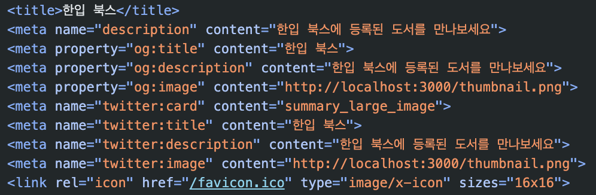
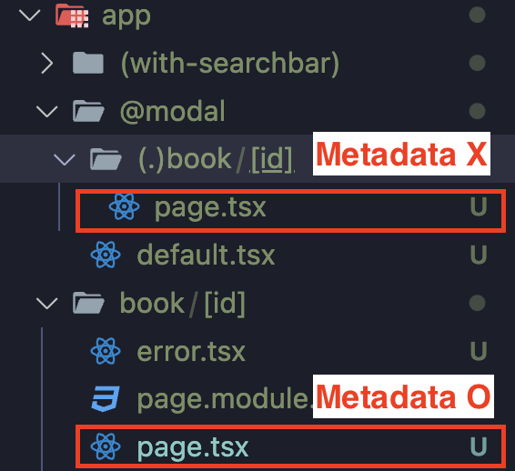

# 검색 엔진 최적화 (SEO)


- 구글, 네이버 등의 검색엔진을 가지고 있는 포털 사이트에서 우리가 제작한 서비스에 어떤 페이지가 있고 어떤 정보들이 있는지 더 잘 수집할 수 있도록 설정해 우리의 서비스가 검색 결과에 더 잘 노출되도록 설정하는 기술
- 검색 엔진 최적화 방법
  - Sitemap 설정하기
  - RSS 발행하기
  - 시멘틱 태그 설정하기
  - 메타 데이터 설정하기 등
- 이 모든 방법을 다 알아보기엔 시간이 부족하기 때문에 비교적 많은 수행과정을 가진 메타데이터 설정하기만 다뤄보도록 한다.
  - 페이지 별로 메타데이터를 설정할 수 있다.

# 정적인 값으로 Metadata 설정하기 (metadata 변수)

- 페이지 컴포넌트 파일에서 Page 컴포넌트의 상단에 `metadata` 변수를 선언하여 `export`로 내보내준다.
  - `metadata` 변수는 `정적인 데이터`로 메타데이터를 설정할 때 사용한다.
  - 약속된 이름의 변수로 이렇게 설정하면 자동으로 페이지의 메타데이터로 설정된다.

```ts
export const metadata: Metadata = {
  title: "한입 북스",
  description: "한입 북스에 등록된 도서를 만나보세요",
  openGraph: {
    title: "한입 북스",
    description: "한입 북스에 등록된 도서를 만나보세요",
    images: ["/thumbnail.png"],
  },
};
```



- 'twitter:title'... 트위터만을 위한 메타 태그도 자동으로 설정된다.

# 동적인 값으로 Metadata 설정하기 (generateMetadata 변수)

## queryString을 사용하는 Metadata 설정하기

- 검색 페이지의 Metadata를 설정. 사용자가 입력한 검색어를 메타데이터에 표시하고자 한다.
- 페이지 컴포넌트 파일에서 Page 컴포넌트의 상단에 `generateMetadata` 함수를 선언하여 `export`로 내보내준다.
  - generateMetadata 함수는 `동적`인 값으로 메타데이터를 설정할 수 있다.
  - generateMetadata는 매개변수로 페이지 컴포넌트에 전달되는 `Props`를 똑같이 전달 받을 수 있다.

```ts
type Props = {
  searchParams: { q?: string };
};

export function generateMetadata({ searchParams }: Props): Metadata {
  return {
    title: `${searchParams.q} : 한입 북스 검색`,
    description: `${searchParams.q} 검색 결과 입니다.`,
    openGraph: {
      title: `${searchParams.q} : 한입 북스 검색`,
      description: `"${searchParams.q}" 검색 결과 입니다.`,
      images: ["/thumbnail.png"],
    },
  };
}
```

## Params로 데이터 페칭한 값을 사용하는 Metadata 설정하기

- 책의 상세페이지의 Metadata 설정. 사용자가 선택한 책의 데이터를 백엔드 서버에서 받아와 메타데이터에 표시하고자 한다.
- Page 컴포넌트에서 받아오듯 선택한 book의 id 값을 백엔드 서버에 전달하기 위해서 params를 매개변수로 받아온다.
- generateMetadata 안에서 `fetch` 메서드를 사용하여 직접 백엔드 서버로부터 데이터를 받아온다.
- 이때 비동기로 작업이 이루어져야 하므로 `async`로 generateMetadata 함수를 비동기로 설정하고 함수의 반환값 또한 비동기로 설정되어야 하므로 `Promise<Metadata | null>`로 설정한다.
  - `Promise<Metadata | null>`: 비동기로 Matadata의 형식의 데이터가 반환되거나 오류가 발생하게 되면 아무것도 반환되지 않게되므로 `null`을 추가한다.

```ts
export async function generateMetadata({
  params,
}: {
  params: { id: string };
}): Promise<Metadata | null> {
  const res = await fetch(
    `${process.env.NEXT_PUBLIC_API_SERVER_URL}/book/${params.id}`,
    { cache: "force-cache" }
  );
  if (!res.ok) {
    throw new Error(res.statusText);
  }

  const book: BookData = await res.json();

  return {
    title: `${book.title} - 한입 북스`,
    description: `${book.description}`,
    openGraph: {
      title: `${book.title} - 한입 북스`,
      description: `${book.description}`,
      images: [book.coverImgUrl],
    },
  };
}
```

### 인터셉팅 라우트로 설정한 모달창이 열릴 경우엔 Metadata가 적용되지 않는다.



- Modal과 book의 페이지 컴포넌트 모두 URL 경로가 '~/book/[id]'일 때 렌더링 되긴 하지만 Matadata는 'app/book/[id]/page.tsx'에서 설정하여 해당 페이지 컴포넌트가 렌더링될 때 동작되는 것이다.
- Modal의 경우 Metadata를 설정한 페이지 컴포넌트가 아닌 '@modal'슬롯의 페이지 컴포넌트가 렌더링 된 것이기 때문에 동작하지 않는다.

# favicon 설정하기

- 'app' 경로에 보면 기본적으로 파비콘이 설정되어 있는 것을 확인할 수 있다.
- 기본 설정된 파비콘을 삭제하고 설정하고 싶은 파비콘 파일을 'app' 경로에 `favicon.ico`로 저장하면 된다.
