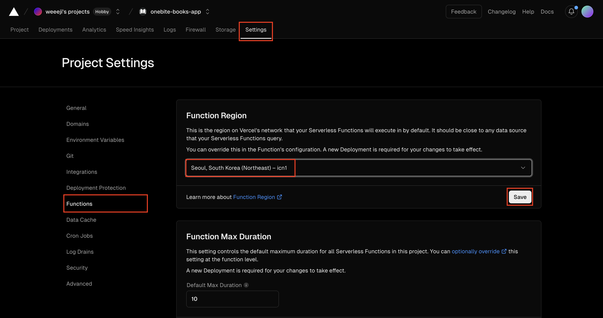
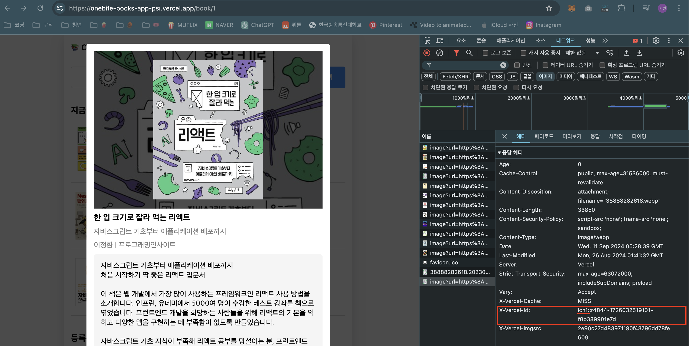

# 프로젝트 성능 개선

- 이전 실습에서 streaming이나 serverAction을 실습할 때 딜레이를 걸어두거나 굳이 dynamic page로 설정하는 등의 작업이 있기 때문에 페이지가 느리게 동작하는 단점이 있었다.
- 때문에 프로젝트 성능을 개선해보도록 한다.

## 1. 'app/(with-searchbar)/page.tsx' 수정

- `delay` 삭제
- `export const dynamic = "force-dynamic"` 동적 페이지 설정 삭제
- ststic 페이지로 변할 것이기 때문에 Suspense 컴포넌트 삭제

## 2. 'app/(with-searchbar)/search/page.tsx' 수정

- `delay` 삭제

## 3. 'app/book/[id]/page.tsx' 수정

- 수정 전에는 generateStaticParams 함수를 통해 1, 2, 3 id에 해당하는 3개의 도서 페이지만 정적으로 생성하고 있지만 모든 도서의 페이지를 정적으로 빌드타임에 만들어두어 사용자에게 좀 더 빠르게 페이지를 제공하도록 한다.

- 비동기적으로 generateStaticParams 함수에서 백엔드에 연결해서 모든 도서의 id 값을 받아와 불러온 도서 id를 return하여 모든 도서 페이지를 빌드 타임에 정적으로 생성한다.
  1. 비동기 작업을 위해 generateStaticParams 함수에 async를 붙인다.
  2. 백엔드 서버에서 결과값을 받아올 변수 res를 선언하고 fetch 메소드로 모든 도서의 정보를 받아온다.
  3. 만약 결과값으로 에러를 받아온다면 throw로 에러를 생성해 백엔드에서 받아온 에러 메세지 던진다.
  4. 제대로 응답 값을 받아오면 변수 books에 BookData의 배열 형태로 res의 json값을 받아온다.
  5. 배열 형태로 받아온 모든 도서의 값을 map 메소드를 활용하여 데이터의 id값을 객체 형태의 값을 가진 배열을 리턴한다.

```ts
// 수정 전
export function generateStaticParams() {
  return [{ id: "1" }, { id: "2" }, { id: "3" }];
}

// 수정 후
export async function generateStaticParams() {
  const res = await fetch(`${process.env.NEXT_PUBLIC_API_SERVER_URL}/book`);
  if (!res.ok) {
    throw new Error(res.statusText);
  }
  const books: BookData[] = await res.json();

  return books.map((book) => ({ id: book.id.toString() }));
}
```

## 4. 'app/actions/create-review.action.ts' 수정

- `delay` 삭제

# vercel 재배포

```bash
vercel --prod
```

# vercel 플랫폼 최적화

## Function Region 수정

- 프로젝트의 `setting` 탭에서 왼쪽 카테고리의 `Function` 클릭
- Function Region을 `한국(Seoul, South Korea (Northeast) - icn1)`으로 설정
  - Function Region: 배포한 Next 페이지가 어떤 물리적 장소에서 제공될 건지 선택하는 것이다. 가까운 리전일 수록 속도가 빨라진다.
- `save` 클릭하여 설정
  

## vercel 재배포

```bash
vercel --prod
```

## 사이트 확인

- 브라우저 개발자도구 > 네트워크 탭 > 도서 아이템 클릭하면 네트웨크에 뜬 요소에서 응답헤더 > 'x-vercel-id'을 확인하면 inc1(서울)로부터 응답받았음을 확인할 수 있다.
  
